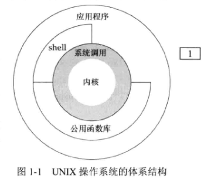

## 1 - UNIX基础知识

### 1. 操作系统

可将操作系统定义为一种软件，它控制计算机硬件资源，提供程序运行环境。通常将这种软件称为 **内核  (kernel)** 。（ **Linux** 是 **GNU** 操作系统的内核 ）

**内核** 的接口是 **系统调用 (system call)** ，**公用函数库** 构建在系统调用之上，应用程序既可以调用公用函数库，也可以使用系统调用。**shell** 是一个特殊的应用程序，为运行其他应用程序提供了一个接口。

### 2. shell

**shell** 是一个命令行解释器，它读取用户输入，然后执行命令。**shell** 的输入来自终端（交互式shell）或文件（shell脚本）。

### 3. 文件系统

**UNIX 文件系统** 是目录和文件的一种层次结构。

**目录 (dictionary)** 是一个包含目录项的文件。逻辑上，可以认为每个目录项都包含一个文件名，同时还包含说明该文件属性的信息。

目录中的每个文字称为 **文件名 (filename)** ，创建新目录时会自动创建了两个文件名：$.$ 和 $..$  ，点指向当前目录，点点指向父目录。在最高层次的根目录中，点点与点相同。

