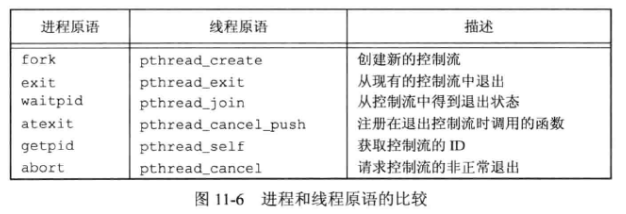

# 11 - 线程

## 1. 线程概念

典型的 **UNIX进程** 可以看成只有一个 **控制线程** ：一个进程在某一时刻只能做一件事情。有了 **多个控制线程** ，就可以把进程设计成在某一时刻能够做不止一件事，每个线程处理各自独立的任务。

**每个线程都包含有表示执行环境所必需的信息**：

- 进程中表示线程的 **线程 ID**
- 一组寄存器值
- 栈
- 调度优先级和策略
- 信号屏蔽字
- **errno** 变量
- 线程私有数据

**一个进程所有信息对该进程的所有线程都是共享的**：

- 可执行程序的代码
- 程序的全局内存和堆内存
- 栈
- 文件描述符

**线程的优点** ：

- 每个线程在进行事件处理时可以采用 **同步编成模式** ，同步编程模式要比异步编程模式简单得多
- 多个进程必需使用操作系统提供的复杂机制才能实现内存和文件描述符的共享。而多个线程自动地可以访问相同的存储地址空间和文件描述符
- 有些问题可以分解从而提高整个程序的吞吐量。有多个线程时，相互独立的任务可以交叉进行（任务的处理过程互不依赖），此时只需要为每个任务分配一个单独的线程
- 交互的程序同样可以通过使用多线程来改善响应时间，多线程可以把程序中处理用户输入输出的部分与其他部分分开

## 2. 线程 ID

每个线程都有一个 **线程 ID** ，线程 ID 只在它所属的进程上下文中才有意义。用 **pthread_t** 数据类型来表示线程 ID ，Linux 中使用无符号长整型表示。

**pthead_equal** 函数对两个线程 ID 进行比较：

```c++
#include <pthread.h>
int pthread_equal(pthread_t tid1, pthread_t tid2);
//返回值：若想等，返回非0数值；否则，返回0
```

线程可调用 **pthread_self** 函数获得自身的线程ID：

```c++
#include <pthread.h>
pthread_t pthread_self(void);
```

## 3. 线程创建

新增的线程通过调用 **pthread_create** 函数创建：

```c++
#include <pthread.h>
int pthread_create(pthread_t *restrict tidp, const pthread_attr_t *restrict attr,
                  void *(*start_rtn)(void *), void *restrict arg);
//返回值：若成功，返回0；否则，返回错误编号
```

**pthread_create** 成功返回时，新创建线程的线程 ID通过 $tidp$ 返回。$attr$ 参数用于定制各种不同的线程属性，如果为 **NULL** ，则使用默认属性。

新创建的线程从 $start\_rtn$ 函数的地址开始运行。若需要向 $start\_rtn$ 函数传递的参数有一个以上，需要把这些参数放到一个结构中，然后把这个结构的地址作为 $arg$ 参数传入。

线程创建时并不能保证哪个线程会先运行，可能是新创建的线程，也可能是调用线程。

## 4. 线程终止

如果 **进程中的任意线程** 调用了 **exit** 、**_Exit** 或者 **_exit** ，那么整个进程就会终止。如果 **信号处理的默认动作是终止进程** ，那么发送到线程的信号就会终止整个进程 。

单个线程可以通过 $3$ 种方式退出（不终止整个进程）：

1. 线程可以简单地从启动例程中退出，返回值是线程的退出码
2. 线程可以被同一进程中的其他线程取消（ **pthread_cancel** ）
3. 线程调用 **pthread_exit** 

**pthread_exit** 函数用于线程退出：

```c++
#include <pthread.h>
void pthread_join(pthead_t thread, void *rval_ptr);
//返回值：若成功，返回0；否则返回错误编号
```

**pthread_join** 用于等待一个线程的结束：

```c++
#include <pthread.h>
int pthread_join(pthread_t thread, void **rval_ptr);
//返回值：若成功，返回0；否则，返回错误编号
```

**pthead_join** 的调用线程将一直阻塞，直到指定的线程调用 **pthread_exit** 、从启动例程中返回或被取消。如果线程简单地从它的启动例程返回，$rval\_ptr$ 就包含返回码。如果线程被取消，由 $rval\_ptr$ 指定的内存单元就设置为 `PTHREAD_CANCELED` 。若将 $rval\_ptr$ 设置为 **NULL** ，调用 **pthread_join** 函数可以等待指定的线程终止，但并不获取线程的终止状态。

可以通过 **pthread_join** 自动把线程置于分离状态，这样资源就可以恢复。

默认情况下，线程的终止状态会保存直到对该线程调用 **pthread_join** ，如果线程已被 **分离** ，线程的底层存储资源可以在线程终止时被立即收回。

可以调用 **pthread_detach** 分离线程：

```c++
#include <pthread.h>
int pthread_detach(pthread_t tid);
//返回值：若成功，返回0；否则，返回错误编号
```

线程可以通过 **pthread_cancel** 函数来请求 **取消同一进程中的其他线程**：

```c++
#include <pthread.h>
int pthread_cancel(pthread_t tid);
//返回值：若成功，返回0；否则，返回错误编号
```

默认情况下，**pthread_cancel** 函数会使得 $tid$ 标识的线程的行为表现为如同调用了参数为 `PTHREAD_CANCELED` 的 **pthread_exit** 函数，但是，线程可以选择忽略取消或者控制如何被取消。

**pthread_cancel** 并不等待线程终止，它仅仅提出请求。

线程可以安排它退出时需要调用的 **线程清理处理程序** ：

```c++
#include <pthread.h>
void pthread_cleanup_push(void (*rtn)(void *), void *arg);
void pthread_cleanup_pop(int execute);
```

一个线程可以建立多个清理处理程序，处理程序记录在栈中，也就是说，它们的执行顺序与注册顺序相反。**pthread_cleanup_pop** 函数删除上次 **pthread_cleanup_push** 函数建立的清理处理程序。这两个函数必须在与线程相同的作用域中以匹配的对的形式使用。

当线程执行以下动作时，清理函数 $rtn$ 是由 **pthread_cleanup_push** 函数调度的，调用时只有一个参数 $arg$ ：

- 调用 **pthread_exit** 时
- 响应取消请求时
- 用非零 $execute$ 参数调用 **pthread_cleanup_pop** 时

可以看到，如果线程是通过从它的启动例程中返回而终止的话，它的清理处理程序就 **不会** 被调用 。

## 5. 进程和线程原语的比较



## 6. 线程同步

当一个线程可以修改的变量，其他线程也可以读取或修改的时候，需要对线程进行 **同步** ，确保它们在访问变量的存储内容时不会访问到无效的值。

线程使用 **锁** ，同一时间只允许一个线程访问该变量。

## 7. 互斥量

**互斥量 (mutex)** 从本质上说是一把锁，在访问共享资源前对互斥量进行设置（ **加锁** ），在访问完成后释放互斥量（ **解锁** ）。对互斥量加锁以后，任何其他试图再次对互斥量加锁的线程都会被阻塞，直到当前线程释放该互斥锁。

**互斥变量** 是用 **pthread_mutex_t** 数据类型表示的。可以通过将其设置为 `PTHREAD_MUTEX_INITIALIZER` 进行初始化（只适用于静态分配的互斥量），也可以通过 **pthrsisuoead_mutex_init** 函数进行初始化。如果动态分配互斥量（如调用 **malloc** ），在释放内存前需要调用 **pthread_mutex_destroy** 。

```c++
#include <pthread.h>
int pthread_mutex_init(pthread_mutex_t *restrict mutex, const pthread_mutexattr_t *restrict attr);
int pthread_mutex_destroy(pthread_mutex_t *mutex);
//两个函数的返回值：若成功，返回0；否则，返回错误编号
```

$attr$ 是互斥量属性，设为 **NULL** 则使用默认属性。

使用 **pthread_mutex_lock** 对互斥量进行加锁，使用 **pthread_mutex_unlock** 对互斥量进行解锁：

```c++
#include <pthread.h>
int pthread_mutex_lock(pthread_mutex_t *mutex);
int pthread_mutex_trylock(pthread_mutex_t *mutex);
int pthraed_mutex_unlock(pthread_mutex_t *mutex);
//所有函数的返回值：若成功，返回0；否则，返回错误编号
```

如果线程不希望被阻塞，可以使用 **pthread_mutex_trylock** 尝试对互斥量进行加锁。如果调用此函数时互斥量处于未锁住状态，则此函数将锁住互斥量，不会出现阻塞直接返回 $0$ ，否则函数不能锁住互斥量，返回 `EBUSY` 。

## 8. 避免死锁

 死锁产生的 **原因** ：

- 线程对用一个互斥量加锁两次，它自身会陷入死锁状态
- 两个线程都在相互请求另一个线程拥有的资源

如果需要对多个互斥量加锁，可以通过 **控制互斥量加锁的顺序** 来避免死锁的发生。有时对互斥量排序很困难，可以先释放占有的锁，然后过一段时间再试，这种情况可以使用 **pthread_mutex_trylock** 接口避免死锁。（如果已经占有某些锁而且 **pthread_mutex_trylock** 接口返回成功，就可以前进，如果不能获取锁，就可以先释放已经占有的锁，做好清理工作，然后过一段时间再重新试 ）。

## 9. 函数 pthread_mutex_timedlock

函数 **pthread_mutex_timelock** 函数在线程试图获取一个已加锁的互斥量时，指定线程阻塞时间。若超过时间值，**pthread_mutex_timelock** 不会对互斥量进行加锁，而是返回错误码 `ETIMEDOUT` 。

除时间限制外作用同 **pthread_mutex_lock** 。

```c++
#include <pthread.h>
#include <time.h>
int pthread_mutex_timelock(pthread_mutex_t *restrict mutex, const struct timespec *restrict tsptr);
//返回值：若成功，返回0；否则，返回错误编号
```

超时指定愿意等待的 **绝对时间** （指示在时间 $X$ 之前可以阻塞等待）。超时时间用 **timespec** 结构来表示，用秒和纳秒来描述时间。

## 10. 读写锁

**pthread_rwlock_t** 为 **读写锁**（共享互斥锁），它比互斥量允许更高的并行性，适合于对数据结构读的次数远大于写的情况。

读写锁有 **3 种状态** ：读模式下加锁状态、写模式下加锁状态、不加锁状态。一次只有一个线程可以占有写模式的读写锁，但是多个线程可以同时占有读模式的读写锁。

对于读写锁的 **各个状态**：

- 当读写锁是 **写加锁** 状态时，在此锁被解锁之前，所有试图对这个锁加锁的线程都会被阻塞 。
- 当读写锁是 **读加锁** 状态时，所有试图以读模式对它进行加锁的线程都可以得到访问权，但是任何希望以写模式对此锁进行加锁的线程都会阻塞。但是当一个线程试图以写模式获取锁时，读写锁会阻塞随后的读模式锁请求，避免读模式锁长期占用 。

读写锁通过 **pthread_rwlock_init** 函数进行初始化：

```c++
#include <pthread.h>
int pthread_rwlock_init(pthread_rwlock_t *restrict rwlock,
                       const pthread_rwlockattr_t *restrict attr);
int pthread_rwlock_destroy(pthread_rwlock_t *rwlock);
//两个函数的返回值：若成功，返回0；否则，返回错误编号
```

也可使用 `PTHREAD_RWLOCK_INITIALIZER` 常量对静态分配的读写锁进行初始化。

要在读模式下锁定读写锁，需要调用 **pthread_rwlock_rdlock** ；要在写模式下锁定读写锁，需要调用 **pthread_rwlock_wrlock** 。不管以何种方式锁住读写锁，都调用 **pthread_rwlock_unlock** 进行解锁：

```c++
#include <pthread.h>
int pthread_rwlock_rdlock(pthread_rwlock_t *rwlock);
int pthread_rwlock_wrlock(pthread_rwlock_t *rwlock);
int pthread_rwlock_unlock(pthread_rwlock_t *rwlock);
//返回值：若成功，返回0；否则，返回错误编号
```

读写锁原语的 **条件版本**：

```c++
#include <pthread.h>
int pthread_rwlock_tryrdlock(pthread_rwlock_t *rwlock);
int pthread_rwlock_trywrlock(pthread_rwlock_t *rwlock);
//返回值：可以获取锁时，返回0；否则，返回错误EBUSY
```

带有 **超时** 的读写锁：

```c++
#include <pthread.h>
#include <time.h>
int pthread_rwlock_timedrdlock(pthread_rwlock_t *restrict rwlock,
                              const struct timespec *restrict tsptr);
int pthread_rwlock_timedwrlock(pthread_rwlock_t *restrict rwlock,
                              const struct timespec *restrict tsptr);
//返回值：若成功，返回0；若超时，返回 ETIMEOUT
```

## 11. 条件变量

**条件变量** 是线程可用的另一种 **同步机制** ，条件变量由互斥量保护，允许线程以无竞争的往事等待特定的条件发生 。

条件变量上有两种 **基本操作** ：

- **等待**：一个线程因等待条件为真而处于等待在条件变量上，此时线程不会占用互斥量（等待条件前要锁住互斥量，等待过程中对互斥量解锁，等待到函数返回（条件改变或超时）后，互斥量再次被锁住）
- **通知**：另一个线程在使条件为真时，通知该条件变量的等待线程（在给等待线程发信号时，不需要占有互斥量）

**pthread_cond_t** 表示条件变量，**初始化** 时，可以把常量 `PTHREAD_COND_INITIALIZER` 赋给静态分配的条件变量，如果条件变量是动态分配的，则需要调用 **pthread_cond_init** 函数对其进行初始化：

```c++
#include <pthread.h>
int pthread_cond_init(pthread_cond_t *restrict cond,
                     const pthread_condattr_t *restrict attr);
int pthread_cond_destroy(pthread_cond_t *cond);
//返回值：若成功，返回0；否则，返回错误编号
```

使用 **pthread_cond_wait** 等待条件变量为真：

```c++
#include <pthread.h>
int pthread_cond_wait(pthread_cond_t *restrict cond,
                     pthread_mutex_t *restrict mutex);
int pthread_cond_timedwait(pthread_cond_t *restrict cond,
                          pthread_mutex_t *restrict mutex,
                          const struct timespec *restrict tsptr);
//返回值：若成功，返回0；否则，返回错误编号
```

有两个函数可以用于通知线程条件已经满足。**pthread_cond_signal** 函数至少能唤醒一个等待该条件的线程，而 **pthread_cond_broadcast** 函数则能唤醒等待该条件的所有线程：

```c++
#include <pthread.h>
int pthread_cond_signal(pthread_cond_t *cond);
int pthread_cond_broadcast(pthread_cond_t *cond);
//返回值：若成功，返回0；否则，返回错误编号
```

## 12. 自旋锁

**自旋锁** 与互斥量类似，但它不是通过休眠使进程阻塞，而是在获取锁之前一直处于 **忙等 (自旋)** 阻塞状态（不占用CPU）。当线程自旋等待锁变为可用时，CPU不能做其他事情，这是为什么自旋锁只能够被持有一小段时间的原因。

自旋锁 **可用于**：锁持有时间短，而且线程并不希望在重新调度上花费太多的成本。自旋锁通常作为底层原语用于实现其他类型的锁。

**pthread_spinlock_t** 表示自旋锁，初始化和反初始化函数为：

```c++
#include<pthread.h>
int pthread_spin_init(pthread_spinlock_t *lock, int pshared);
int pthread_spin_destroy(pthread_spinlock_t *lock);
//返回值：若成功，返回0；否则，返回错误编号
```

可以用 **pthread_spin_lock** 和 **pthread_spin_trylock** 函数对自旋锁进行加锁，前者在获取锁之前一直自旋，后者如果不能获取锁，就立即返回 `EBUSY` 错误。调用 **pthread_spin_unlock** 函数解锁：

```c++
#include <pthread.h>
int pthread_spin_lock(pthread_spinlock_t *lock);
int pthread_spin_trylock(pthread_spinlock_t *lock);
int pthread_spin_unlock(pthread_spinlock_t *lock);
//返回值：若成功，返回0；否则，返回错误编号
```

## 13. 屏障

**屏障 (barrier)** 是用户协调多个线程并行工作的同步机制。屏障允许每个线程等待，知道所有的合作线程都达到某一点，然后从该点继续执行。

**初始化和反初始化**：

```c++
#include <pthread.h>
int pthread_barrier_init(pthread_barrier *restrict barrier,
                        const pthread_barrierattr_t *restrict attr,
                        unsigned int count);
int pthread_barrier_destroy(pthread_barrier *barrier);
//返回值：若成功，返回0；否则，返回错误编号
```

$count$ 参数指定在允许所有线程继续运行之前，必须到达屏障的线程数目。

使用 **pthread_barreir_wait** 函数来表明，线程已完成工作，准备等所有其他线程赶上来：

```c++
#include <pthread.h>
int pthread_barrier_wait(pthread_barrier_t *barrier);
//返回值：若成功，返回 0 或者 PTHREAD_BARRIER_SERIAL_THREAD；否则，返回错误编号
```

调用 **pthread_barrier_wait** 的线程在屏障计数未满足条件时，会进入休眠状态。若该线程是最后一个调用该函数的线程，就满足了屏障计数，所有线程都被唤醒。

## 14. 五个基本同步机制

- 互斥量
- 读写锁
- 条件变量
- 自旋锁
- 屏障


　    


　


