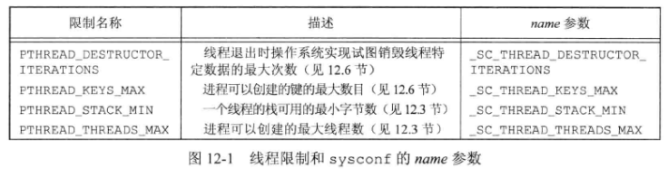
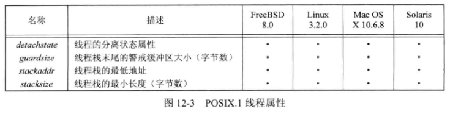
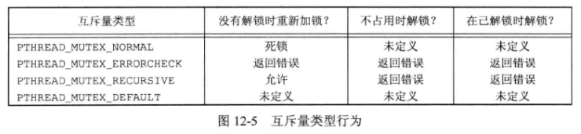

## 12 - 线程控制

### 1. 线程限制

下图为与 **线程操作** 有关的一些 **限制**：



可以通过 **sysconf** 函数进行查询 。

### 2. 线程属性

可使用 **pthread_attr_t** 结构修改线程默认属性，并把这些属性与创建的线程联系起来。

**初始化** 和 **反初始化**：

```c++
#include <pthread.h>
int pthread_attr_init(pthread_attr_t *attr);
int pthread_attr_destroy(pthead_attr_t *attr);
//返回值：若成功，返回0；否则，返回错误编号
```

**POSIX.1** 定义的线程属性有：



#### 2.1 分离状态属性

如果不需要了解线程的终止状态，可以修改 **detachstate** 属性，让线程一开始就处于 **分离状态** ，且让操作系统在线程退出时收回它所占的资源：

```c++
#include <pthread.h>
int pthread_atr_getdetachstate(const pthread_attr_t *restrict attr,
                              int *detachstate);
int pthread_attr_stdetachstate(pthread_attr_t *attr, int *detachstate);
//返回值：若成功，返回0；否则，返回错误编号
//detachstate参数：PTHREAD_CREATE_DETACHED表示以分离状态启动线程
//PTHREAD_CREATE_JOINABLE表示正常启动线程，应用程序可以获取线程的终止状态
```

#### 2.2 线程栈属性

可以使用 **pthread_attr_getstack** 和 **pthread_attr_setstack** 对 **线程栈属性** 进行管理：

```c++
#include <pthread.h>
int pthread_attr_getstack(const pthread_attr_t *restrict attr,
                         void **restrict stackaddr,
                         size_t *restrict stacksize);
int pthread_attr_setstack(pthread_attr_t *attr, void *stackaddr, size_t stacksize);
//返回值：若成功，返回0；否则，返回错误编号
```

如果线程栈的虚地址空间都用完了，可以使用 **malloc** 或者 **mmap** 来为可替代的栈分配空间，并用 **pthread_attr_setstack** 函数来改变新建线程的栈位置。$stackaddr$ 参数指定的地址可以用作线程栈的内存范围中的最低可寻址地址。

#### 2.3 栈的最小长度属性

如果希望改变默认的栈大小，又不想自己处理线程栈的分配问题，可通过 **pthread_attr_getstacksize** 和 **pthread_attr_setstacksize** 函数读取或设置线程属性 $stacksize$ ：

```c++
#include <pthread.h>
int pthread_attr_getstacksize(const pthread_attr_t *restrict attr,
                             size_t *restrict stacksize);
int pthread_attr_setstacksize(pthread_attr_t *attr, size_t stacksize);
//返回值：若成功，返回0；否则，返回错误编号
```

选择的 $stacksize$ 不能小于 `PTHREAD_STACK_MIN` 。

需要调整栈大小的 **原因** ：

- 需要 **调小** 的原因：对于shuxing线程来说，一个进程中的虚地址空间必须被所有的线程栈共享，如果线程很多，以致于线程栈的累计大小超过了可用的虚地址空间，就需要减少默认的线程栈大小
- 需要 **调大** 的原因：如果线程调用的函数分配了大量的自动变量，或者调用的函数设计许多很深的 **栈帧** ，那么需要的栈的大小可能要不默认的大

#### 2.4 栈的警戒缓冲区属性

线程属性 $guardsize$ 控制着线程末尾之后用以避免栈溢出的扩展内存的大小：

```c++
#include <pthread.h>
int pthread_attr_getguardsize(const pthread_attr_t *restrict attr,
                             size_t *restrict guardsize);
int pthread_attr_setguardsize(pthread_attr_t *attr, size_t guardsize);
//返回值：若成功，返回0；否则，返回错误编号
```

如果修改了线程属性 $stackaddr$ ，系统认为我们将自己管理栈，进而使栈警戒缓冲区机制无效，这等同于把 $guardsize$ 线程属性设为 $0$ 。

如果 $guardsize$ 线程属性被修改了，操作系统可能会把它取为页大小的整数倍。如果线程指针溢出到警戒区域，应用程序就可能通过信号接收到出错信息。

### 3. 互斥量属性

互斥量属性使用 **pthread_mutexattr_t** 表示。

**初始化** 和 **反初始化**：

```c++
#include <pthread.h>
int pthread_mutexattr_init(pthread_mutexattr_t *attr);
int pthread_mutexattr_destroy(pthread_mutexattr_t *attr);
//返回值：若成功，返回0；否则，返回错误编号
```

#### 3.1 进程共享属性

**进程共享** 互斥属性默认为 `PTHREAD_PROCESS_PRIVATE` ，此时在进程中，多个线程可以访问一个同步对象。

进程访问共享数据也需要同步，如果 **进程共享** 互斥量属性设置为 `PRHREAD_PROCESS_SHARED` ，从多个进程彼此之间共享的内存数据块中分配的互斥量就可以用于这些进程的同步。

**查询** 和 **修改** 进程共享属性：

```c++
#include <pthread.h>
int pthread_mutexattr_getpshared(const pthread_mutexattr_t *restrict attr, 
                               	int *restrict pshared);
int pthread_mutexattr_setpshared(pthread_mutexattr_t *attr, int pshared);
//返回值：若成功，返回0；否则，返回错误编号
```

#### 3.2 健壮属性

**健壮属性** 与多个进程间共享的互斥量有关，它定义互斥量持有进程终止时，互斥量状态恢复的问题。

默认值是 `PTHREAD_MUTEX_STALLED` ，这意味着持有互斥量的进程终止时不需要采取特别的动作，以后对**pthread_mutex_lock()**  的所有调用进程将以不确定的方式被阻塞。

另一个取值是 `PTHREAD_MUTEX_ROBUST` ，这将导致：若进程获取锁，而锁被另一个进程持有且终止时未解锁，此时该线程会阻塞，从 **pthread_mutex_lock** 返回的值为 `EOWNERDEAD` ，应用程序通过此返回值可以知道需要恢复互斥量。

使用 **健壮** 的互斥量改变了使用 **pthread_mutex_lock** 的方式，因为必须检查 $3$ 个返回值而非 $2$ 个：不需要恢复的成功、需要恢复的成功以及失败 。（若不使用健壮的互斥量，只检查成功和失败）

```c++
#include <pthread.h>
int pthread_mutexattr_getrobust(const pthread_mutexattr_t *restrict attr,
                               int *restrict robust);
int pthread_mutexattr_setrobust(pthread_mutexattr_t *attr, int robust);
//返回值：若成功，返回0；否则，返回错误编号
```

如果应用状态无法恢复，在线程对互斥量解锁之后，该互斥量将处于永久不可用状态。为了避免这样的问题，线程可以调用 **pthread_mutex_consistent** 函数，指明与该互斥量相关的状态在互斥量解锁之前是一致的：

```c++
#include <pthread.h>
int pthread_mutex_consistent(pthread_mutex_t *mutex);
//返回值：若成功，返回0；否则，返回错误编号
```

线程通过 **pthread_mutex_consistent** 能让互斥量正常工作，若没调用此函数就对互斥量进行解锁，那么其他试图获得该互斥量的阻塞线程就会得到错误码 `ENOTRECOVERABLE` ，若发生了此情况，互斥量将不再可用 。

#### 3.3 类型属性

**类型** 互斥量属性控制着互斥量的锁定特性：

- `PTHREAD_MUTEX_NORMAL`：一种标准互斥量类型，不做任何特殊的错误检查或死锁检测
- `PTHREAD_MUTEX_ERRORCHECK`：此互斥量类型提供错误检查
- `PTHREAD_MUTEX_RECURSIVE`：此互斥量类型允许同一线程在互斥量解锁之前对该互斥量进行多次加锁。递归互斥量维护锁的计数，在解锁次数和加锁次数不相同的情况下，不会释放锁
- `PTHREAD_MUTEX_DEFAULT`：此互斥量类型可以提供默认特性和行为。操作系统在实现它的时候可以把这种类型自由地映射到其他互斥量类型中的一种

**互斥量类型行为总结**：



- **不占用时解锁** 指：一个线程对另一个线程加锁的互斥量进行解锁的情况
- **在已解锁时解锁** 指：当一个线程对已经解锁的互斥量进行解锁时将会发生什么，这通常是编码错误引起的

得到和修改互斥量 **类型** 属性：

```c++
#include <pthread.h>
int pthread_mutexattr_gettype(const pthread_mutexattr_t *restrict attr, 
                              int *restrict type);
int pthread_mutexattr_settype(pthread_mutexattr_t *attr, int type);
//返回值：若成功，返回0；否则，返回错误编号
```

### 4. 读写锁属性

**读写锁属性** 用 **pthread_rwlockattr_t** 表示。

初始化和反初始化：

```c++
#include <pthread.h>
int pthread_rwlockattr_init(pthread_rwlockattr_t *attr);
int pthread_rwlockattr_destroy(pthread_rwlockattr_t *attr);
//返回值：若成功，返回0；否则，返回，返回错误编号
```

读写锁支持的唯一属性是 **进程共享** 属性，它与互斥量的进程共享属性是相同的：

```c++
#include <pthread.h>
int pthread_rwlockattr_getpshared(const pthread_rwlockattr_t *restrict attr,
                                 int *restrict pshared);
int pthread_rwlockattr_setpshared(pthread_rwlockattr_t *attr, int pshared);
//返回值：若成功，返回0；否则，返回错误编号
```

### 5. 条件变量属性

条件变量有两个属性：**进程共享** 属性和 **时钟** 属性。

初始化与反初始化：

```c++
#include <pthread.h>
int pthread_condattr_init(pthread_condattr_t *attr);
int pthread_condattr_destroy(pthread_condattr_t *attr);
//返回值：若成功，返回0；否则，返回错误编号
```

#### 5.1 进程共享属性

**进程共享属性** 控制着条件变量是可以被单进程的多个线程使用，还是可以被多进程的线程使用

```c++
#include <pthread.h>
int pthread_condattr_getpshared(const pthread_condattr_t *restrict attr,
                               int *restrict pshared);
int pthread_condattr_setpshared(pthread_condattr_t *attr, int pshared);
//返回值：若成功，返回0；否则，返回错误编号
```

#### 5.2 时钟属性

**时钟** 属性控制计算 **pthread_cond_timewait** 函数的超时参数（ **tsptr** ）时采用的是哪个时钟。

```c++
#include <pthread.h>
int pthread_condattr_getclock(const pthread_condattr_t *restrict attr,
                             clockid_t *restrict clock_id);
int pthread_condattr_setclock(pthread_condattr_t *attr, clockid_t clock_id);
//返回值：若成功，返回0；否则，返回错误编号
```

### 6. 屏障属性

初始化和反初始化：

```c++
#include <pthread.h>
int pthread_barrierattr_init(pthread_barrierattr_t *attr);
int pthread_barrierattr_destroy(pthread_barrierattr_t *attr);
//返回值：若成功，返回0；否则，返回错误编号
```

屏障属性只有 **进程共享** 属性，它控制着屏障是可以 **被多进程的线程使用** （ `PTHREAD_PROCESS_SHARED` ），还是只能 **被初始化屏障的进程内的多线程使用** （ `PTHREAD_PROCESS_PRIVATE` ）：

```c++
#include <pthread>
int pthread_barrierattr_getpshared(const pthread_barrierattr_t *restrict attr,
                                  int *restrict pshared);
int pthread_barrierattr_setpshared(pthread_barrierattr_t *attr, int pshared);
//返回值：若成功，返回0；否则，返回错误编号
```

### 7. 重入

如果一个函数在相同的时间点可以被多个线程安全地调用（一个函数对多个线程来说是 **可重入的** ），就称该函数是 **线程安全** 的 。

操作系统实现支持线程安全函数这个特性时，对 **POSIX.1** 中的一些非线程安全函数会提供可替代的 **线程安全版本**：在非线程安全版本名字后加 `_r` 。

很多函数并不是线程安全的，因为它们返回的数据存放在 **静态的内存缓冲区** 中，通过修改接口，要求调用者自己 **提供缓冲区** 可以使函数变为线程安全。

### 8. 线程特定数据

**线程特定数据（线程私有数据）** 是存储和查询某个特定线程相关数据的一种机制，使用线程特定数据可以使每个线程访问它自己单独的数据副本，而不需要担心与其他线程的同步访问问题。

使用线程特定数据的 **原因**：

- 有时候需要维护基于每线程的数据
- 它提供了让基于进程的接口适应多线程环境的机，如 **errno** 被定义为线程私有数据，这样，一个线程做了重置 **errno** 的操作也不会影响进程中其他线程的 **errno** 值

在分配线程特定数据之前，需要创建与该数据关联的 **键** ，这个键用于获取对线程特定数据的访问：

```c++
#include <pthread.h>
int pthread_key_create(pthread_key_t *keyp, void (*destructor)(void *));
//返回值：若成功，返回0；否则，返回错误编号
```

创建的键存储在 $keyp$ 指向的内存单元中，这个键可被进程中所有线程使用，但每个线程把这个键与不同的线程特定数据地址进行关联。创建新键时，每个线程的数据地址设为空值。

$destructor$ 为与该键关联的析构函数。当线程调用 **pthread_exit** 、线程执行返回或线程被取消时，若数据地址已被置为非空值，那么析构函数就会被调用，它唯一的参数就是该数据地址。如果线程调用了 **exit** 、**_exit** 、**_Exit** 或 **abort** ，或者出现其他非正常推出时，就不会调用析构函数。

线程通常使用 **malloc** 为线程特定数据分配内存。

线程调用 **pthread_key_delete** 来取消与线程特定数据值之间的关联关系：

```c++
#include <pthread.h>
int pthread_key_delete(pthread_key_t key);
//返回值：若成功，返回0；否则，返回错误编号
```

**pthread_once** 用于某个多线程调用的模块使用前的初始化，但是无法判定哪个线程先运行，从而不知道把初始化代码放在哪个线程合适的问题：

```c++
#include <pthread.h>
pthread_once_t initflag = PTHREAD_ONCE_INIT;
int pthread_once(pthread_once_t *initflag, void (*initfn)(void));
//返回值：若成功，返回0；否则，返回错误编号
```

$initflag$ 必须是一个非本地变量（如全局变量或静态变量），而且必须初始化为 `PTHREAD_ONCE_INIT` 。

如果每个线程都调用 **pthread_once** ，系统就能保证初始化例程 $initfn$ 只被调用一次，即系统首次调用 **pthread_once** 时 。

键一旦创建后，就可以通过调用 **pthread_setspecific** 函数把键和线程特定数据关联起来。可以通过 **pthread_getspecific** 函数获得线程特定数据的地址：

```c++
#include <pthread.h>
void *pthread_getspecific(pthread_key_t key);
//返回值：线程特定数据值；若没有值与该键关联，返回NULL
int pthread_setspecific(pthread_key_t key, const void *value);
//返回值：若成功，返回0；否则，返回错误编号
```

### 9. 取消选项

**可取消状态** 和 **可取消类型** 这两个线程属性没有包含在 **pthread_attr_t** 结构中，它们影响着响应 **pthread_cancel** 函数调用时所呈现的行为 。

线程可以通过 **pthread_setcancelstate** 修改它的 **可取消状态**：

```c++
#include <pthread.h>
int pthread_setcancelstate(int state, int *oldstate);
//返回值：若成功，返回0；否则，返回错误编号
//state: PTHREAD_CANCEL_ENABLE 和　PTHREAD_CANCEL_DISABLE
```

**pthread_setcancelstate** 把当前的可取消状态设置为 $state$ ，把原来的可取消状态存储在 $oldstate$ 指向的内存单元，这两步是一个原子操作。

**pthread_cancel** 调用并不等待线程终止。默认情况下，线程在取消请求发出以后还是继续执行，直到某个 **取消点**。取消点是线程检查它是否被取消的一个位置，如果取消了，则按照请求行事。

线程启动时默认的可取消状态是 `PTHREAD_CANCEL_ENABLE` 。当状态设为 `PTHREAD_CANCEL_DISABLE` 时，对 **pthread_cancel** 的调用并不会杀死线程。相反，取消请求对这个线程来说还处于挂起状态，当取消状态再次变为`PTHREAD_CANCEL_ENABLE` 时，线程将在下一个取消点上对所有挂起的取消请求进行处理 。

**POSIX.1** 定义了一些函数作为 **取消点** ，也可以调用 **pthread_testcancel** 函数在程序中添加自己的取消点：

```c++
#include <pthread.h>
void pthread_testcancel(void);
```

调用 **pthread_testcancel** 时，如果有某个取消请求正处于挂起状态，而且取消并没有置为无效，那么线程就会被取消。但是，如果取消被置为无效，**pthread_testcancel** 调用就没有任何效果了。

上述的默认的 **取消类型** 也称为 **推迟取消** （调用 **pthread_cancel** 后，在线程到达取消点之前，并不会出现真正的取消 ）。可以通过调用 **pthread_setcanceltype** 来修改取消类型 ：

```c++
#include <pthread.h>
int pthread_setcanceltype(int type, int *oldtype);
//返回值：若成功，返回0；否则，返回错误编号
```

此函数把 **取消类型** 设置为 $type$ 。参数类型可以是 `PTHREADCANCEL_DEFFERED` （ 延迟取消 ）和 `PTHREAD_CANCEL_ASYNCHRONOUS` （ 异步取消 ）。把原来的取消类型返回到 $oldtype$ 中。

使用 **异步取消** ，线程可以在任意时间撤销，不是非得遇到取消定才能被取消。

 

 


