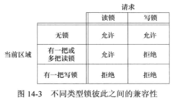
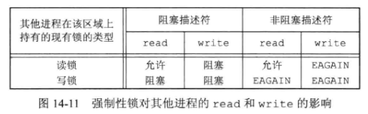
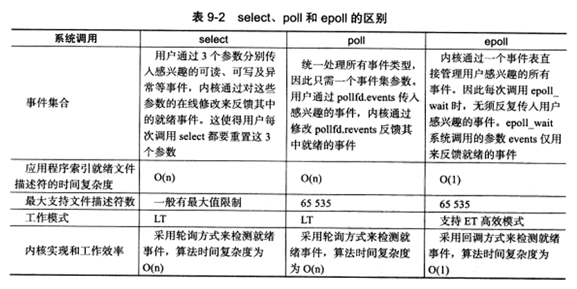
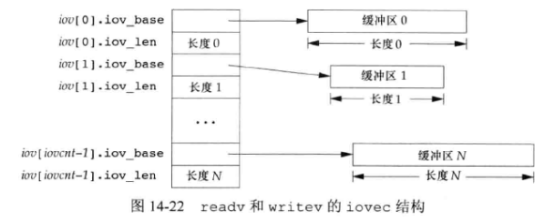
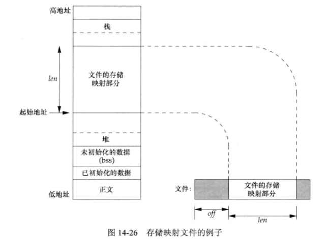

## 14 - 高级I/O

### 1. 非阻塞 IO

**非阻塞 I/O** 使我们可以发出 **open** 、**read** 和 **write** 这样的 **I/O** 操作，并使这些操作不会永远阻塞。如果这种操作不能完成，则调用立即出错返回，表示该操作如继续执行将阻塞 。

对于一个给定的描述符，有两种为其指定 **非阻塞 I/O** 的方法：

- 如果调用 **open** 获得描述符，则可指定 `O_NONBLOCK` 标志
- 对于已经打开的一个描述符，则可调用 **fcntl** ，由该函数打开 `O_NONBLOCK` 文件状态标志 

### 2. 记录锁

**记录锁 (字节范围锁)** 的功能是：当地一个进程正在读或修改文件的某个部分时，使用记录锁可以组织其他进程修改同一文件区 。它可以锁定文件中一个区域或是整个文件 。

#### 2.1 fcntl 记录锁

```c++
#include <fcntl.h>
int fcntl(int fd, int cmd, .../* struct flock *flockptr*/);
//返回值：若成功，依赖于cmd；否则，返回-1
```

对于记录锁，$cmd$ 为：

- `F_GETLK`：判断由 $flockptr$ 所描述的锁是否会被另一把锁所排斥
- `F_SETLK`：非阻塞地设置由 $flockptr$ 所描述的锁，若兼容性规则阻止系统给这把锁，函数返回出错，并将 **errno** 设置为 `EACCES` 或　`EAGAIN` 
- `F_SETLKW`：阻塞地设置由 $flockptr$ 所描述的锁，若不能加锁，调用进程被置为休眠 。如果锁已可用或休眠由信号中断，则该进程被唤醒 。

$flockptr$ 是一个指向 **flock** 结构的指针。**flock** 结构包含了：

- `l_type`：所希望的锁类型，`F_RDLCK`（共享读锁）、`F_WRLCK`（独占性写锁）或 `F_UNLCK`（解锁一个区域）
- `l_start` 和 `l_whence`：加锁或解锁区域的起始字节偏移量
- `l_len`：区域字节长度
- `l_pid`：持有锁的进程 ID

对于 **共享读锁** 和 **独占性写锁** 的基本规则是：任意多个进程在一个给定的字节上可以有一把共享的读锁，但是在一个给定字节上只能有一个进程有一把独占写锁 。具体 **兼容性规则** 如下图：



上面兼容性规则适用于 **不同进程提出的锁请求** ，并不适用于 **单个进程提出的多个锁请求** 。如果一个进程对一个文件区间已经有了一把锁，后来该进程又企图在同一文件区间再加一把锁，那么新锁将替换已有锁 。

 #### 2.2 死锁

如果两个进程响度等待 对方持有并且不释放（锁定） 的资源时，则这两个进程就处于 **死锁状态** 。

#### 2.3 锁的隐含继承和释放

关于记录锁的 **自动继承和释放** 有 $3$ 条规则：

1. 锁与进程和文件两者相关联 。即：当一个进程终止时，它所建立的锁全部释放；无论一个描述符何时关闭，该进程通过这一描述符引用的文件上的任何一把锁都会释放（这些锁都是该进程设置的）
2. 由 **fork** 产生的子进程不继承父进程所设置的锁 
3. 在执行 **exec** 后，新程序可以继承原执行程序的锁

#### 2.4 建议性锁和强制性锁

**建议性锁**：建议性锁flock，不具备强制性。一个进程使用flock将文件锁住，另一个进程可以直接操作正在被锁的文件，修改文件中的数据，原因在于flock只是用于检测文件是否被加锁，针对文件已经被加锁，另一个进程写入数据的情况，内核不会阻止这个进程的写入操作 。

**强制性锁**：强制性锁会让内核检查每一个 **open** 、**read** 和 **write** ，验证调用进程是否违背了正在访问的文件上的一把锁 。

对一个特定文件 **打开其设置组 ID 位** 、 **关闭其执行位** 便开启了对该文件的强制性锁机制 。

如果一个进程试图读或写一个强制性锁起作用的文件，而欲读、写的部分又由其他进程加上了锁，会有如下图所示可能性：

 

### 3. I/O 多路转接（I/O 复用）

例如：当一个进程有两个 **输入描述符** 时，不能对两个输入中的任一个使用 **阻塞 read** ，因为不知道到底哪一个输入会得到数据 。

- **使用多进程方法**：**fork** 出子进程，每个进程执行 **阻塞 read** 处理一条数据通路 。缺点是开销大，且操作终止时需要通过进程间通信通知别的进程停止，使程序变得复杂 。
- **使用多线程方法**：一个进程使用两个线程，CPU 开销依然大，且处理多线程之间的同步问题引入了更多复杂性
- **一个进程使用非阻塞 I/O**：将两个输入描述符都设置为非阻塞的，对第一个描述符发一个 **read** ，如果该输入上有数据，则读数据并处理它；否则调用立即返回 。对别的描述符做同样处理 。在此之后，等待一定时间，然后再尝试从第一个描述符读 。这种 **轮询** 的方式浪费了大量 CPU 时间 。
- **使用异步 I/O**：利用这种技术，进程告诉内核，当描述符准备好可以进行 I/O 时，用一个信号通知它 。缺点是：这种信号对每个进程而言只有 $1$ 个，如果使该信号对两个描述符都起作用，那么进程在接到此信号时将无法判别是哪一个描述符准备好了 。为了确定是哪一个描述符准备好了，仍需将这两个描述符都设置为非阻塞的，并顺序尝试执行 I/O 。
- **使用 I/O 多路转接**：这是一种比较好的技术，先构造一张描述符的列表，然后调用一个函数，直到这些描述符中的一个已准备好 I/O 时，该函数才返回，并告知进程哪些描述符已准备好 I/O 。

#### 3.1 函数 select 和 pselect

**select** 函数可以执行 **I/O 多路转接** ：

```cpp
#include <sys/select.h>
int select(int maxfdp1, fd_set *restrict readfds, fd_set *restrict writefds, 
           fd_set *restrict exceptfds, struct timeval *restrict tvptr);
//返回值：准备就绪的描述符数目；若超时，返回 0；若出错，返回 -1
```

$tvptr$ 参数指定 **等待的时间长度** ，单位为秒和微秒：

- $tvptr==NULL$：永远等待，直到所指定的描述符中的一个已准备好或捕捉到一个信号 。若捕捉到一个信号，则 **select** 返回 $-1$ ，**errno** 设置为 `EINTR` 。
- $tvptr->tvsec == 0$ &&  $tvptr->tv_usec==0$：不等待，测试所有指定的描述符并立即返回。这是轮询系统找到多个描述符状态而不阻塞 **select** 函数的方法 。
- $tvptr->tv_sec \not=  0$ || $tvptr->tv_usc \not= 0$ ：等待指定的秒数和微秒数。当指定的描述符之一已准备好，或当指定的时间值已经超过时立即返回。如果在超时时还没文件描述符准备好，则返回值为 $0$ ，否则，将 $tvptr$ 更新为剩余时间值 。

$readfds$ 、$writefds$ 、$exceptfds$ 是指向 **描述符集**　的指针，说明了我们关心的 **可读** 、**可写** 或 **处于异常条件** 的描述符集合 。每个描述符集存储在一个 **fd_set** 数据类型中，**fd_set** 是一个很大的字节数组，为每一个可能的描述符保持一位：


对于 **fd_set** 的操作函数：

```cpp
#include <sys/select.h>
int FD_ISSET(int fd, fd_set *fdset);	//测试描述符集中的一个指定位是否已打开
//返回值：若 fd 在描述符集中，返回非 0 值；否则，返回 0
void FD_CLR(int fd, fd_set *fdset);	//清除fdset中指定位
void FD_SET(int fd, fd_set *fdset);	//开启fdset中的指定位
void FD_ZERO(fd_set *fdset);	//将一个fd_set变量的所有位设置为 0
```

**select** 中的三个描述符集指针都可以为 **NULL** ，表示对相应条件并不关心。如果三个指针都是 **NULL** ，则 **select** 提供了比 **sleep** 更精确的定时器 。

**select** 第一个参数 $maxfdp1$ 的意思是 **最大文件描述符值加 1** ，考虑所有 $3$ 个描述符集中的最大描述符编号值，然后加 $1$ 。因为文件描述符是从 $0$ 开始计数的 。

**select 函数返回值**：

- 返回值 $-1$ 表示出错 。如在所指定的描述符中一个都没准备好时捕捉到一个信号 。
- 返回值 $0$ 表示超时的时候没有描述符准备好 。
- 一个 **正返回值** 说明了已经准备好的描述符数 ，该值是 $3$ 个描述符集中已准备好的描述符数之和，所以如果同一描述符已准备好读和写，那么在返回值中会对其计两次数 。

**一个描述符阻塞与否并不影响 select 是否阻塞** ：如希望读一个非阻塞描述符，并且以超时值为 $5s$ 调用 **select** ，则 **select** 最多阻塞 $5s$ 。

**pselect** 函数是 **select** 函数的一个变体：

```cpp
#include <sys/select.h>
int pselect(int maxfdp1, fd_set *restrict readfds, fd_set *restrict writefds,
           fd_set *restrict exceptfds, const struct timespec *restrict tsptr,
           const sif=gset_t *restrict sigmask);
//返回值：准备就绪的描述符数目；若超时，返回 0；若出错，返回 -1
```

**pselect 函数与 select 函数的 区别**：

- **pselect** 超时值由 **timespec** 结构指定，提供更精准的超时时间 。
- **pselect** 超时值被声明为 **const** ，保证了调用 **pselect** 不会改变此值
- **pselect** 可使用 **信号屏蔽字** ，调用 **pselect** 时以原子操作的方式安装该信号屏蔽字，返回时恢复以前的信号屏蔽字。（ $simask$ 为 **NULL** 时与 **select** 相同 ）

#### 3.2 函数 poll

**poll** 与 **select** 类似，也是在指定时间内轮询一定数量的文件描述符，以测试其中是否有就绪者：

```cpp
#include <poll.h>
int poll(struct pollfd fdarray[], nfds_t nfds, int timeout);
//返回值：准备就绪的描述符数目；若超时，返回 0；若出错，返回 -1
```

与 **select** 不同，**poll** 不是为每个条件（可读、可写、异常条件）各构造一个描述符集，而是构造一个 **pollfd** 类型的数组，**pollfd** 结构体为：

```cpp
struct pollfd {
    int fd;			// file descriptor to check, or < 0 to ignore
    short events;	// events of interest on fd
    short revents;	// events that occurred on fd
};
```

$fdarray$ 数组中的元素数由 $nfds$ 指定。

$fdarray$ 数组每个元素的 **events** 成员设置为下图中所示值的一个或几个，通过这些值告诉内核我们关心的是每个描述符的哪些事件。返回时，**revents** 成员由内核设置，用于说明每个描述符发生了哪些事件。（ 下图前 $4$ 行测试的是可读性，接下来 $3$ 行测试的是可写性，最后 $3$ 行测试的是异常条件 。

**poll** 最后一个参数 $timeout$ 指定的是等待时间，与 **select** 类似 。

与 **select** 一样，一个描述符是否会阻塞不会影响 **poll** 是否阻塞 。

#### 3.3 epoll

（ 此部分为补充内容）

**epoll** 是 **Linux** 上特有的 I/O 复用函数 。

**epoll** 和 **poll** 、**select** 的 **差异** ：

- **epoll** 使用一组函数来完成任务，而不是单个函数
- **epoll** 把文件描述符事件放在 **内核事件表** 当中，从而无需像 **select** 和 **epoll** 那样每次调用都要重复传入描述符集或事件集
- **epoll** 需要一个额外文件描述符，来唯一标识 **内核事件表**
- **epoll** 采用回调方法来检测就绪事件，而 **select** 和 **epoll** 采用轮询方式，复杂度更高

**内核事件表** 的文件描述符由 **epoll_create** 函数创建：

```c
#include <sys/epoll.h>
int epoll_create(int size);	//size 参数并不起作用，只是给内核一个提示，告诉它事件表有多大
//返回值为内核事件表的文件描述符：epfd
```

用 **epoll_ctl** 函数来操作内核事件表：

```c
#include <sys/epoll.h>
int epoll_ctl(int epfd, int op, int fd, struct epoll_event *event);
//返回值：若成功，返回 0；若失败，返回 -1 并设置 errno
```

$fd$ 参数是要操作的文件描述符 。

$op$ 参数指定操作类型：

- `EPOLL_CTL_ADD`：往事件表中注册 $fd$ 上的事
- `EPOLL_CTL_MOD`：修改 $fd$ 上的注册事件
- `EPOLL_CTL_DEL`：删除 $fd$ 上的注册事件

$event$ 参数指定事件，**epoll_event** 定义如下：

```c
struct epoll_event {de
    _unit32_t events;	//epoll事件类型基本是将poll事件类型的宏前面加E
    epoll_data_t data;	//存储用户数据
};
```

**epoll_wait** 函数用来 **等待** 一组文件描述符上的事件：

```c
#include <sys/epoll.h>
int epoll_wait(int epfd, struct epoll_event *events, int maxevents, int timeout);
//返回值：若成功，返回就绪的文件描述符的个数；若失败，返回 -1 并设置errno
```

$timeout$ 参数与 **poll** 的 $timeout$ 参数相同 。**maxevents** 参数指定最多监听多少事件 。

**epoll_wait** 函数如果检测到事件，就将所有 **就绪的事件** 从内核事件表复制到它的第二个参数 $events$ 中，而 **select** 和 **poll** 的数组参数既用于传入用户注册事件，又用于输出内核检测到的就绪事件，这提高了程序索引就绪文件描述符的效率 。（ 使用 **epoll** 函数，程序可直接从数组获取就绪文件描述符，而使用 **select** 和 **poll** 函数，需要对数组中的元素进行一次判断 ）

**LT** 和 **ET** 模式：

- **LT 模式** ：即 **电平触发** ，是默认的工作方式，当 **epoll_wait** 检测到有事件发生并通知应用程序后，应用程序可以不立即处理该事件，这样，当应用程序下一次调用 **epoll_wait** 时，**epoll_wait** 还会通知此事件，直到此事件被解决 。（ 此模式下，**epoll** 相当于一个效率更高的 **poll** ）
- **ET 模式**：即 **边缘触发** ，当往内核事件表中注册一个文件描述符上的 `EPOLLET` 事件时，**epoll** 将以 **ET** 模式来操作该文件描述符，它是 **epoll** 的高效工作模式 。当 **epoll_wait** 检测到有事件发生并将此事件通知应用程序后，应用程序必须立即处理该事件，因为后续的 **epoll_wait** 调用将不再向应用程序通知这一事件 。可见，**ET 模式** 降低了同一个事件重复触发的次数，因此效率更高 。

**EPOLLONESHOT** 事件：对于注册了 `EPOLLONESHOT` 事件的文件描述符，系统最多触发其上注册的一个可读、可写或者异常事件，且只触发一次 。这样，当一个线程在处理某个文件描述符时，其他线程是不可能有机会操作该文件描述符的 。

#### 3.4 三组 I/O 复用函数的比较



### 4. POSIX 异步 I/O

**异步 I/O 作用**：在执行 I/O 操作时，如果还有其他事务要处理而不想被 I/O 操作阻塞，就可以使用异步 I/O 。

异步 I/O 接口使用 **AIO 控制块** 来描述 I/O 操作 。**aiocb** 结构定义了 **AIO 控制块** 。

在进行异步 I/O 之前需要先 **初始化 AIO 控制块** ，调用 **aio_read** 函数来进行 **异步读** 操作，或调用 **aio_write** 函数来进行 **异步写** 操作：

```c
#include <aio.h>
int aio_read(struct aiocb *aiocb);	
int aio_write(struct aiocb *aiocb);
//返回值：若成功，返回 0；若出错，返回 -1
```

当这些函数返回成功时，异步 I/O 请求便已经被操作系统放入等待处理的队列中了。这些返回值与实际 I/O 操作的结果没有任何关系 。

要想强制所有等待中的异步操作 **不等待而写入持久化的存储中** ，可以设立一个 AIO 控制块并调用 **aio_fsync** 函数：

```c
#include <aio.h>
int aiu_fsync(int op, struct aiocb *aiocb);
//返回值：若成功，返回 0；若出错，返回 -1
```

为获取一个异步读、写或者同步操作的 **完成状态** ，需要调用 **aio_error** 函数：

```c
#include <aio.h>
int aio_error(const struct aiocb *aiocb);
//返回值：异步操作成功返回 0；函数调用失败返回 -1；异步读、写或同步操作仍在等待返回 EINPROGRESS
```

可调用 **aio_return** 函数来 **获取异步操作的返回值** ，获取返回值前必须确认操作已完成：

```c
#include <aio.h>
ssize_t aio_return(const struct aiocb *aiocb);
//返回值：函数调用失败，返回 -1，并设置 errno
```

如果在完成了所有事务时，还有异步操作未完成，可以调用 **aio_suspend** 函数来阻塞进程，直到操作完成：

```c
#include <aio.h>
int aio_suspend(const struct aiocb *const list[], int nent, 
                const struct timespec *timeout);
//返回值：若有任何I/O操作完成，返回 0；若出错，返回 -1
```

若还有不想再完成的等待中的异步 I/O 操作时，可尝试使用 **aio_cancel** 函数 **取消** 它们：

```c
#include <aio.h>
int aio_cancel(int fd, struct aiocb *aiocb);
//若 aiocb 为NULL，系统尝试取消所有该文件上未完成的异步 I/O 操作；其他情况下，系统将尝试取消由 AIO 控制块描述的单个异步 I/O 操作
```

**aio_listio** 函数提交一系列由一个 AIO控制块列表描述的 I/O 请求：

```c
#include <aio.h>
int lio_listio(int mode, struct aiocb *restrict const list[restrict], 
               int nent, struct sigevent *retrict sigev);
//返回值：若成功，返回 0；若出错，返回 -1
```

$mode$ 参数决定了 I/O 是否真的是异步的 。如果该参数被设定为 `LIO_WAIT` ，**lio_listio** 函数将在所有由列表指定的 I/O 操作完成后返回（此情况下，$sigev$ 被忽略 ）如果 $mode$ 参数被设定为 `LIO_OWAIT` ，**lio_listio** 函数将在 I/O 请求入队后立即返回 。进程将在所有 I/O 操作完成后，按照 $sigev$ 参数指定的，被异步地通知 。

### 5. 函数 readv 和 writev

**readv** 和 **writev** 函数用于在一次函数调用中 **读、写多个非连续缓冲区** 。也将这两个函数称为 **散布读** 和 **聚集写**：

```c
#include <sys/uio.h>
ssize_t readv(int fd, const struct iovec *iov, int iovent);
ssize_t writev(int fd, const struct iovec *iov, int iovent);
//返回值：已读或已写的字节数；若出错，返回 -1
```

$iovcnt$ 指定 $iov$ 数组中的元素数 。

**iovec** 结构：

```c
struct iovec {
    void *iov_base;	// starting address of buffer
    size_t iov_len;	// size of buffer
};
```



**writev** 函数从缓冲区中聚集输出数据的顺序是：$iov[0]$ 、$iov[1]$ 直至 $iov[iovcnt-1]$ 。**writev** 返回输出的字节总数，通常应等于所有缓冲区长度之和 。

**readv** 函数则将读入的数据按上述同样顺序散布到缓冲区中 。**readv** 总是先填满一个缓冲区，然后填下一个。**readv** 返回读到的字节总数，如果遇到文件尾端，已无数据可读，则返回 $0$ 。

### 6. 存储映射 I/O

**存储映射 I/O 能将一个磁盘文件映射到存储空间的一个缓冲区上** ，于是，当从缓冲区中取数据时，就相当于读文件中的相应字节；将数据写入缓冲区时，相应字节就自动写入文件。这样就可以在不使用 **read** 和 **write** 的情况下执行 I/O 。

**mmap** 函数将一个给定的文件映射到一个存储区域中：

```c
#include <sys/mman.h>
void *mmap(void *addr, size_t len, int prot, int flag, int fd, off_t off);
//返回值：若成功，返回映射区的起始地址；若出错，返回 MAP_FAILED
```

$addr$ 参数用于指定映射存储区的起始地址，通常设置为 $0$ ，表示由系统选择该映射区的起始地址 。$fd$ 参数是指定要被映射文件的描述符 。$len$ 是映射的字节数，$off$ 是要映射字节在文件中的起始偏移量。（ $addr$ 和 $off$ 的值通常被要求是系统虚拟存储页长度的倍数）

$prot$ 参数指定了映射存储区的保护要求。（映射区不可访问，或是可读、可写、可执行的并集）

$flag$ 参数影响映射存储区的多种属性 。



子进程能通过 **fork** 继承存储映射区（因为子进程复制父进程地址空间，而存储映射区是该地址空间中的一部分），新程序不能通过 **exec** 继承存储映射区 。

调用 **mprotect** 函数可以 **更改一个现有映射的权限**：

```c
#include <sys/mman.h>
int mprotect(void *addr, size_t len, int prot);
//返回值：若成功，返回 0；若出错，返回 -1
```

$prot$ 的合法值与 **mmap** 中的 $prot$ 参数一样 。地址参数 $addr$ 的值必须是系统页长的倍数 。

如果共享映射中的页已经修改，那么可以调用 **msync** 将页冲洗到被映射的文件中（ 类似于 **fsync** ，但作用于存储映射区 ）：

```c
#include <sys/mman.h>
int msync(void *addr, size_t len, int flags);
//返回值：若成功，返回 0；若出错，返回 -1
```

当进程终止时，会自动解除存储映射区的映射，或者直接调用 **munmap** 函数也可以解除映射区：

```c
#include <sys/mman.h>
int munmap(void *addr, size_t len);
//返回值：若成功，返回 0；若出错，返回 -1
```

关闭映射存储区时使用的文件描述符并不解除映射区；调用 **munmap** 并不会使映射区的内容写到磁盘文件上 。


 


