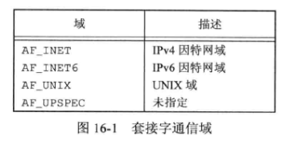
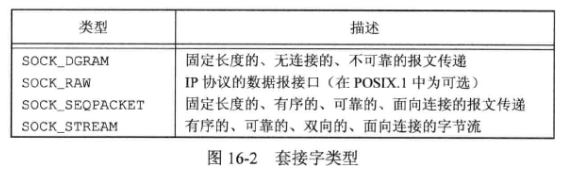
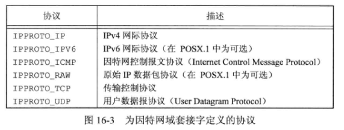
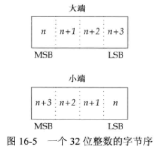

# 16 - 网络IPC:套接字

## 1. 网络 IPC

**经典进程间通信机制** （ **IPC** ）：管道、**FIFO** 、消息队列、信号量和共享存储，允许在同一台计算机上运行的进程之间通信 。

**网络进程间通信** 是不同计算机（通过网络连接）上的进程相互通信的机制 。（也可用于计算机内通信）

## 2. 套接字描述符

**套接字** 是通信端点的抽象，应用程序用 **套接字描述符** 访问套接字 。套接字描述符在 UNIX 系统中被当作是一种文件描述符 。

使用 **socket** 函数 **创建** 一个套接字：

```c
#include <sys/socket.h>
int socket(int domain, int type, int protocol);
//返回值：若成功，返回套接字描述符；若出错，返回 -1
```

参数 $domain$ （ 域 ）确定通信的特性，表示各个域的常数都以 `AF_` 开头，意指 **地址族**：



参数 $type$ 确定套接字的类型，进一步确定通信特征：



参数 $protocol$ 通常是 $0$ ，表示为给定的域和套接字类型选择默认协议 。当对同一域和套接字类型支持多个协议时，使用 $protocol$ 选择一个特定协议 ：



`AF_INET` 通信域中，套接字类型 `SOCK_STREAM` 默认协议是 **TCP** ，要求在交换数据之前，在本地和通信的对等进程之间建立一个 **逻辑连接** ，提供面向连接的字节流服务 ；套接字类型 `SOCK_DGRAM` 默认协议是 **UDP** ，两个对等进程之间通信时不需要逻辑连接 。

**流控制传输协议 (SCTP)** 提供了因特网域上的顺序数据包服务。（ `SOCK_SEQPACKET` ）

`SOCK_RAW` 套接字提供一个数据报接口，用于直接访问下面的 **网络层 ( IP层 )** 。使用这个接口时，应用程序负责构造自己的协议头部 。

不再需要套接字时，使用 **close** 函数 **关闭对套接字的访问** ，并且释放该描述符以便重新使用 。

套接字通信是双向的 ，可以采用 **shutdown** 函数来禁止一个套接字的 **I/O**：

```c
#include <sys/socket.h>
int shutdown(int sockfd, int how);
//返回值：若成功，返回 0；若出错，返回 -1
```

如果 $how$ 是 `SHUT_RD` （关闭读端），那么无法从套接字读取数据；如果 $how$ 是 `SHUT_WR` （关闭写端），那么无法使用套接字发送数据 ；如果 $how$ 是 `SHUT_RDWR` ，则既无法读取数据，又无法发送数据 。

**使用 shutdown 的原因**：

- 只有最后一个文件描述符引用被关闭时，**close** 才释放网络端点；而 **shutdown** 允许使一个套接字处于不活动状态，和引用它的文件描述符数目无关
- 可以很方便地关闭套接字双向传输中的一个方向

## 3. 寻址

**进程标识** 用于标识一个目标通信进程 。它由两部分组成：

- **计算机的网络地址**：用于标识网络上我们想与之通信的计算机
- 该计算机上用 **端口号** 表示的服务，它可以帮助标识特定的进程

### 3.1 字节序

**字节序** 是一个处理器架构特性，用于指示像整数这样的大数据类型内部的字节如何排序 ：

- **大端字节序**：最大字节地址出现在数据最低有效字节（ **LSB** ）上
- **小端字节序**：最小字节地址出现在数据最低有效字节上

最高有效字节（ **MSB** ）总是在左边，最低有效字节（ **LSB** ）总是在右边 。



网络协议指定了字节序，因此异构计算机系统能够交换协议信息而不会被字节序所混淆 。

**TCP/IP** 协议栈使用大端字节序，有 $4$ 个用来在处理器字节序和网络字节序之间实施转换的函数：

```c
#include <arpa/inet.h>
unit32_t htonl(uint32_t hostint32);	//返回：以网络字节序表示的 32 位整数
unit64_t htons(uint16_t hostint16);	//返回：以网络字节序表示的 16 位整数
unit32_t ntohl(uint32_t netint32);	//返回：以主机字节序表示的 32 位整数
unit16_t ntohs(uint16_t netint16);	//返回：以主机字节序表示的 16 位整数
```

### 3.2 地址格式

一个地址标识一个特定通信域的套接字端点 。为使不同地址格式能够传入到套接字函数，地址会被强制转换成一个通用的地址结构：

```c
struct sockaddr {
    sa_family_t		sa_family;	// address family
    char			sa_data[];	// variable-length address
    //...
};
```

**因特网地址** 定义在 `<netinet/in.h>` 头文件中 。在 **IPv4** 因特网域（ `AF_INET` ）中，套接字地址用结构 **sockaddr_in** 表示：

```c
struct in_addr {
    in_addr_t		s_addr;	// IPv4 address
};
struct sockaddr_in {
    sa_family_t		sin_family;	// address family
    in_port_t		sin_port;	// port number
    struct in_addr 	sin_addr;	// IPv4 address
};
```

**IPv6** 因特网域（ `AF_INET6` ）套接字地址用结构 **sockaddr_in6** 表示 。**sockaddr_in** 与 **sockaddr_in6** 结构相差比较大，但它们均被强制转换成 **sockaddr** 结构输入到套接字例程中 。

**inet_ntop** 函数和 **inet_pton** 函数完成 **二进制地址格式与点分十进制字符表示 (a.b.c.d)** 之间的相互转换：

```c
#include <arpa/inet.h>
const char *inet_ntop(int domain, const void *restrict addr,
                     char *restrict str, socklen_t size);
//将网络字节序的二进制地址转换成文本字符串格式
//返回值：若成功，返回地址字符串指针；若出错，返回 NULL
int inet_pton(int domain, const char *restrict str, void *restrict addr);
//将文本字符串格式转换成网络字节序的二进制地址
//返回值：若成功，返回 1；若格式无效，返回 0；若出错，返回 -1
```

$domain$ 参数仅支持两个支持值：`AF_INET` 和 `AF_INET6` 。

### 3.3 地址查询

**getaddrinfo** 函数允许 **将一个主机名和一个服务名映射到一个地址**：

```c
#include <sys/socket.h>
#include <netdb.h>
int getaddrinfo(const char *restrict host, const char *restrict service,
               	const struct addrinfo *restrict hint, struct addrinfo **restrict res);
//返回值：若成功，返回 0；若出错，返回非 0 错误码
```

需要提供 **主机名** 、**服务名** ，或者两者都提供 。如果只提供一个名字，则另一个必须是一个空指针 。

参数 $res$ 为返回值 ，是一个链表结构 **addrinfo** 。

$hint$ 是一个用于过滤地址的模板 。

**getnameinfo** 函数 **将一个地址转换成一个主机名和一个服务名**：

```c
#include <sys/socket.h>
#include <netdb.h>
int getnameinfo(const struct sockaddr *restrict addr, socklen_t alen,
               char *restrict host, socklen_t hostlen,
               char *restrict service, socklen_t servlen, int flags);
//返回值：若成功，返回 0；若出错，返回 非0值
```

套接字地址（ $addr$ ）被翻译成一个主机名和一个服务名 。如果 $host$ 非空，则指向一个长度为 $hostlen$ 的缓冲区用于存放返回的主机名；如果 $service$ 非空，则指向一个长度为 $servlen$ 字节的缓冲区用于存放返回的主机名 。

### 3.4 套接字与地址关联

使用 **bind** 函数来 **关联地址和套接字** ：

```c
#include <sys/socket.h>
int bind(int sockfd, const struct sockaddr *addr, socklen_t len);
//返回值：若成功，返回 0；若出错，返回 -1
```

对于因特网域，如果指定 **IP** 地址为 `INADDR_ANY` ，套接字端点可以被绑定到所有的系统网络接口上 。

可以调用 **getsockname** 函数来 **发现绑定到套接字上的地址**：

```c
#include <sys/socket.h>
int getsockname(int sockfd, struct sockaddr *restrict addr, socklen_t *restrict alenp);
//返回值：若成功，返回 0；若出错，返回 -1
```

返回时，$alenp$ 指向的整数会被设置成返回地址的大小 。

如果套接字已经 **和对等方连接** ，可以调用 **getpeername** 函数来找到对方的地址：

```c
#include <sys/socket.h>
int getpeername(int sockfd, struct sockaddr *restrict addr, socklen_t *restrict alenp);
//返回值：若成功，返回 0；若出错，返回 -1
```

## 4. 建立连接

如果处理一个 **面向连接** 的网络服务（ `SOCK_STREAM` 或 `SOCK_SEQPACKET` ），那么在开始交换数据之前，需要在请求服务的进程套接字（客户端）和提供服务的进程套接字（服务器）之间建立一个连接 。

使用 **connect** 函数来建立连接：

```c
#include <sys/socket.h>
int connect(int sockfd, const struct sockaddr *addr, socklen_t len);
//返回值：若成功，返回 0；若出错，返回 -1
```

在 **connect** 中指定的地址是我们想与之通信的服务器地址 。如果 $sockfd$ 没有绑定到一个地址， **connect** 会给调用者绑定一个默认地址 。

若套接字处于 **非阻塞模式** ，那么在连接不能马上建立时，**connect** 会返回 $-1$ 并将 **errno** 设置为特殊的错误码 `EINPROGRESS` 。应用程序可以使用 **poll** 或者 **select** 来判断套接字描述符何时 **可写** ，如果可写 ，连接完成 。

**注**：**connect** 函数还可以用于无连接的网络服务（ `SOCK_DGRAM` ），传送的报文的目标地址会设置成 **connect** 调用中指定的地址，这样每次传送报文时就不需要再提供地址 。另外，仅能接收来自指定地址的报文 。

服务器调用 **listen** 函数来宣告它 **愿意接收连接请求**：

```c
#include <sys/socket.h>
int listen(int sockfd, int backlog);
//返回值：若成功，返回 0；若出错，返回 -1
```

参数 $backlog$ 提供了一个提示，提示系统该进程要入队的未完成连接请求数量 。

一旦服务器调用了 **listen** ，所用的套接字就能接收连接请求 。使用 **accept** 函数获得连接请求并建立连接：

```c
#include <sys/socket.h>
int accept(int sockfd, struct sockaddr *restrict addr, socklen_t *restrict len);
//返回值：若成功，返回套接字描述符；若出错，返回 -1
```

函数 **accept** 返回的文件描述符是套接字描述符，该描述符连接到调用 **connect** 的客户端 。这个新的套接字描述符和原始套接字 $sockfd$ 具有相同的套接字类型和地址族 。传给 **accept** 的原始套接字没有关联到这个连接，而是 **继续保持可用状态并接收其他连接请求**  。

若不关心客户端标识，可以将 $addr$ 和 $len$ 设为 **NULL** 。否则，在调用 **accept** 之前，将 $addr$ 参数设为足够大的缓冲区来存放地址，并且将 $len$ 指向的整数设为这个缓冲区的字节大小 。返回时，**accept** 会在缓冲区填充客户端的地址，并且更新指向 $len$ 的整数来反映该地址的大小 。

如果没有连接请求在等待，**accept** 会阻塞直到一个请求到来 。如果 $sockfd$ 处于非阻塞模式，**accept** 会返回 $-1$ ，并将 **errno** 设置为 `EAGAIN` 或 `EWOULDBLOCK` 。

服务器可以使用 **poll** 或者 **select** 来等待一个请求的到来 。这种情况下，一个带有等待连接请求的套接字（服务器的）会以 **可读** 的方式出现 。   

## 5. 数据传输

### 5.1 发送数据的函数 

**send** 函数：

```c
#include <sys/socket.h>
ssize_t send(int sockfd, const void *buf, size_t nbytes, int flags);
//返回值：若成功，返回发送的字节数；若出错，返回 -1
```

使用 **send** 时套接字必须 **已经连接** 。

**send** 成功 **返回** 时，数据已被无错误地发送到 **网络驱动器** 上，并不表示连接的另一端的进程就一定接受了数据 。

对于 **支持报文边界** 的协议，如果尝试发送的单个报文的长度超过协议所支持的最大长度，那么 **send** 会失败，并将 **errno** 设为 `EMSGSIZE` 。对于 **字节流** 协议，**send** 会阻塞直到整个数据传输完成 。

**sendto** 函数可以在 **无连接** 的套接字上指定一个 **目标地址**：

```c
#include <sys/socket.h>
ssize_t sendto(int sockfd, const void *buf, size_t nbytes, int flags,
              const struct sockaddr *destaddr, socklen_t destlen);
//返回值：若成功，返回发送的字节数；若出错，返回 -1
```

还可以调用带有 **msghdr** 结构的 **sendmsg** 来 **指定多重缓冲区传输数据**：

```c
#include <sys/socket.h>
ssize_t sendmsg(int sockfd, const struct msghdr *msg, in flags);
//返回值：若成功，返回发送的字节数；若出错，返回 -1
```

### 5.2 接收数据的函数

**recv** 函数：

```c
#include <sys/socket.h>
ssize_t recv(int sockfd, void *buf, size_t nbytes, int flags);
//返回值：返回数据的字节长度；若无可用数据或对等方已经按序结束，返回 0；若出错，返回 -1
```

如果发送者已经调用 **shutdown** 来结束传输，或者网络协议支持按默认的顺序关闭并且发送端已经关闭，那么当所有的数据接收完毕后，**recv** 会返回 $0$ 。

使用 **recvfrom** 可以 **得到数据发送者的地址**：

```c
#include <sys/socket.h>
ssize_t recvfrom(int sockfd, void *restrict buf, size_t len, int flags,
                struct sockaddr *restrict addr, socklen_t *restrict addrlen);
//返回值：返回数的字节长度；若无可用数据或对等方已经按序结束，返回 0；若出错，返回 -1
```

**recvfrom** 通常用与无连接的套接字 。

为了将接收到的数据送入 **多个缓冲区** ，或者想接收辅助数据，可以使用 **recvmsg**：

```c
#include <sys/socket.h>
ssize_t recvmsg(int sockfd, struct msghdr *msg, int flags);
//返回值：返回数的字节长度；若无可用数据或对等方已经按序结束，返回 0；若出错，返回 -1
```

**recvmsg** 用 **msghdr** 结构指定接收数据的输入缓冲区 。

## 6. 带外数据

**带外数据** 允许更高优先级的数据传输 。带外数据 **先行传输** ，即使传输队列已经有数据 。**TCP** 支持带外数据，但是 **UDP** 不支持 。

**TCP** 将带外数据称为 **紧急数据** ，仅支持一个字节的紧急数据，但是允许紧急数据在普通数据传递机制数据流之外传输 。


