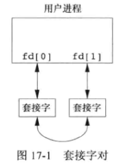
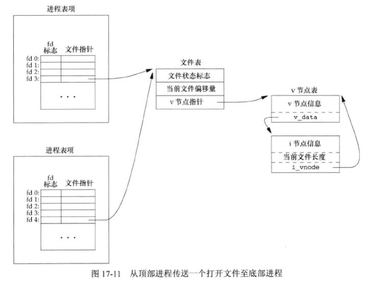

# 17 - 高级进程间通信

## 1. UNIX 域套接字

**UNIX 域套接字** 用于在同一台计算机上运行的进程之间的通信 ，它可以在同一计算机系统上运行的两个进程之间传送打开的文件描述符 。

**UNIX 域套接字** 仅仅 **复制数据** ，它们并不执行协议处理，不需要添加或删除网络报头，无需计算校验和，不要产生顺序号，无需发送确认报文 。所以比 **因特网域套接字** 效率更高 。

**UNIX 域套接字** 提供流和数据报两种接口 。**UNIX 域数据报服务** 是可靠的，既不会丢失报文，也不会传递出错 。

**UNIX 域套接字** 就像是套接字和管道的混合 。可以使用它们面向网络的域套接字接口或使用 **socketpair** 函数来创建一对 **无名的** 、**相互连接** 的 **UNIX 域套接字**：

```c
#include <sys/socket.h>
int socketpair(int domain, int type, int protocol, int sockfd[2]);
//返回值：若成功，返回 0；若出错，返回 -1
```

一对相互连接的 **UNIX 域套接字** 可以起到 **全双工管道** 的作用：两端对读和写开放 。将其称为 **fd 管道** ，以便与普通的半双工管道区分开来 。



可以 **命名** UNIX 域套接字（即将套接字与一个地址绑定） ，并可将其用于告示服务 。UNIX 域 套接字的地址由 **sockaddr_un** 结构表示：

```c
struct sockaddr_un {
    sa_family_t sun_family;		// AF_UNIX
    char sun_path[108];			// pathname
};
```

**sockaddr_un** 的 **sun_path** 成员名包含一个路径名 。当我们将一个 **地址** 绑定到一个 **UNIX 域套接字** 时，系统会用该路径名创建一个 `S_IFSOCK` 类型的文件 。

如果试图绑定同一个地址时，该文件已经存在，那么 **bind** 请求会失败 。当关闭套接字时，并不自动删除该文件，所以必须确保在应用程序退出前，对该文件执行解除链接操作 。

## 2. 唯一连接

服务器进程可以使用标准 **bind** 、**listen** 和 **accept** 函数，为客户进程安排一个 **唯一UNIX 域连接** 。客户进程使用 **connect** 与服务器进程联系 。在服务器进程接受了 **connect** 请求后，在服务器进程和客户进程之间就存在了 **唯一连接** 。（ 此操作与因特网域套接字操作相同 ）

## 3. 传送文件描述符

 使用 **UNIX 域套接字** 可以是一个进程（通常是服务器进程）能够处理打开一个文件所要做的一切操作 以及向调用进程送回一个描述符，该描述符可被用于以后的所有 I/O 函数 。

当两个 **独立进程** 打开同一文件时，虽然它们共享同一个 **v 节点** ，但每个进程都有它自己的 **文件表项** 。当一个进程向另一个进程传送一个打开文件描述符时，发送进程和接收进程共享同一文件表项（ 与 **fork** 之后父子进程共享打开文件表情况相同 ）：



当发送进程将描述符传送给接收进程后，通常会关闭该描述符 。发送进程拿关闭该描述符并不会真的关闭该文件或设备，其原因是该描述符仍被视为由接收进程打开（ 即使接收进程尚未接收到该描述符 ）。


