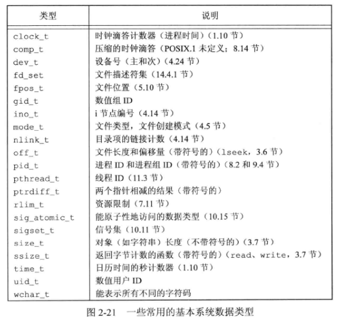

# 2 - UNIX标准及实现

## 1. POSIX 标准

**POSIX** 指的是 **可移植操作系统系统接口 (Portable Operating System Interface)** ，是一个最初由 **IEEE** 制定的标准族。

与本书相关的是 **1003.1** 操作系统接口标准，该标准的目的是提升应用程序在各种UNIX系统环境之间的可移植性。**1003.1** 以UNIX操作系统为基础，但它并不限于UNIX和UNIX类的系统。

**POSIX.1** 的限制和常量大多有的定义在 `<limits.h>` 头文件中，有的没有定义，因为：一个给定进程的实际值可能依赖于系统的存储总量。如果没有在头文件中定义它们，则不能在编译时使用它们作为数组边界。所以，**POSIX.1** 提供了 $3$ 个运行时函数以供调用，分别是：**sysconf** 、**pathconf** 和 **fpathconf** 。使用这三个函数可以在运行时得到实际的实现值。

## 2. 基本系统数据类型

某些UNIX系统变量已与某些C数据类型联系在一起，头文件 `<sys/types.h>` 中定义了某些与实现有关的数据类型，被称为 **基本系统数据类型 (primitive system data type)** 。在头文件中，这些数据类型都是用C的 `typedef` 来定义的。它们绝大多数都以 `_t` 结尾。

