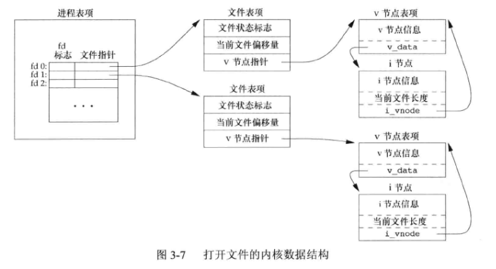
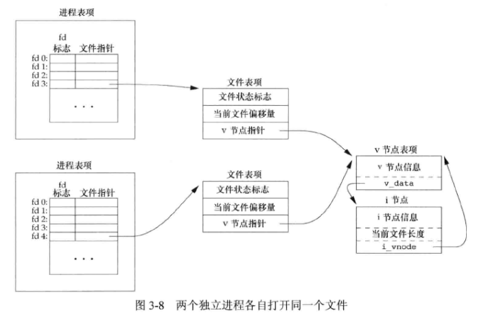
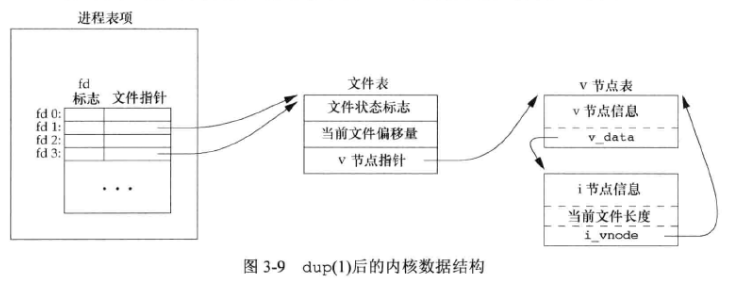

# 3 - 文件I/O

## 1. 文件描述符

对于内核而言，所有打开的文件都通过 **文件描述符 (file descriptor)** 引用。当打开一个现有文件或创建一个新文件时，内核向进程返回一个文件描述符。当读、写一个文件时，使用 `open` 或 `creat` 返回的文件描述符标识该文件，将其作为参数传送给 `read` 或者 `write` 。

UNIX系统shell把 **文件描述符** $0$ 与进程的标准输入（ `STDIN_FILENO` ）关联，**文件描述符** $1$ 与标准输出（ `STDOUT_FILENO` ）关联，**文件描述符** $2$ 与标准错误关联（ `STDERR_FILENO` ）。这些常量在头文件 `<unistd.h>` 中定义。

## 2. 函数 open 和 openat

调用 `open` 或 `openat` 函数可以打开或创建一个文件。

```c++
#include <fcntl.h>
int open(const char *path, int oflag, .../*mode_t mode*/);
int openat(int fd, const char *path, int oflag, .../*mode_t mode*/);
```

**返回值** ：若成功，则返回文件描述符（最小的未用描述符数值）；若失败，fanhui $-1$ 。

**oflag 参数** ：

- `O_RDONLY` ：只读打开，定义为 $0$
- `O_WRONLY` ：只写打开，定义为 $1$
- `O_RDWR` ：读、写打开，定义为 $2$
- `O_APPEND` ：每次都追加到文件尾端
- `O_SYNC` ：使每次 `write` 等待物理 `I/O` 操作完成，包括由该 `write` 操作引起的文件属性更新所需的 `I/O` 。（数据和属性总是同步更新）
- `O_TRUNC` ：如果此文件存在，而且为只写或读-写成功打开，则将其长度截断为0

**open 与 openat** 函数关联：

1. $path$ 参数指定的是绝对路径名，在这种情况下，$fd$ 参数被忽略，`openat` 函数相当于 `open` 函数。
2. $path$ 参数指定的是相对路径名，$fd$ 参数指出了相对路径名在文件系统中的开始地址。$fd$ 参数是通过打开相对路径名所在的目录来获取。
3.  $path$ 参数指定了相对路径名，$fd$ 具有特殊值 `AT_FDCWD` 。在这种情况下，路径名在当前工作目录中获取，`openat` 函数在操作上与 `open` 函数类似。

**openat** 函数作用：

1. 让线程可以使用相对路径名打开目录中的文件，而不再只能打开当前工作目录
2. 避免 **TOCTTOU (time-of-check-to-time-of-use) 错误** （若有两个基于文件的函数调用，第二个依赖于第一个调用的结果，则这两个调用不具备原子性，两个函数调用之间文件改变，会导致第一个函数调用结果无效）。**[解决原理](https://www.cnblogs.com/liqiuhao/p/9450093.html)**：防止在用相对路径使用访问文件时，不同进程/线程对文件夹访问的竞争。

## 3. 函数 create

可以调用 `create` 函数创建一个新文件。

```c++
#include <fcntl.h>
int create(const char *path, mode_t mode);
```

**返回值** ：若成功，返回为只写打开的文件描述符；若失败，返回 $-1$ 。

此函数等效于：`open(path, O_WRONLY | O_CREAT | O_TRUNC, mode);` ，不需要单独的 `create` 函数。

**缺点**：只能以只写方式打开所创建的文件，必须先调用 `create` 、`close` 再调用 `open` 才可以读新创建的文件。（可用 `open(path, O_RDWR | O_CREAT | O_TRUNC, mode);` 代替）

## 4. 函数 close

可调用 `close` 函数关闭一个打开文件。

```c++
#include <unistd.h>
int close(int fd);
```

**返回值**：若成功，返回 $0$ ；若失败，返回 $-1$ 。

关闭一个文件时还会释放该进程加在该文件上的所有记录锁。

当一个进程终止时，内核会自动关闭它所有的打开文件。

## 5. 函数 lseek

**当前文件偏移量 (current file offset)** 通常是一个非负整数，用以度量从文件开始处计算的字节数。通常，读、写操作都从当前文件偏移量处开始，并使偏移量增加所读写的字节数。按系统默认的情况，当打开一个文件时，除非指定 `O_APPEND` 选项，否则该偏移量被设置为 $0$ 。

可调用 `lseek` 函数显示地为一个打开文件设置偏移量。

```c++
#include <unistd.h>
off_t lseek(int fd, off_t offset, int whence);	//Linux上 off_t 字节数为8
```

**返回值**：若成功，返回新的文件偏移量；若失败，返回 $-1$ （若 $fd$ 指向的是一个管道、FIFO或者网络套接字，则函数返回 $-1$ ，并将 **errno** 设置为 `ESPIPE` ）。

**参数 whence** ：

- 若 $whence$ 是 `SEEK_SET` ( $0$ )，则将该文件的偏移量设置为距文件开始处 $offset$ 个字节
- 若 $whence$ 是 `SEEK_CUR` ( $1$ )，则将该文件的偏移量设置为其当前值加 $offset$ ，$offset$ 可为正或负
- 若 $whence$ 是 `SEEK_END` ( $2$ )，则将该文件的偏移量设置为文件长度加 $offset$ ，$offset$ 可正可负

**确定打开文件的当前偏移量** ：

```c++
off_t curpos;
curpos = lseek(fd, 0, SEEK_CUR);
```

## 6. 函数 read

调用 `read` 函数从打开文件中读数据。

```c++
#include <unistd.h>
ssize_t read(int fd, void *buf, size_t nbytes);
```

**返回值**：读到的字节数，若已到文件尾，返回 $0$ ；若失败，返回 $-1$ 。

返回值必须是一个带符号整型 ( `ssize_t` )，以保证能够返回正整数字节数、$0$ (表示文件尾端) 或 $-1$ (出错) 。

读操作从文件的当前偏移量处开始，在成功返回之前，该偏移量将增加实际读到的字节数。

## 7. 函数 write

调用 `write` 函数向打开文件写数据。

```c++
#include <unistd.h>
ssize_t write(int fd, const void *buf, size_t nbytes);
```

**返回值**：若成功，返回已写的字节数；若出错，返回 $-1$ 。

对于普通文件，写操作从文件的当前偏移量处开始。如果在打开该文件时，指定了 `O_APPEND` 选项，则在每次写操作之前，将文件偏移量设置在文件的当前结尾处。在一次成功写之后，该文件偏移量增加实际写的字节数。

## 8. Core Dump

当程序运行的过程中异常终止或崩溃，操作系统会将程序当时的内存状态记录下来，保存在一个文件中，这种行为就叫做 **Core Dump** 。

程序的主存镜像存放在磁盘的一个文件中以便测试诊断。

## 9. 表示打开文件的三种数据结构

1. 每个进程表项包含一张打开 **文件描述符表** ，每个文件描述符占用一项。与每个文件描述符相关联的是：
   - 文件描述符标志
   - 指向一个文件表项的指针
2. 内核为所有打开文件维持一张 **文件表** 。每个文件表项包含：
   - 文件状态标志（读、写、添写、同步、非阻塞等）
   - 当前文件偏移量
   - 指向该文件v节点的指针
3. 每个打开文件都有一个 **v节点 (v-node)** 结构。v节点包含了文件类型和对此文件进行各种操作函数的指针。对于大多数文件，v节点还包含了该文件的 **i节点 (i-node, 索引节点)** ，i节点包含了文件的所有者、文件长度、指向 文件实际数据块在磁盘上所在位置 的指针等。



**上图**：该进程有两个不同的打开文件，一个文件从标准输入（文件描述符0）打开，另一个从标准输出（文件描述符1）打开。

**v节点作用** ：创建v节点结构的目的是对在一个计算机系统上的多文件系统类型提供支持。这种文件系统称为 **虚拟文件系统** 。

Linux没有将相关数据结构分为 **i节点** 和 **v节点** ，而是采用了一个与文件系统相关的i节点和一个与文件系统无关的i节点。

## 10. 文件共享



**上图** ：两个独立进程各自打开了同一文件，每个进程都获得各自的一个文件表项，但对一个给定文件只有一个v节点表项。之所以每个进程都获得自己的文件表项，是因为这可以使每个进程都有它自己对该文件的当前偏移量。

**文件描述符标志和文件状态标志在作用范围方面的区别**：前者只用于一个进程的一个描述符，而后者则应用于指向该给定文件表项的任何进程中的所有描述符（可能会有多个文件描述符项指向同一文件表项的情况，如 fork 后，父进程、子进程各自的每一个打开文件描述符共享同一个文件表项）。

## 11. 原子操作

**原子操作 (atomic operation)** 指的是由多步组成的一个操作。如果该操作原子地执行，则要么执行玩所有步骤，要么一步也不执行，不可能只执行所有步骤的一个子集。

### 11.1 O_APPEND

`O_APPEND` 可以使 “当前文件偏移量设置到文件尾->写入数据” 成为原子操作，在多个进程共同追加一个文件时不会产生冲突。

### 11.2 函数 pread 和 pwrite

这种扩展允许原子性地定位并执行 I/O。

```c++
#include <unistd.h>
ssize_t pread(int fd, void *buf, size_t nbytes, off_t offset);
ssize_t pwrite(int fd, const void *buf, size_t nbytes, off_t offset);
```

调用 **pread** 相当于调用 **lseek** 然后调用 **read** ，但是 **pread** 又与这种顺序调用由下列重要区别：

- 调用 **pread** 时，无法中断其定位和读操作
- 不更新当前文件偏移量

调用 **pwrite** 相当于调用 **lseek** 后调用 **write** ，它们也有类似的区别。

### 11.3 创建一个文件

对 **open** 函数同时指定`O_CREATE` 和`O_EXCL` 时，将检查文件是否存在和创建文件这两个操作作为一个原子操作执行。在文件不存在时创建文件。

## 12. 函数 dup 和 dup2

这两个函数都可用来复制一个现有的文件描述符。

```c++
#include <unistd.h>
int dup(int fd);
int dup2(int fd, int fd2);
```

由 **dup** 返回的新文件描述符一定是当前可用文件描述符中的最小数值。对于 **dup2** ，可以用 $fd2$ 参数指定新描述符的值，若 $fd2$ 已经代开，则现将其关闭。如若 $fd$ 等于 $fd2$ ，则 **dup2** 返回 $fd2$ ，而不关闭它。

这些函数返回的新文件描述符与参数 $fd$ 共享同一个文件表项，所以它们共享同一个文件状态标志（读、写、追加等）以及同一当前文件偏移量。



 

新描述符的执行时关闭 (close-on-exec) 标志总是由 **dup** 函数清除。

## 13. 函数 sync、fsync 和 fdatasync

传统 UNIX 系统在 **内核** 中设有 **缓冲区高速缓存或 页高速缓存** ，大多数磁盘 I/O 都通过缓冲区进行。向文件写入数据时，内核通常先将数据复制到缓冲区中，然后排入队列，再写入磁盘。这种方式被称为 **延迟写 (delayed write)** 。

以下三个函数保证磁盘上实际文件系统与缓冲区中内容保持一致：

```c++
#include <unistd.h>
void sync(void);
int fsync(int fd);
int fdatasync(int fd);	
```

**返回值**：若成功，返回 $0$ ；若出错，返回 $-1$ 。

**sync** 将所有修改过的块缓冲区排入写队列，然后就返回，不等待实际写磁盘操作结束。称为 **update** 的系统守护进程周期性地调用（一般每隔30s）**sync** 函数，定期冲洗 ( **flush** ) 内核的块缓冲区。

**fsync** 函数只对由文件描述符 $fd$ 指定的一个文件起作用，并且等待写磁盘操作结束才返回。会同步数据和文件属性。可用于数据库这样需要确保修改过的块立即写到磁盘上的数据。

**fdatasync** 函数与 **fsync** 类似，但是只影响文件的数据部分。

## 14. 函数 fcntl

`fcntl` 函数用于改变已经打开文件的属性。

```c++
#include <fcntl.h>
int fcntl(int fd, int cmd, ... /* int arg*/);
```

`fcntl` 函数有以下功能（失败使都返回 $-1$ ）：

1. **复制一个已有的描述符**（ $cmd$ = `F_DUPFD` ）：复制一个文件描述符 $fd$ ，返回新的文件描述符（未打开文件描述符中大于等于 $arg$ 的最小值），新文件描述符的 `FD_CLOEXEC` 文件描述符标志被清 $0$ 。
2. **复制一个已有的描述符**（ $cmd$ = `F_DUPFD_CLOEXEC` ）：复制文件描述符，返回新文件描述符，新文件描述符的 `FD_CLOEXEC` 被置 $1$ 。
3. **获取文件描述符标志** （ $cmd$ = `F_GETFD` ）：$fd$ 的文件描述符标志作为返回。
4. **设置文件描述符标志** （ $cmd$ = `F_SETFD` ）：设置 $fd$ 的文件描述符标志为 $arg$ 。
5. **获取文件状态标志** （ $cmd$ = `F_GETFL` ）：$fd$ 的文件状态标志作为返回。文件状态标志在 `open` 时设置。
6. **设置文件状态标志** （ $cmd$ = `F_SETFL` ）：将文件状态设置为 $arg$ 的值。
7. **获取异步I/O所有权** （ $cmd$ = `F_GETOWN` ）：获取当前接收 `SIGIO` 和 `SIGURG` 信号的进程 ID 或进程组 ID 。
8. **设置异步I/O所有权** （ $cmd$ = `F_SETOWN` ）：设置接收 `SIGIO` 和 `SIGURG` 信号的进程 ID 或进程组 ID，正的 $arg$ 指定一个进程 ID，负的 $arg$ 表示等于 $arg$ 绝对值的一个进程组 ID 。
9. **获取/设置记录锁** （ $cmd$ = `F_GETTLK` 、`F_SETTLK` 或 `F_SETTLKW` ）：$arg$ 是指向一个结构的指针。


