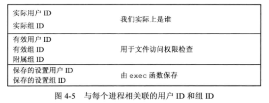
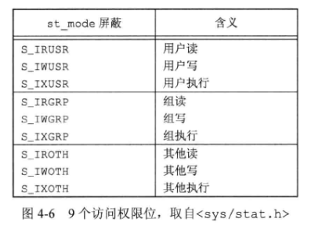
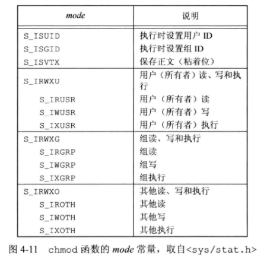
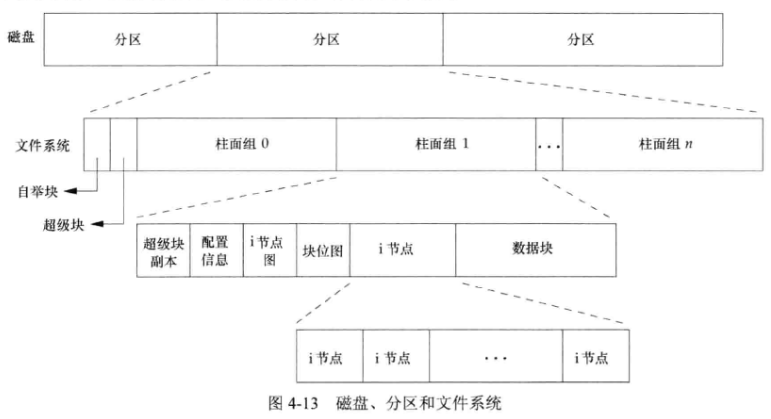
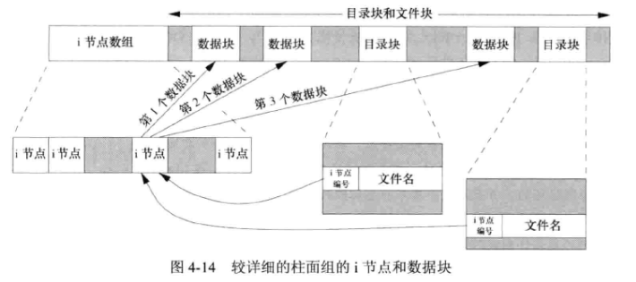
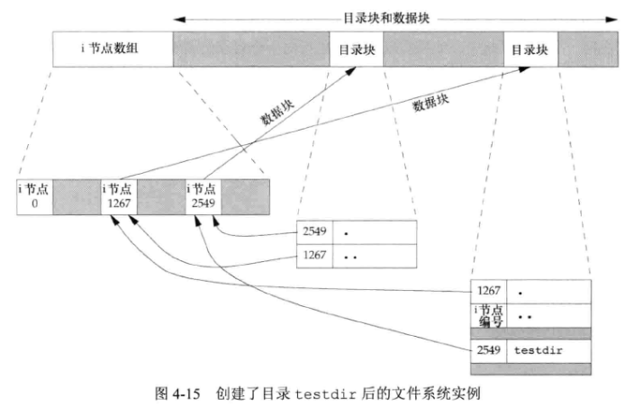
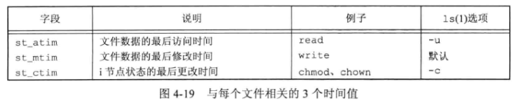
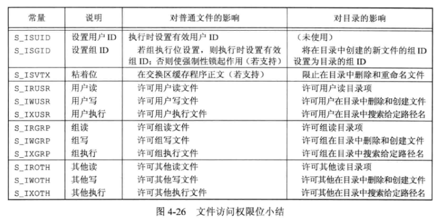

## 4 - 文件和目录

### 1. 函数 stat、fstat、fstatat 和 lstat

```c++
#inlcude <sys/stat.h>
int stat(const char *restrict pathname, struct stat *restrict buf);
int fstat(int fd, struct stat *buf);
int lstat(const char *restrict pathname, struct stat *restrict buf);
int fstatat(int fd, const char *restrict pathname, struct stat *restrict buf, int flag);
```

**stat** 函数返回与 $pathname$ 文件有关的信息结构。

**fstat** 函数获取已在文件描述符 $fd$ 上打开文件的有关信息。

**lstat** 函数在 $pathname$ 是一个符号链接时，返回该符号链接的有关信息，而不是由该符号链接引用的文件的信息。

**fstatat** 函数为相对于 $fd$ 路径的相对路径名 $pathname$ 返回文件统计信息。当 $fd$ 参数的值是 `AT_FDCWD` ，并且 $pathname$ 参数是一个相对路径名，函数会计算相对于当前目录的 $pathname$ 参数。如果 $pathname$ 是一个绝对路径，$fd$ 参数会被忽略，此函数与 **stat** 或 **lstat** 一样。$flag$ 参数控制着是否跟随一个符号链接，当 `AT_SYMLINK_NOFLLOW` 标志被设置时，函数返回符号链接本身信息，否则返回符号链接指向的文件的信息。

$buf$ 是一个指针，指向包含文件统计信息的结构体 **stat** 。

### 2. 文件类型

- **普通文件 (regular file)**：最常用的文件类型，包含了某种形式的数据。
- **目录文件 (directory file)**：这种文件包含了其他文件的名字以及指向这些文字有关信息的指针。内核可以直接写目录，进程必须通过一些函数才能更改目录。
- **块特殊文件 (block special file)**：提供对设备（如磁盘）带缓冲的访问，每次访问以固定长度为单位进行。
- **字符特殊文件 (character special file)**：提供对设备不带缓冲的访问，每次访问长度可变。系统中设备要么是字符特殊文件，要么是块特殊文件。
- **FIFO**：也称为 **命名管道 (named pipe)** ，这种类型的文件用于进程间通信。
- **套接字 (socket)**：这种类型文件用于进程间的网络通信，也可用于在一台宿主机上进程间的非网络通信。
- **符号链接 (symbolic link)**：这种类型的文件指向另一个文件。

文件类型包含在 **stat** 结构的 **st_mode** 成员中。

### 3. 设置用户ID和设置组ID

与一个 **进程** 相关联的 **ID** 如下图所示：



- **实际用户ID** 和 **实际组 ID** 标识我们究竟是谁，在一个登录会话期间这些值并不改变。
- **有效用户ID** 、**有效组ID** 以及 **附属组ID** 决定了文件访问权限。通常，有效用户ID等于实际用户ID，有效组ID等于实际组ID。但是可通过设置 **stat** 文件模式字 **st_mode** 中的 **设置用户ID位** 和 **设置组ID位** ，将进程有效用户ID设置为 **文件所有者的用户ID (st_uid)** ，将有效组ID设置为 **文件的组所有者ID (st_gid)** ，通过这种方式，若文件所有者为超级用户，可将一个进程设置为超级用户权限，无论执行此文件的进程的shiji实际用户ID是什么。
- **保存的设置用户ID** 和 **保存的设置组ID** 在执行一个程序时包含了有效用户ID和有效组ID。

### 4. 文件访问权限

**st_mode** 值包含了对所有类型文件的访问权限位，每个文件有 $9$ 个访问权限位：



**用户** 指文件所有者。**chmod** 命令用于修改这 $9$ 个权限位， `u` 表示用户、`g` 表示组，`o` 表示其他。

对于目录，**读权限** 允许读目录，获得在该目录中所有文件名的列表；**执行权限** 可以使我们通过目录（即搜索该目录，寻找一个特定的文件）。

- 用名字打开任一类型的文件时，对改名字中包含的每一个目录，包括它可能隐含的当前工作目录都应该具有 **执行权限** 。
- 是否打开文件进行读操作取决于 **读权限** 。（与 **open** 函数的 `O_RDONLY` 和 `O_RDWR` 标志相关）
- 能否打开文件进行写操作取决于 **写权限** 。（与 **open** 函数的 `O_WRONLY` 和 `O_RDWR` 标志相关）
- 为了在 **open** 函数中对一个文件指定 `O_TRUNC` 标志，必须对该文件具有 **写权限** 。
- 为了在一个目录中创建一个新文件，必须对该目录具有 **写权限** 和 **执行权限** 。
- 为了删除一个现有文件，必须对包含该文件的目录具有 **写权限** 和 **执行权限** 。
- $7$ 个 **exec** 函数中的任何一个执行某个文件，都必须对该文件具有执行权限。该文件必须是普通文件。

进程每次打开、创建或者删除一个文件时，内核就进行 **文件访问权限测试** ，涉及到 **文件拥有者 (st_uid、st_gid)** （文件性质） 、**进程有效用户ID、有效组ID、附属组ID**（进程性质）。

**文件访问测试流程**：

1. 若进程的有效用户ID是 $0$ （超级用户），则允许访问。
2. 若进程的有效用户ID等于文件所有者ID（也就是进程拥有了此文件），取决于文件所有者的相关权限。
3. 若进程的有效组ID或进程的附属组ID之一等于文件的组ID，取决于组的相关权限。
4. 若其他用户适当的访问权限位被设置，则允许访问；否则拒绝访问。

### 5. 新文件和目录的所有权

新文件（或新目录）的 **用户ID** 设置为进程的有效用户ID。

新文件（或新目录）的 **组ID** 取决于它 **所在的目录的设置组ID位** 是否被设置。如果该目录的这一位已经被设置，则新文件的组ID设置为 **目录的组ID** ；否则新文件的组ID设置为 **进程的有效组ID** 。

### 6. 函数 access 和 faccessat

**access** 和 **faccessat** 函数按 **实际用户ID和实际组ID** 进行访问权限测试（测试也分为四步，将有效改为实际）。

```c++
#include <unistd.h>
int access(const char *pathname, int mode);
int faccessat(int fd, const cahr * pathname, int mode, int flag);
```

**返回值**：若成功，返回 $0$ ；若出错，返回 $-1$ 。

$fd$ 作用与 **fstatat** 函数中的 $fd$ 作用相同。

$flag$ 参数可以用于改变 **faccessat** 的行为，如果 $flag$ 设置为 `AT_EACCESS` ，访问检查用的是调用进程的有效用户ID和有效组ID，而不是实际用户ID和实际组ID。

### 7. 函数 umask

当进程创建一个新文件或者新目录时，就一定会使用 **文件模式创建屏蔽字** 。**open** 和 **create** 函数都有参数 $mode$ ，它指定了新文件的访问权限位。在文件模式创建屏蔽字中 $1$ 的位，在文件 $mode$ 中的相应位一定被关闭。

**umask** 函数为进程设置文件模式创建屏蔽字，并返回之前的值。

```c++
#include <sys/stat.h>
mode_t umask(mode_t cmask);
```

### 8. 函数 chmod、fchmod 和 fchmodat

这三个函数可以更改现有文件的访问权限。

```c++
#include <sys/stat.h>
int chmod(const char *pathname, mode_t mode);
int fchmod(int fd, mode_t mode);
int fchmodat(int fd, const pathname, mode_t mode, int flag);
```

**返回值**：若成功，返回 $0$ ；若出错，返回 $-1$ 。

$flag$ 参数可以用于改变 **fchmodat** 的行为，当设设置成 `AT_SYMLINK_NOFLLOW` 标志时，**fchmodat** 不会跟随符号链接。

为了改变一个文件的权限位，进程的有效用户ID必须等于文件的所有者ID，或者该进程必须具有超级用户权限。

参数 $mode$ ：



### 9. 函数 chown、fchown、fchownat 和 lchown

下面几个函数用于更改文件的 **用户ID** 和 **组ID** （文件所有者） ,如果两个参数 $owner$ 或 $group$ 中的任意一个是 $-1$ ,则对应的ID不变。

```c++
#include <unistd.h>
int chown(const char *pathname, uid_t owner, gid_t group);
int fchown(int fd, uid_t owner, gid_t group);
int fchownat(int fd, const char *pathname, uid_t owner, gid_t group, int flag);
int lchown(const char *pathname, uid_t owner, gid_t group);
```

**返回值**：若成功，返回 $0$ ；若出错，返回 $-1$ 。

在 **符号链接** 情况下，**lchown** 和 **fchownat** （设置了 `AT_SYMLINK_NOFLLOW` 标志 ）更改符号链接本身的所有者，而不是该符号链接所指向文件的所有者。

当 `_POSIX_CHOWN_RESTRICTED` 有效时，不能更改其他用户文件的用户ID，你只可以更改你所拥有的文件的组ID，但只能改到你所属的组。

### 10. 文件中的空洞

普通文件可以包含 **空洞** ，空洞是由所设置的偏移量超过文件尾端，并写入了某些数据后造成的。

### 11. 文件截断

 以下两个函数可以用于截断文件：

```c++
#include <unistd.h>
int truncate(const char *pathname, off_t length);
int ftruncate(int fd, off_t length);
```

**返回值**：若成功，返回 $0$ ；若出错，返回 $-1$ 。

如果该文件以前的长度大于 $length$ ，则超过 $length$ 以外的数据就不再能访问；若小于，文件长度将增加，文件尾端的数据将读作 $0$ 。

### 12. 文件系统



把一个磁盘分成一个或多个 **分区** ，每个分区可以包含一个 **文件系统** ，**i 节点** 是固定长度的记录项，它包含有关文件的大部分信息。



- 每个 **i 节点** 有一个链接计数，其值是指向该i节点的目录项数。这种链接称为 **硬链接** 。只有当链接计数减少至 $0$ 时，才可删除该文件（也就是释放该文件占用的数据块）。这就是为什么“解除对一个文件的链接” 操作并不总是意味着 “释放该文件占用的磁盘块” 。这也是为什么删除一个目录项的函数被称为 **unlink** 而不是 delete。
- 另一种链接类型称为 **符号链接** ，符号链接文件的实际内容（在数据块中）包含了该符号链接所指向的文件的名字。
- **i 节点** 包含了文件有关的所有信息：文件类型、文件访问权限位、文件长度和指向文件数据块的指针文件模式创建等。**stat** 结构中的大多数信息都取自i节点。只有两项重要数据存放在目录项中：文件名和i节点编号。
- 一个 **目录项** 不能指向另一个文件系统的 i节点。
- 当在不更换文件系统的情况下为一个文件 **重命名** 时，该文件实际内容并未移动，只需构造一个指向现有i节点的 **新目录项** ，并删除老的目录项，链接计数不会改变。这就是 **mv** 的操作方式




- **叶目录 (不包含任何其他目录的目录)** 的链接计数总是 $2$ （命名该目录的目录项以及该目录中的 $.$ 项）。
- **非叶目录** 的链接计数大于等于 $3$ ，多了其子目录中的 $..$ 项。

### 13. 函数 link、linkat

**link** 和 **unlink** 函数用于创建一个指向现有文件的链接。

```c++
#include <unistd.h>
int link(const char *existingpath, const char *newpath);
int linkat(int efd, const char*existingpath, int nfd, const char *newpath, int flag);
```

**返回值**：若成功，返回 $0$ ；若出错，返回 $-1$ 。

这两个函数创建一个新目录项 $newpath$ ，引用现有文件 $existingpath$ 。若 $newpath$ 已存在，则返回出错。只创建 $newpath$ 中的最后一个分量，路径中的其他部分应当已经存在。

当现有文件是 **符号链接** 时，若 $flag$ 参数中设置了 `AT_SYMLINK_FOLLOW` 标志，就创建指向符号链接目标的链接；如果这个标志被清除了，则创建一个指向符号链接本身的链接。

很多文件系统实现不允许对于目录的硬链接，为了防止在文件系统中形成循环。（只有超级用户可以）

### 14. unlink、unlinkat 和 remove

用于删除一个现有的目录项：

```c++
#include <unistd.h>
int unlink(const char *pathname);
int unlinkat(int fd, const char *pathname, int flag);
```

这两个函数删除目录项，并将由 $pathname$ 所引用文件的链接计数减 $1$ 。如果对该文件还有其他链接，则仍可通过其他链接访问该文件的数据。如果出错，则不该对该文件做任何更改。

只有当 **链接计数到达 0** 且 **无进程打开此文件** ，此文件内容才会被删除。

$flag$ 参数 `AT_REMOVEDIR` 标志被设置时，**unlinkat** 像 **rmdir** 一样删除目录；否则与 **unlink** 执行相同操作。

如果 $pathname$ 是符号链接，那么 **unlink** 删除该符号链接，而不是删除由该链接所引用的文件。

删除目录通常应使用 $rmdir$ ，也可以用 **remove** 函数解除对一个文件或者目录的链接。对于文件，**remove** 的功能与 **unlink** 相同；对于目录，**remove** 的功能与 **rmdir** 相同。

```c++
#include <stdio.h>
int remove(const char *pathname);
```

### 15. 函数 rename 和 renameat

以下函数对文件或者目录进行 **重命名** ：

```c++
#include <stdio.h>
int rename(const char *oldname, const char *newname);
int renameat(int oldfd, const char *oldname, int newfd, const char *newname);
```

**返回值** ：若成功，返回 $0$ ；若出错，返回 $-1$ 。

如若 $oldname$ 和 $newname$ 引用符号链接，则处理的是符号链接本身，而不是它所引用的文件。

如若 $newname$ 已经存在，则调用进程对它需要有写权限（如同删除情况一样）。另外，调用进程将删除 $oldname$ 目录项，并可能要创建 $newname$ 目录项，所以它需要对包含 $oldname$ 及包含 $newname$ 的目录具有写和执行权限。

**注意** ：文件名保存在目录项中。

### 16. 符号链接

**硬链接** 直接指向文件的 i 节点，硬链接的限制有：

- 要求链接和文件位于同一文件系统中
- 只有超级用户才能创建指向目录的硬链接

**符号链接 (软链接)** 是 **对一个文件的间接指针** ，它避开了硬链接的这些限制。对符号链接以及它指向何种对象并无任何文件系统限制，任何用户都可以创建指向目录的符号链接。符号链接一般用于将一个文件或整个目录结构移到系统中的另一个位置。

当使用以名字引用文件的函数时，若该函数具有处理符号链接的功能，则其路径名参数引用由符号链接指向的文件；否则，一个路径名参数引用链接本身，而不是由该链接指向的文件。

可以用 **symlink** 和 **symlinkat** 函数创建一个符号链接：

```c++
#include <unistd.h>
int symlink(const char *actualpath, const char *sympath);
int symlintkat(const char* actualpath, int fd, const char *sympath);
```

函数创建了一个指向 $actualpath$ 的新目录项 $sympath$ 。在创建此符号链接时，并不要求 $actualpath$ 已经存在，$actualpath$ 和 $sympath$ 并不需要位于同一文件系统中。

因为 **open** 函数跟随符号链接（即open函数打开符号链接指向的文件），所以需要有一种方法打开链接本身：

```c++
#include <unistd.h>
ssize_t readlink(const char *restrict pathname, char *restrict buf, size_t bufsize);
ssize_t readlinkat(int fd, const char *restrict pathname, char *restrict buf, size_t bufsize);
```

两个函数组合了 **open** 、**read** 和 **close** 的所有操作。如果函数成功执行，则返回读入 $buf$ 的字节数。在 $buf$ 中返回的符号链接的内容不以 $null$ 字节终止。

### 17. 文件的时间



### 18. 函数 futimens、utimensat 和 utimes

一个文件的 **访问和修改时间** 可以用以下几个函数更改：

```c++
#include <sys/stat.h>
int futimens(int fd, const struct timespec times[2]);
int utimensat(int fd, const char *path, const struct timespec times[2], int flag);
#include <sys/time.h>
int utimes(const char *pathname, const struct timeval times[2]);
```

$times$ 参数的第一个元素包含访问时间，第二个元素包含修改时间。

不能对状态更改时间 **st_ctime (i 节点最近被修改的时间)** 指定一个值，因为调用这些函数时，此字段会被自动更新。

### 19. 函数 mkdir、mkdirat 和 rmdir

用函数 **mkdir** 和 **mkdirat** 函数创建目录：

```c++
#include <sys/stat.h>
int mkdir(const char *pathname, mode_t mode);
int mkdirat(int fd, const char *pathname, mode_t mode);
```

这两个函数创建一个新的空目录。其中 $.$ 和 $..$ 目录项是自动创建的。所指定的文件访问权限 $mode$ 由进程的 **文件模式创建屏蔽字** 修改。

对目录通常至少要设置一个执行权限位，以允许访问该目录中的文件名。

根据《5》中的规则来设置新目录的 **用户 ID** 和 **组 ID** 。

用 **rmdir** 函数可以删除一个空目录。空目录是只包含 $.$ 和 $..$ 这两项的目录。

```c++
#include <unistd.h>
int rmdir(const char *pathname);
```

如果调用此函数使目录的链接计数称为 $0$ ，并且也没有其他进程打开此目录，则释放此目录所占用的空间。

### 20. 读目录

对某个目录具有访问权限的任一用户都可以读该目录，只有内核才能写目录。一个目录的写权限位和执行权限位决定了在该目录中能否创建新文件以及删除文件，它们并不表示能否写目录本身。

```c++
#include <dirent.h>
DIR *opendir(const char *pathname);
DIR *fdopendir(int fd);
struct dirent *readdir(DIR *dp);
void rewinddir(DIR *dp);
int closedir(DIR *dp);
long telldir(DIR *dp);
void seekdir(DIR *dp, long loc);
```

**opendir** 和 **fopendir** 函数返回目录处理函数需要的 **DIR** 结构。

**dirent** 结构至少需要 `d_indo` 和 `d_name` 两个数据成员。

**readdir** 用于读取目录文件信息，按照目录流的方式读取。

**rewinddir** 函数用来设置参数 $dp$ 目录流目前的读取位置为原来开头的读取位置。

**telldir** 函数用于记录一个目录流的位置。

**seekdir** 函数用于设置参数 $dp$ 目录流读取位置。

 ### 21. 函数 chdir、fchdir 和 getcwd

进程调用 **chdir** 或 **fchdir** 函数可以更改当前工作目录：

```c++
#include <unistd.h>
int chdir(const char *pathname);
int fchdir(int fd);
```

因为当前工作目录是 **进程** 的一个属性，所以它只影响调用 **chdir** 的进程本身，而不影响其他进程。

函数 **getcwd** 可以得到当前工作目录完整的绝对路径：

```c++
#include <unistd.h>
char *getcwd(char *buf, size_t size);
```

该缓冲区必须有足够的长度以容纳绝对路径名再加上一个终止 $null$ 字节，否则返回出错。

### 22. 文件访问权限小结




