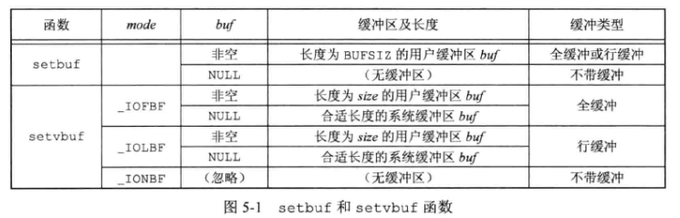
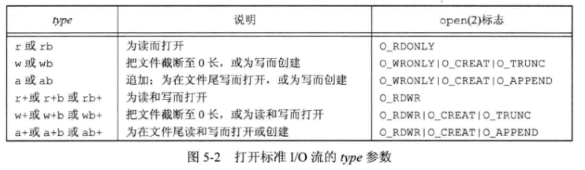

## 5 - 标准I/O库

### 1. 标准 I/O 库作用

- 缓冲区分配
- 以优化的块长度执行 **I/O** 等
- 使用户不必担心如何选择使用正确的块长度

**标准 I/O** 最终都要调用第三章中的 **I/O 例程** 。

### 2. 流和 FIFE 对象

当用 **标准 I/O** 库打开或创建一个文件时，使一个 **流** 与一个文件相关联。（类比于文件 I/O 和文件描述符）

标准 I/O 文件流可用于单字节或多字节（“宽”）字符集。**流的定向** 决定了所读、写的字符是单字节还是多字节的。本书只涉及 **字节定向流 (单字节)** 。

当打开一个流时，标准 I/O函数 **fopen** 返回一个指向 **FILE** 对象的指针（ **文件指针** ），该对象是一个结构，包含了标准 I/O 库为管理该流需要的所有信息，包括 **用于实际 I/O 的文件描述符** 、**指向用于该流缓冲区的指针** 、**缓冲区的长度** 、**当前在缓冲区中的字符数以及出错标志** 等。

为了引用流，将 **文件指针** 作为参数传递给每个标准 I/O 函数。

### 3. 标准输入、标准输出和标准错误

 对一个进程预定义三个流：**标准输入** 、**标准输出** 和 **标准错误** 。

这三个标准 I/O 流通过预定义文件指针（FILE *） **stdin** 、**stdout** 和 **stderr** 加以引用。这3个文件指针定义在头文件 `<stdio.h>` 中。

### 4. 缓冲

标准 I/O 库提供 **缓冲** 的目的是尽可能减少使用 **read** 和 **write** 调用的次数。

标准 I/O 提供了以下 3 种类型的缓冲：

1. **全缓冲**：在填满标准 I/O 缓冲区后才进行实际 I/O操作。在一个流上执行第一次 I/O 操作时，相关标准函数通常调用 **malloc** 获得需使用的缓冲区。术语 **flush** 说明标准 I/O 缓冲区的写操作，可由标准 I/O 例程自动地冲洗，也可调动 **fflush** 函数 。
2. **行缓冲**：当在输入输出中遇到换行符时，标准 I/O 库执行 I/O 操作。
3. **不带缓冲**：标准 I/O 库不对字符进行缓冲存储。

很多系统 **默认** 使用下列类型的缓冲：

- 标准错误是不带缓冲的。
- 若是指向终端设备的流，则是行缓冲的；否则是全缓冲的。

以下两个函数可以 **更改缓冲类型** ：

```c++
#include <stdio.h>
void setbuf(FILE *restrict fp, char *restrict buf);
int setvbuf(FILE *restrict fd, char *restrict buf, int mode, size_t size);
```

这些函数一定要在流已被打开后、对该流执行任何一个其他操作之前调用。



一般而言，应由系统选择缓冲区的长度，并自动分配缓冲区。在这种情况下关闭此流时，标准 I/O 将自动释放缓冲区。

**fflush** 函数可以刷新流 $fp$ 的输出缓冲区：

```c++
#include <stdio.h>
int fflush(FILE *fp);
```

`fflush(stdout)` 刷新标准输出缓冲区，把输出缓冲区里的东西打印到标准输出设备上。

`fflush(NULL)` 导致所有输出流被冲洗。

### 5. 打开流

下列三个函数 **打开一个标准 I/O 流** ：

```c++
#include <stdio.h>
FILE *fopen(const char *restrict pathname, const char *restrict type);
FILE *freopen(const char *restrict pathname, const char *restrict type, FILE *restrict fp);
FILE *fdopen(int fd, const char *type);
```

**返回值**：若成功，返回文件指针；若出错，返回 NULL 。

**fopen** 函数打开路径名为 $pathname$ 的一个指定文件。

**freopen** 函数一般用于将一个指定的文件打开为一个预定义的流：标准输入、标准输出或标准错误。

**fdopen** 函数去一个已有的文件描述符，并使一个标准的 I/O 流与该描述符相结合，一般用于创建管道和网络通信通道函数返回的描述符。



如果由多个进程用标准 I/O 用 **追加写方式** 打开同一文件，那么来自每个进程的数据都将正确地写到文件中。

调用 **fclose** 关闭一个打开的流：

```c++
#include <stdio.h>
int fclose(FILE *fp);
```

在该文件被关闭之前，冲洗缓冲中的输出数据，缓冲区中的输入数据被丢弃。如果标准 I/O 库已经为该流自动分配了一个缓冲区，则释放此缓冲区。

当一个进程 **正常终止** 时（直接调用 exit 函数，或从 main 函数返回），则所有带未写缓冲数据的标准 I/O 流都被冲洗，所有打开的标准 I/O 流都被关闭。

### 6. 读和写流

打开了流，有三种不同类型 **非格式化 I/O** 对其进行读、写操作：

1. 每次一个字符的 I/O，`getc` 、`fgetc` 、`getchar`
2. 每次一行的 I/O，`fgets` 、`fputs`
3. 直接 I/O，`fread` 、`fwrite`

**格式化 I/O** 有 **printf** 和 **scanf** 。

一次读一个字符的 **输入函数** ：

```c++
#include <stdio.h>
int getc(FILE *fp);
int fgetc(FILE *fp);
int getchar(void);
```

三个函数的 **返回值**：若成功，返回下一个字符；若已到达文件尾端或出错，返回 EOF 。

函数 **getchar** 等同于 **getc (stdin)** 。**getc** 可被实现为宏，**fgetc** 不可被实现为宏。

**EOF** 表示 **已出错** 或者 **到达文件尾端** ，是负值，一般是 $-1$ 。为了区分这两种情况，要调用 **ferror** 和 **feof** ：

```c++
#include <stdio.h>
int ferror(FILE *fp);
int feof(FILE *fp);
```

**返回值** ：若条件为真，返回 $非0$ ，否则返回 $0$ 。

为每个流在 **FILE** 对象中维护了两个标志：**出错标志** 和 **文件结束标志** 。调用 **clearerr** 函数可清除这两个标志：

```c++
#include <stdio.h>
int clearerr(FILE *fp);
```

从流中读取数据后，可调用 **ungetc** 将字符再压送回流中：

```c++
#include <stdio.h>
int ungetc(int c, FILE *fp);
```

**返回值**：若成功，返回 $c$ ，若出错，返回 **EOF** 。

压送回流中的字符以后又可从流中读出，但读出字符的顺序与压送回的顺序相反。一次只能会送一个字符。压送回时，将它们写回标准 I/O 库的缓冲区中，而非底层文件或设备上。

上述每个输入函数都对应一个 **输出函数**：

```c++
#include <stdio.h>
int putc(int c, FILE *fp);
int fputc(int c, FILE *fp);
int putchar(int c);
```

**返回值**：若成功，返回 $c$ ；若出错，返回 **EOF** 。

与输入函数一样，**putchar (c)** 等同于 **putc(c, stdout)** 。**putc** 可被实现为宏，而 **fputc** 不能实现为宏。

### 7. 每次一行 I/O

以下函数提供 **每次输入一行** 的功能：

```c++
#include <stdio.h>
char *fgets(char *restrict buf, int n, FILE *restrict fp);
char *gets(char *buf);
```

**返回值**：若成功，返回 $buf$ ；若已到达文件尾端或出错，返回 **NULL** 。

**fgets** 必须指定缓冲长度 $n$ ，此函数一直读到下一个换行符为止，但不超过 **n - 1** 个字符，读入的字符被送入缓冲区，缓冲区以 **null** 字节结尾 。

**gets** 不能指定缓冲区长度，易造成缓冲区溢出（该行长度长于缓冲区长度），所以不推荐使用。

以下两个函数提供 **每次输出一行** 的功能：

```c++
#include <stdio.h>
int fputs(const char *restrict str, FILE *restrict fp);
int puts(const char *str);
```

**返回值**：若成功，返回非负值，若出错，返回 **EOF** 。

**fputs** 将一个以 **null** 字节终止的字符串写到指定的流，尾端的终止符 **null** 不写出。

**puts** 不推荐使用，因为使用它后必须将一个换行符写到标准输出。

### 8. 二进制 I/O

为了一次读或写一个完成的结构，可以使用以下函数执行 **二进制 I/O 操作** ：

```c++
#include <stdio.h>
size_t fread(void *restrict ptr, size_t size, size_t nobj, FILE *restrict fp);
size_t fwrite(const void *restrict ptr, size_t size, size_t nobj, FILE *restrict fp);
```

$size$ 为该结构的 `sizeof` ，$nobj$ 为对象或元素个数。

**fread** 和 **fwrite** 返回读或写的对象数。对于 **读** ，如果出错或到达文件尾端，则此数字可以少于 $nobj$ ，应调用 **ferror** 或 **feof** 以判断究竟是哪一种情况；对于 **写** ，如果返回值少于 $nobj$ ，则出错。

**使用二进制 I/O** 的 基本问题是，它只能用于读在同一系统上已写的数据，不同系统之间交换二进制数据的实际解决方法是使用互认的规范格式。

### 9. 定位流

三种方法 **定位标准 I/O 流** ：

1. **ftell** 和 **fseek** 函数，文件偏移量用长整型表示。
2. **ftello** 和 **fseeko** 函数，文件偏移量用 `off_t` 表示。
3. **fgetpos** 和 **fsetpos** 函数，使用一个抽象数据类型 `fpos_t` 记录文件位置。

对于 **二进制文件** ，文件指示器从文件起始位置开始度量，以字节为度量单位，$whence$ 包括：`SEEK_SET` （从文件起始位置开始）、`SEEK_CUR`（从文件当前位置开始） 和 `SEEK_END`（从文件尾端开始） 。

对于 **文本文件** ，文件当前位置不能以简单的字节偏移量来度量。$whence$ 必须是 `SEEK_SET` ，$offset$ 只能有两种值：$0$ （后退到文件起始位置），或是对该文件的 **ftell** 所返回的值。使用 **rewind** 函数也可将一个流设置到文件的起始位置。

### 10. 格式化 I/O

#### 10.1 格式化输出

```c++
#include <stdio.h>
int printf(const char *restrict format, ...);
int fprintf(FILE *restrict fp, const char *restrict format, ...);
int dprintf(int fd, const char *restrict format, ...);
//以上三个函数返回值：若成功，返回输出字符数；若输出出错，则返回负值
int sprintf(char *restrict buf, const char *restrict format, ...);
//返回值：若成功，返回存入数组的字符数；若编码出错，返回负值
int snprintf(char *restrict buf, size_t n, const char *restrict format, ...);
//若缓冲区足够大，返回将要存入数组的字符数；若编码出错，返回负值
```

**printf** 将格式化数据写到标准输出，**fprintf** 写至指定的流，**dprintf** 写至指定的文件描述符。

**sprintf** 将格式化的字符送入数组 $buf$ 中，**sprintf** 在该数组尾端自动加一个 **null** 字节，但该字符不包括在返回值中。使用 **sprintf** 必须保证缓冲区足够大，否则会造成缓冲区溢出问题。

**snprintf** 中，缓冲区长度是一个显式参数，超过缓冲区尾端写的所有字符都被丢弃。

**格式说明** 控制其余参数如何编写，以后又如何显示。每个参数按照转换说明编写，转换说明以百分号 **% **开始。

#### 10.2 格式化输入

```c++
#include <stdio.h>
int scanf(const char *restrict format, ...);
int fscanf(FILE *restrict fp, const char *restrict format, ...);
int sscanf(const char *restrict buf, const char *restrict format, ...);
```

**scanf** 族用于分析输入字符串，并将字符序列转换成指定类型的变量。在格式之后的各参数包含了变量的地址，用转换结果对这些变量赋值。

### 11. 内存流

**标准 I/O 流** 仍使用 **FILE** 指针进行访问，但并没有底层文件。所有的 I/O 都是通过 **缓冲区** 与 **主存** 之间来回传送字节来完成的。

**fmemopen** 函数用于内存流创建：

```c++
#include <stdio.h>
FILE *fmemopen(void *restrict buf, size_t size, const char *restrict type);
```

**返回值**：若成功，返回流指针；若错误，返回 **NULL** 。

**fmemopen** 函数允许调用者提供缓冲区用于内存流；$buf$ 参数指向缓冲区的开始位置，$size$ 参数指定了缓冲区大小的字节数。如果 $buf$ 为空，**fmemopen** 函数分配 $size$ 字节数的缓冲区，在这种情况下，当流关闭时缓冲区会被释放。

**过程** ：内存流创建 -> 字符写入流 -> 流冲洗（流冲洗后缓冲区才会发生变化）

因为避免了缓冲区溢出，内存流非常适用于创建字符串。因为内存流只访问主存，不访问磁盘上的文件。所以对于把标准 I/O 流作为参数用于临时文件的函数来说，会有很大的性能提升。


