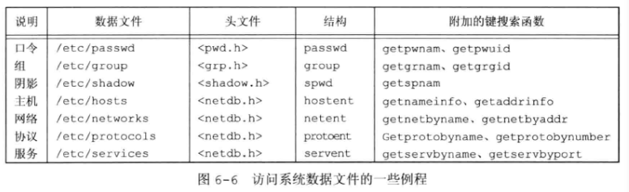

## 6 - 系统数据和文件和信息

### 1. 系统数据文件

一般情况下，对于每个数据文件至少有 $3$ 个函数：

1. **get 函数**：读下一个记录，如果需要，还会打开该文件。此种函数通常返回一个指向一个静态存储类结构的指针 。当已达到文件尾端时返回空指针。
2. **set 函数**：打开相应数据文件（如果尚未打开），然后 **rewind** 该文件。如果希望在 相应文件起始处 开始处理，则调用此函数。
3. **end 函数**：关闭相应数据文件。如前所述，在结束了对相应数据文件的读、写操作后，总应调用此函数以关闭所有相关文件。

另外如果数据文件支持某种形式的 **键搜索** ，则也提供具有指定键的记录的例程。

### 2. 网络信息服务

在很多系统中，用户和组数据库是 **网络信息服务 (NIS)** 实现的。这使管理人员可编辑数据库的主副本，然后将它自动分发到组织中的所有服务器上。客户端系统联系服务器以查看用户和组的有关信息。**NIS+** 和 **轻量级目录访问协议** 提供了类似功能。很多系统通过配置文件 `/etc/nsswitch.conf` 控制用于管理每一类信息的方法。

 