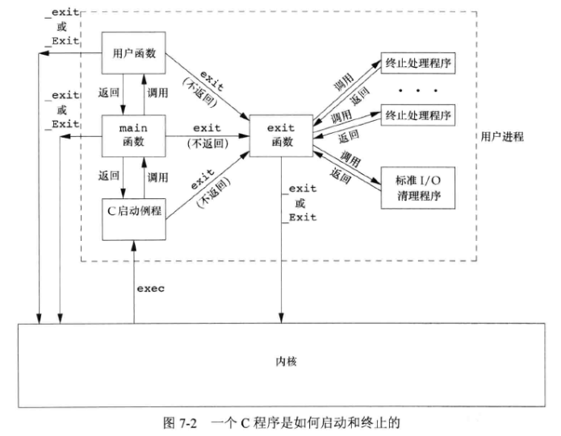
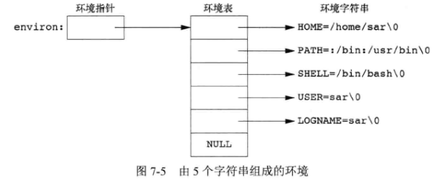
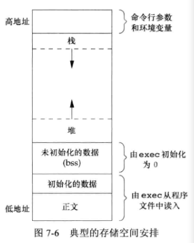

## 7 - 进程环境

### 1. main 函数

C 程序总是从 **main 函数** 开始执行：

```c++
int main(int argc, char *argv[]);
```

$argc$ 为命令行参数的数目，$argv$ 是指向参数各个指针所构成的数组。

内核使用一个 **exec 函数** 执行 C 程序，在调用 main 前先调用一个特殊的启动例程。可执行程序文件将此例程指定为程序的起始地址，启动例程在调用 main 函数前从内核获取命令行参数和环境变量值。

### 2. 进程终止

#### 2.1 终止类型 

**正常终止**：

1. 从 main 返回
2. 调用 exit
3. 调用 _exit 和 _Exit
4. 最后一个线程从启动例程返回
5. 从最后一个线程调用 pthread_exit

**异常终止**：

6. 调用 abort
7. 接到一个信号
8. 最后一个线程对取消请求做出响应

#### 2.2 退出函数

三个函数用于正常终止一个程序：

```c++
#include <stdlib.h>
void exit(int status);
void _Exit(int status);
#include <unistd.h>
void _exit(int status);
```

**exit** 函数总是执行一个标准 I/O 库的清理关闭操作：对于所有打开流调用 **fclose** 函数，这造成输出缓冲中的所有数据都被冲洗（写到文件上）。

**_exit** 和 **_Exit** 立即进入内核。

#### 2.3 atexit

由 **exit** 函数自动调用的函数是 **终止处理程序 (exit handler)** ，调用 **atexit** 函数来登记这些函数：

```c++
#include <stdlib.h>
int atexit(void (*func)(void));
```

**返回值**：若成功，返回 $0$ ；若出错，返回 $非0$ 。

**atexit** 的参数是一个函数地址。**exit** 函数调用这些函数的顺序与它们登记时候的顺序相反。同一函数如若登记多次，也会被调用多次。（ **exit** 首先调用各终止处理程序，然后关闭 (fclose) 所有打开流 ）



### 3. 环境表

每个程序都接收到一张 **环境表** ，它是一个字符指针数组，各指针指向的字符串称为 **环境字符串** 。全局变量 **environ** 为 **环境指针** ，包含了该指针数组的地址。

```c++
extern char **environ;
```



### 4. C 程序的存储空间布局

C 程序存储空间包括：

- **正文段**：这是由CPU执行的机器指令部分。通常，正文段可共享，且是只读的，以防止程序由于以外而修改其指令。
- **初始化数据段**：称为 **数据段** ，包含了程序中需要明确赋初值的变量。
- **未初始化数据段**：称为 **bss 段** ，在程序开始执行前，内核将此段中的数据初始化为 $0$ 或空指针。
- **栈**：保存自动变量（局部作用域变量）以及每次函数调用时所需保存的信息（其返回地址以及调用者的环境信息）。最近被调用的函数在栈上为其自动和临时变量分配存储空间，通过这种方式使用栈，C递归函数可以工作。
- **堆**：在堆中进行动态存储分配。

需要存储在磁盘程序文件中的段只有正文段和初始化数据段。




### 5. 共享库

- **共享库** 使得可执行文件中不再需要包含公用的库函数，而只需在所有进程都可引用的存储区中保存这种库例程的一个副本。
- 程序第一次执行或调用某个库函数时，用 **动态链接** 的方法将程序与共享库函数相链接。
- 这减少了执行文件长度，但增加了一些运行时间开销。这种开销发生在该程序第一次被执行时，或者每个共享库函数第一次被调用时。

### 6. 存储空间分配

三个用于 **存储空间动态分配** 的函数：

- **malloc**：分配指定字节数的存储区。此存储区中的初始值不确定。
- **calloc**：为指定数量指定长度的对象分配存储空间。该存储空间中的每一位 (bit) 都初始化为 $0$ 。
- **realloc**：增加或减少以前分配区的长度。当增加长度时，可能需要将以前分配区的内容移到另一个足够大的区域，以便在尾端提供增加的存储区，而新增区域内的初始值不确定。$newsize$ 是存储区的长度。

**free** 函数用于释放 $ptr$ 指向的存储空间，被释放的空间通常被送入可用存储区池。若一个进程调用 **malloc** 函数，但却忘记了调用 **free** 函数，那么该进程占用的存储空间就会连续增加，这被称为 **泄露 (leakage)** 。

```c++
#include <stdlib.h>
void *malloc(size_t size);
void *calloc(size_t nobj, size_t size);
void *realloc(void *ptr, size_t newsize);
//三个函数返回值：若成功，返回非空指针；若出错，返回 NULL
void free(void *ptr);
```


