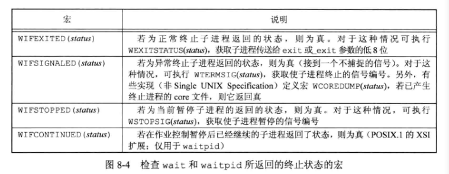
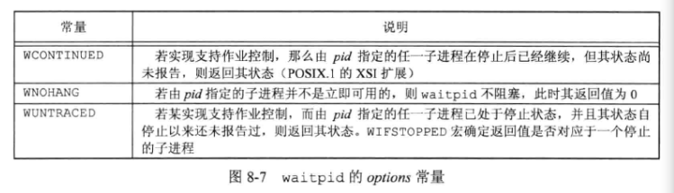
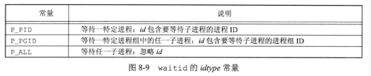
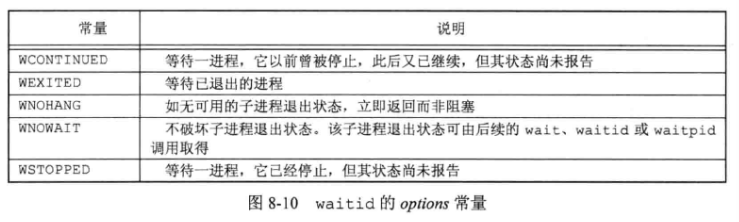
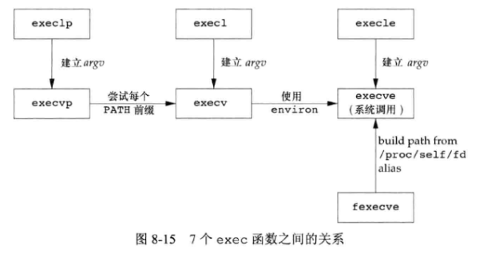
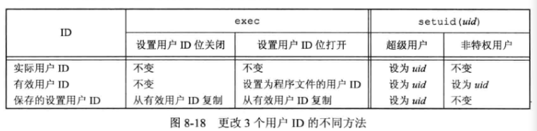
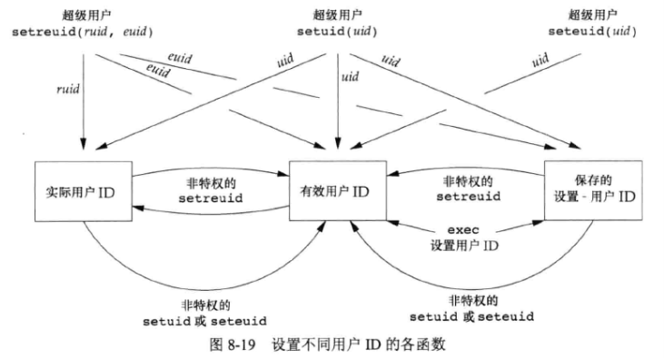

## 8 - 进程控制

### 1. 进程标识

每个进程都有一个非负整型表示的 **唯一进程 ID** 。进程 ID 是可复用的（延迟复用算法）。

ID 为 $0$ 的进程通常是调度进程，常常被称为 **交换进程 (swapper)** 。该进程是内核的一部分，它并不执行任何磁盘上的程序，因此也被称为 **系统进程** 。

ID 为 $1$ 通常是 **init** 进程，负责在自举内核后启动一个 UNIX 系统。init 进程决不会终止，它是一个普通的用户进程（不是内核中的系统进程），但它以超级用户特权运行。

**获取各种标识符** 的函数：

```c++
#include <unistd.h>
pit_t getpid(void);		//返回值：调用进程的进程ID
pid_t getppid(void);	//返回值：调用进程的父进程ID
uid_t getuid(void);		//返回值：调用进程的实际用户ID
uid_t geteuid(void);	//返回值：调用进程的有效用户ID
gid_t getgid(void);		//返回值：调用进程的实际组ID
gid_t getegid(void);	//返回值：调用进程的有效组ID
```

这些函数都没有出错返回。

### 2. 函数 fork

一个现有的进程可以调用 **fork 函数** 创建一个新进程：

```c++
#include <unistd.h>
pid_t fork(void);
```

**返回值**：子进程返回 $0$ ，父进程返回子进程ID；若出错，返回 $-1$ 。

由 **fork** 创建的新进程被称为 **子进程 (child process)** 。**fork** 函数被调用一次，但是返回两次。

**父进程返回值是子进程ID** 的原因是：一个进程的子进程可以有多个，并且没有一个函数使一个进程可以获得其所有子进程的进程ID。

**子进程返回值是 0** 的原因是：一个进程只会有一个父进程，所以子进程总是可以调用 **getppid** 以获得父进程的进程 ID 。

子进程是父进程的 **副本** 。父进程和子进程 **共享正文段** 。

**写时复制 (COW)** 技术使得子进程可与父进程共享 **数据段** 、**栈**、**堆** ，且内核将它们的访问权限改变为 **只读**　。如果父进程和子进程中的任一个试图修改这些区域，则内核只为修改区域的那块内存制作一个副本，通常是虚拟存储系统中的一 **页** 。

**clone** 系统调用允许调用者控制哪些部分由父进程和子进程共享。

**fork** 之后是父进程先执行还是子进程先执行是不确定的，取决于内核所使用的调度算法。如果要求父进程和子进程之间相互同步，则要求某种形式的 **进程间通信** 。

### 3. 文件共享

父进程所有打开 **文件描述符** 都被复制到子进程中。父进程和子进程每个相同的打开描述符 **共享一个文件表项** （所以父子进程共享一个 **文件偏移量**）。


描述符在 **fork** 前打开，之后 **处理文件描述符** 有以下两种常见情况：

- **父进程等待子进程完成**：在这种情况下，父进程无需对其描述符做任何处理。当子进程终止后，它曾进行过读、写操作的任一共享描述符的文件偏移量已做了相应更新。
- **父进程和子进程各自执行不同的程序段**：在这种情况下，在 fork 之后，父进程和子进程各自关闭它们不需要使用的文件描述符，这样就不会干扰对方使用的文件描述符。这种方法是网络服务进程经常使用的。

父进程与子进程具体 **区别**：

- fork 的返回值不同
- 进程 ID 不同
- 这两个进程的父进程 ID 不同：子进程的父进程 ID 是创建它的进程 ID，而父进程的父进程 ID 不变
- 子进程的 **tms_utime** 、**tms_stime** 、**tms_cutime** 和 **tms_ustime** 的值设置为 $0$ 
- 子进程不继承父进程设置的文件锁
- 子进程的未处理闹钟被清除
- 子进程的未处理信号集设置为空集

使用 **fork** **失败** 的两个主要原因：

- 系统中已经有了太多的进程（通常意味着某个方面出了问题）
- 该实际用户 ID 的进程总数超过了系统限制

**fork** 的两种用法：

- **一个父进程希望复制自己，使父进程和子进程执行不同的代码段** 。这在网络服务进程中是最常见的——父进程等待客户端的服务请求。当这种请求到达时，父进程调用 fork，使子进程处理此请求，父进程则继续等待下一个服务请求。
- **一个进程要执行一个不同的程序** 。这对 shell 是常见的情况。这种情况下，子进程从 fork 返回后立即调用 exec。

### 4. 函数 vfork

**vfork** 函数的调用序列和返回值与 **fork** 相同，但两者的语义不同。**vfork** 函数用于创建一个新进程，而该新进程的目的是 **exec** 一个新程序。

**vfork** 与 **fork** 区别：
bubian
- **vfork** 不将父进程的地址空间完全复制到子进程中，因为子进程会立即调用 **exec** 或 **exit** ，不过子进程在调用这两个函数之前，会在父进程的空间中运行。
- **vfork** 保证子进程先运行，在它调用 **exec** 或 **exit** 后父进程才可能被调度运行。

### 5. 函数 exit

**进程的五种正常终止方式**：

1. 在 main 函数内执行 **return** 语句，等效于调用 exit 。
2. 调用 **exit** 函数。其操作包括调用各终止处理程序（由 atexit 函数登记的），然后关闭所有标准 I/O 流等。
3. 调用 **_exit** 和 **_Exit** 函数。这两个函数无需运行终止处理程序或信号处理程序，不对标准 I/O 流进行冲洗。
4. 进程最后一个线程在其启动例程中执行 **return** 语句。此时进程以终止状态 $0$ 返回。
5. 进程的最后一个线程调用 **pthread_exit** 函数。

**进程的三种异常终止方式**：

6. 调用 **abort** ，产生 `SIGABRT` 信号。
7. 当进程接收到某些信号。信号可由进程自身（如调用abort）、其他进程或内核产生。
8. 最后一个线程对 **取消 (cancellation)** 请求做出响应。

不管进程如何终止，都会关闭所有打开描述符，释放使用的存储器等。

**终止进程如何通知其父进程是如何终止的？**

- 对于三个终止函数（**exit*、*_exit**、**_Exit**），将其退出状态作为参数传递给函数。
- 对于异常终止情况，内核（不是进程本身）产生一个指示其异常终止原因的终止状态。
- 任一情况下，父进程都通过 **wait** 或 **waitpid** 函数取得其终止状态。

**若父进程在子进程前终止，如何处理？**

通过 **init** 进程收养：对于父进程已经终止的子进程（ **孤儿进程** ），它们的父进程改变为 **init** 进程。操作过程为：在一个进程终止时，内核逐个检查所有活动进程，以判断它是否是正要终止进程的子进程，如果是，则该进程的父进程 ID 就更改为 $1$ （ init 进程的 ID）。**孤儿进程** 不会有什么危害。

**若子进程在父进程之前终止，父进程如何得到子进程终止状态？**

当终止进程的父进程调用 **wait** 或 **waitpid** 时，可以得到关于终止进程的信息，包括：进程 ID、该进程的终止状态以及该进程使用的 CPU时间总量。

**僵死进程 (zombie)** ：

一个已经终止、但是其父进bubian程尚未对其进行善后处理（获取终止子进程的有关信息、释放它仍占用的资源）的进程。僵死进程的资源不会被释放，进程 ID 也一直被占用，但是系统所能使用的进程 ID 是有限的，如果大量地产生僵死进程，将因为没有可用的进程 ID 而导致系统不能产生新的进程. 此即为僵尸进程的危害，应当避免

**一个由 init 进程收养的进程终止时会变成僵死进程吗？**

不会。因为 **init** 被编写成无论何时只要有一个子进程终止，**init** 就会调用一个 **wait** 函数取得其终止状体。这样也就防止了在系统中塞满僵死进程。

### 6. 函数 wait 和 waitpid

当一个进程正常或异常终止时，内核就向其父进程发送 `SIGCHLD` 信号。子进程终止和内核向父进程发送信号都是异步事件。

调用 **wait** 或 **waitpid** 的函数会：

- 如果其所有的子进程都还在运行，则阻塞。
- 如果一个子进程已终止，正等待父进程获取其终止状态，则取得该子进程的终止状态立即返回。
- 如果它没有任何子进程，则立即出错返回。

**wait** 和 **waitpid** 函数：

```c++
#include <sys/wait.h>
pid_t wait(int *statloc);
pid_t waitpid(pid_t pid, int *statloc, int options);
```

**返回值**：若成功，返回进程 ID；若出错，返回 $0$ 或 $-1$ 。

两个函数区别：

- 在一个子进程终止前，**wait** 使其调用者阻塞，而 **waitpid** 有一选项，可使调用者不阻塞。
- **waitpid** 可等待一个特定进程，而 **wait** 则返回任一终止子进程的状态（某一子进程终止，就立即返回）。
- **waitpid** 通过 `WUNTRACED` 和 `WCONTINUD` 选项支持作业控制。
- **wait** 唯一出错情况是没有子进程，对于 **waitpid** ，如果指定的进程或进程组不存在，或者参数 $pid$ 指定的进程不是调用进程的子进程，都可能出错。 

$statloc$ 参数是一个整型指针，终止进程的终止状态存放在它所指向的单元内。若不关心终止状态，可设为空指针。

**终止状态的宏** 定义在 `<sys/wait.h>` 中：



**waitpid** 中 $pid$ 参数bubian作用解释如下：

- $pid==-1$ ：等待任一子进程。此种情况下，**waitpid** 与 **pid** 等效。
- $pid > 0$ ：等待进程 ID 与 $pid$ 相等的子进程。
- $pid==0$ ：等待组 ID 等于调用进程组 ID 的任一子进程。
- $pid < -1$ ：等待组 ID 等于 $pid$ 绝对值的任一子进程。

**waitpid** 的 $options$ 参数或是 $0$ ，或是以下常量按位或运算的结果：




### 7. 函数 waitid

**waitid** 是另一个可以取得进程终止状态的函数，提供了更多灵活性。

```c++
#include <sys/wait.h>
int waitid(idtype_t idtype, id_t id, siginfo_t *infop, int options);
```

**返回值**：若成功，返回 $0$ ；若出错。返回 $-1$ 。

**waitid** 允许一个进程指定要等待的子进程，使用两个单独的参数表示要等待的子进程所属的类型。

$id$ 参数的作用与 $idtype$ 的值相关：



$options$ 参数是下图各标志的按位或运算，这些标志指示调用者关注哪些状态变化：



`WCONTINUED` 、`WEXITED` 或 `WSTOPPED` 这三个常量之一必须指定。

$infop$ 参数是指向 **siginfo** 结构的指针。该结构包含了造成子进程状态改变有关信号的详细信息。

### 8. 函数 wait3 和 wait4

这两个函数多了 $rusage$ 参数，允许内核返回由终止进程及其所有子进程使用的资源概况：

```c++
#include <sys/types.h>
#include <sys/wait.h>
#include <sys/time.h>
#include <sys/resource.h>

pid_t wait3(int *stbubianatloc, int options, struct rusage *rusage);
pid_t wait4(pid_t pid, int *statloc, int options, struct rusage *rusage);
```

资源统计信息包括 **用户CPU时间总量** 、**系统CPU时间总量** 、**缺页次数** 、**接收到信号的次数** 等。

### 9. 竞争条件

当多个进程都企图对共享数据进行某种处理，而最后的结果又取决于运行的顺序时，认为发生了 **竞争条件** 。

如果一个进程要 **等待其父进程终止** ，则可使用下列形式的循环：

```c++
while (getppid() != 1)
    sleep(1);
```

这种形式的循环称为 **轮询 (polling)** ，它的问题是浪费了 CPU 时间，因为调用者每隔 1s 都被唤醒，然后进行条件测试。

为 **避免竞争条件和轮询** ，在多个进程之间需要有某种形式的信号发送和接收的方法。可使用 **信号机制** 或多种形式的 **进程间通信 (IPC)** 。

### 10. 函数 exec

当进程调用一种 **exec** 函数时，该进程执行的程序完全替换为新程序，而新程序则从其 **main** 函数开始执行。因为调用 **exec** 并不创建新进程，所以前后的进程 ID 并未改变。**exec** 只是用磁盘上的一个新程序替换了当前进程的正文段、数据段、堆段和栈段。

有七种不同的 **exec** 函数可供使用，用于初始执行新的程序：

```c++
#include <unistd.h>
int execl(const char *pathname, const char *arg0, ... /* (char *)0 */);
int execv(const char *pathname， char *const argv[]);
int execle(const char *pathname, const char *arg0, ... /* (char *)0, char *const envp[] */);
int execve(const char *pathname, char *const argv[], char *const envp[]);
int execlp(const char *filename, const char *arg0, ... /* (char *)0 */);
int execvp(const char *filename, char *const argv[]);
int fexecve(int fd, char *const argv[], char *const envp[]);
```
bubian
**返回值**：若出错，返回 $-1$ ；若成功，不返回 。

**7个函数的区别** ：

1. 前四个函数以路径名作为参数，之后两个以文件名作为参数（函数名中带 **p** ），最后一个函数以文件描述符为参数。当指定 $filename$ 作为参数时，如果 $filename$ 中含有 $/$ ，将其视为路径名；否则就按 **PATH** 环境变量，在它所指定的各目录中搜寻可执行文件。
2. 参数表传递有区别，**l** 表示列表 **list** ，**v** 表示矢量 **vector** 。若使用 **列表** ，参数表以空指针结尾。若使用 **矢量** ，要先构造一个指向各参数的指针数组。
3. 与向新进程传递 **环境表** 有关。以 **e** 结尾的 $3$ 个函数（ **execle** 、**execve** 和 **fexecve** ）可以传递一个指向环境字符串指针数组的指针，其他 $4$ 个函数则使用调用进程中的 **environ** 变量为新程序复制现有的环境。

**对打开文件的处理** 与每个描述符的 **执行时关闭 (close-on-exec)** 标志值有关。进程中每个打开描述符都有一个执行时关闭标志。若设置了此标志，则在执行 **exec** 时关闭该描述符；否则该描述符仍打开。除非特定使用 **fcntl** 设置了该执行时关闭标志，否则系统的默认操作是在 **exec** 后仍保持这种描述符打开。

**在 exec 时要关闭打开目录流** ，这通常是由 **opendir** 函数实现的，它调用 **fcntl** 函数为对应于打开目录流的描述符设置执行时关闭标志。

**在 exec 前后实际用户 ID 和 实际组 ID 保持不变 ，而有效 ID 是否改变取决于所执行程序文件的设置用户 ID 位和设置组 ID 位是否设置** 。如果新程序的设置用户 ID 位已设置，则有效用户 ID 变成程序文件所有者的 ID；否则有效用户 ID 不变。对组 ID 的处理方式与此相同。

只有 **execve** 是 **系统调用** ，别的函数都是库函数，调用此系统调用，示意图为：



### 11. 更改用户 ID 和 更改组 ID

**特权** （如能改变当前日期的表示法）和 **访问控制** （如能否读、写一个特定文件），是基于 **用户 ID** 和 **组 ID** 的。在设计应用时，一般使用 **最小特权模型** 。

可使用 **setuid** 函数设置 **实际用户 ID** 和 **有效用户 ID** ：

```c++
#include <unistd.h>
int setuid(uid_t uid);
int setgid(gid_t gid);
```

**返回值**：若成功，返回 $0$ ；若出错，返回 $-1$ 。

**更改用户ID** 的规则：

- 若进程具有超级用户特权，则 **setuid** 函数将 **实际用户 ID** 、**有效用户 ID** 以及 **保存的设置用户 ID** 设置为 $uid$ 。
- 若进程没有超级用户权限，但是 $uid$ 等于实际用户 ID 或 保存的设置用户 ID，则 **setuid** 只将 **有效用户 ID** 设置为 $uid$ 。
- 若两个条件都不满足，则 **errno** 设置为 `EPERM` ，并返回 $-1$ 。

关于内核所维护的 $3$ 个用户ID，还要 **注意** ：

- 只有超级用户可以更改实际用户ID 。
- 仅当对程序文件设置了用户ID位时，exec 函数才设置有效用户 ID 。
- 保存的设置用户 ID 是由 exec 复制有效用户 ID 而得到的。如果设置了文件的设置用户ID位，则在exec根据文件的用户ID设置了进程的有效用户ID之后，这个副本就被保存起来了。



**getuid** 和 **geteuid** 函数获得实际用户ID和有效用户ID的当前值。**getresuid** 和 **getresgid** 函数分别用于获取保存的设置用户ID和保存的设置组ID。

函数 **setreuid** 和 **setregid** ：

用于设置实际用户ID为 $ruid$ ，设置有效用户ID为 $euid$ 

```c++
#include <unistd.h>
int setreuid(uid_t ruid, uid_t euid);
int setregid(gid_t rgid, gid_t egid);
```

若其中任一参数的值为 $-1$ ，则表示相应的ID应当保持不变。

函数 **seteuid** 和 **setegid** 只更改有效用户ID和有效组ID。

**下图总结了更改 3 个不同用户ID的各个函数**：



**组 ID** 相关函数用法同用户ID函数。

**保存的设置用户ID的作用**：在需要提升特权的时候，通过设置程序文件的设置用户ID而得到额外的权限。

### 12. 解释器文件

**解释器文件 (interpreter file)** 是文本文件，其起始行的形式是：

```c++
#!pathname [optional-argument]
//如: #!/bin/sh
```

$pathname$ 通常是绝对路径名。内核调用 **exec** 函数的进程执行解释器文件第一行中 $pathname$ 所指定的文件。

**优点**：

- 有些程序是用某种语言写的脚本，解释器文件可将这一事实隐藏起来。
- 解释器在脚本效率方面也提供了好处。
- 解释器脚本使我们可以使用除 `/bin/sh` 以外的其他shell来编写 shell 脚本 。

### 13. 函数 system

**system** 用于执行一个命令字符串：

```c++
#include <stdlib.h>
int system(const char *cmdstring);
```

**system** 在其实现中调用了 **fork** 、**exec** 和 **waitpid** ，因此有 $3$ 种返回值：

1. **fork** 失败或者 **waitpid** 返回除 `EINTR` 之外的出错，则 **system** 返回 $-1$ ，并且设置 **errno** 以指示错误类型。
2. 如果 **exec** 失败（表示不能执行shell），则其返回值如同 shell 执行了 **exit(127)** 。
3. 否则所有 $3$ 个函数（ **fork** 、**exec** 和 **waitpid**） 都成功，那么 **system** 返回的是 shell 的终止状态，其格式已在 **waitpid** 中说明。

使用 **system** 而不是直接使用 **fork** 和 **exec** 的优点是：**system** 进行了所需的各种出错处理以及各种信号处理。

### 14. 用户标识

系统通常记录用户登录时使用的名字，**getlogin** 函数可以获取此登录名：

```c++
#include <unistd.h>
char *getlogin(void);
```

**返回值**：若成功，返回指向登录名字字符串的指针；若出错，返回 **NULL** 。

如果调用此函数的进程（ **守护进程** ）没有连接到用户登录时所用的终端，则函数会失败。

### 15. 进程调度

**UNIX** 系统对进程提供的只是 **基于调度优先级的粗粒度的控制** ，**调度策略** 和 **调度优先级** 是由内核确定的。

进程可以通过调整 **nice** 值降低它对CPU的占有，从而降低运行优先级。只有 **特权进程** 允许提高调度权限。友好值越小，优先级越高。`NZERO` 是系统默认的友好值。

进程可以通过 **nice** 函数获取或更改它的 友好值：

```c++
#include <unistd.h>
int nice(int incr);
```

**返回值**：若成功，返回新的 **nice** 值 `NZERO` ；若出错，返回 $-1$ 。

$incr$ 参数被增加到进程的 **nice** 值上。若 $incr$ 太大，系统把它降到最大合法值；若太小，提高到最小合法值。如果 **nice** 返回 $-1$ 且 **errno** 不为 $0$ ，说明 **nice** 调用失败。

**getpriority** 函数可以用于获取一组相关进程的 **nice** 值：

```c++
#include <sys/resource.h>
int getpriority(int which, id_t who);
```

**返回值**：若成功，返回 `-NZERO~NZERO-1` 之间的 **nice** 值；若出错，返回 $-1$ 。

$which$ 参数控制 $who$ 参数是如何解释的，`PRIO_PROCESS` 表示进程，`PRIO_PGRP` 表示进程组，`PRIO_USER` 表示用户 ID。$who$ 参数选择感兴趣的一个或多个进程，如果 $who$ 参数为 $0$ ，表示调用进程、进程组或者用户（取决于 $which$ 参数的值 ）；当 $which$ 设为 `PRIO_USER` 并且 $who$ 为 $0$ 时，使用调用进程的实际用户ID；如果 $which$ 参数作用于多个进程，则返回所有作用进程中优先级最高的（最小的 **nice** 值 ）。

**setpriority** 函数可用于为进程、进程组和属于特定用户 ID 的所有进程设置优先级：

```c++
#include <sys/resources.h>
int setpriority(int which, id_t who, int value);
```

参数 $which$ 和 $who$ 与 **getpriority** 函数中相同。$value$ 增加到 `NZERO` 上，然后变为新的友好值。

**子进程从父进程中继承友好值** 。

### 16. 进程时间

可度量的时间包括 $3$ 种：**墙上时钟时间** 、**用户 CPU 时间** 和 **系统 CPU 时间** ，任一进程可以调用 **times** 函数获得它自己以及终止子进程的上述值：

```c++
#include <sys/time.h>
clock_t times(struct tms *buf);
```

**返回值**：若成功，返回流逝的 **墙上时钟时间**（以时钟滴答数为单位）；若出错，返回 $-1$ 。

$tms$ 结构为：

```c++
struct tms {
    clock_t tms_utime;	//user CPU time
    clock_t tms_stime;	//system CPU time
    clock_t tms_cutime;	//user CPU time, terminated children
    clock_t tms_cstime;	//system CPU time, terminated children
};
```

**times** 函数返回墙上时钟时间作为其函数值，此值是相对于过去某一时刻度量的，所以需要使用相对值，所有此函数返回的 **clock_t** 值都用 `_SC_CLK_TCK` 转换成秒数。


 


