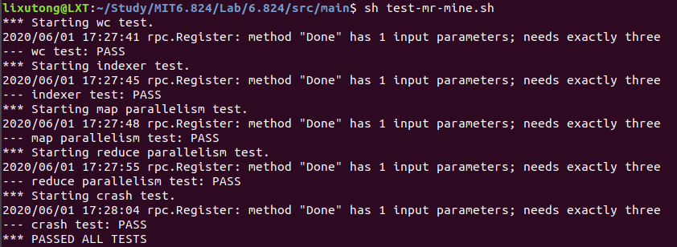

# MIT6.824 (2020) Lab1

此文是对 **MIT6.824 分布式系统 (2020)** 课程 **Lab1** 的代码设计与实现 。

**Lab1 详情页**： [6.824 Lab 1: MapReduce](https://pdos.csail.mit.edu/6.824/labs/lab-mr.html)

**源代码地址**：[GitHub](https://github.com/XutongLi/MIT6.824-Lab)

**MapReduce 个人解读**：[MapReduce 解读](https://blog.csdn.net/brianleelxt/article/details/106486025)

***

## 1. 任务

实现一个 **MapReduce** 系统，包括：

- **worker** 用于调用 **Map** 和 **Reduce** 函数，并执行文件读写
- **master** 用于调度任务给多个 **worker** 并进行容错管理

需要实现的代码位于：`mr/rpc.go` 、`mr/master.go` 和 `mr/worker.go` 。

代码中已给出了顺序版 **MapReduce** `mrsequential.go` 以及 **word count** 任务 `mrapps/wc.go` ，开始 **Lab** 前建议先把这两部分代码看一下 。

***

## 2. 设计

### 2.1 Worker

- 开启后发送 **RPC** 请求给 **master** 进行任务申请
  - 若被分配了 **map** 任务：
    - 读取输入文件内容
    - 执行 **Map** 函数
    - 将中间键值对写入临时文件
    - 开始申请下一个任务
  - 若被分配了 **reduce** 任务：
    - 读取中间文件
    - 执行 **Reduce** 函数
    - 结果写入输出文件
    - 开始申请下一个任务
  - 响应表示目前无空闲任务可以分配
    - 阻塞 **1s**
    - 重新申请任务
  - 响应表示所有任务已完成
    - **worker** 退出

### 2.2 Master

- 开启后初始化共享数据

- 等待 **worker** 的 **RPC** 请求
- **worker** 的 **RPC** 请求到来
  - 对共享数据加锁，并通过 **defer** 延迟解锁
  - 判断 **RPC** 请求中是否包含已完成任务相关信息
    - 若已完成任务为 **map** 
      - 将该 **map** 任务产生的临时中间文件重命名为正式中间文件
      - 更新该 **map** 任务状态为 `已完成`
      - 判断是否所有 **map** 任务都已完成，并存入状态变量中
    - 若已完成任务为 **reduce**
      - 更新该 **reduce** 任务状态为 `已完成`
      - 判断是否所有 **reduce** 任务都已完成，并存入状态变量中
  - 如果仍有 **map** 任务未完成
    - 判断是否有未开始的 **map** 任务或者已开始但是超时未响应的 **map** 任务
      - 若有，分配此 **map** 任务给 **worker** ，修改此任务状态为 `进行中` ，并构建 **RPC** 响应包
      - 若没有，**RPC** 响应包中的状态表示为 `等待` ，表示此时无任务可分配给 **worker**
  - 如果 **map** 任务全部完成，**reduce** 任务未全部完成
    - 判断是否有未开始的 **reduce** 任务或者已开始但是超时未响应的 **reduce** 任务
      - 若有，分配此 **reduce** 任务给 **worker** ，修改此任务状态为 `进行中` ，并构建 **RPC** 响应包
      - 若没有，**RPC** 响应包中的状态表示为等待，表示此时无任务可分配给 **worker**
  - 如果 **map** 任务和 **reduce** 任务已全部完成
    - **RPC** 响应包状态表示为 `已完成` ，通知 **worker** 退出执行

***

## 3. 实现

### 3.1 rpc.go

**worker** 进行任务申请的 **rpc** 请求包和响应包结构如下所示：

```go
type ApplyForTaskArgs struct {
	FinishedTaskType	int 	// 已完成任务的类型，0-map/1-reduce，若无已完成任务，设为-1
	FinishedIndex		int		// 已完成任务的索引，若无已完成任务，设为-1
}

type ApplyForTaskReply struct {
	Status		int		// 任务分配状态，0-分配到一个任务/1-暂无可分配任务/2-所有任务都已完成
	TaskType	int		// 若分配到任务，表示任务类型，0-map/1-reduce
	FileName	string	// 若分配到map任务，表示输入文件名
	MapIndex 	int		// 若分配到map任务，表示map任务的索引
	ReduceIndex	int 	// 若分配到reduce任务，表示reduce任务的索引
    NMap		int 	// map任务总数（输入文件数量）
	NReduce		int 	// reduce任务总数
}
```

### 3.2 master.go

首先定义相关数据结构：

```go
// 一个map任务的相关信息
type mapTaskDetail struct {
	filename  			string 			// map任务对应的输入文件名
	status				int				// map任务状态，0-未开始/1-执行中/2-已完成
	startTime			time.Time		// map任务开始时间
}
//一个reduce任务的相关信息
type reduceTaskDetail struct {
	status				int				// reduce任务状态，0-未开始/1-执行中/2-已完成
	startTime 			time.Time		// reduce任务开始时间
}
// master信息
type Master struct {
	nMap 				int				// M, map任务数（也是输入文件数）
	nReduce				int				// R, reduce任务数
	mapTask 			[]mapTaskDetail		// map任务相关信息构成的数组
	reduceTask			[]reduceTaskDetail	// reduce任务相关信息构成的数组
	allMapFinished		bool			// 若所有map已完成，为true
	allReduceFinished	bool			// 若所有reduce任务已完成，为true
	mutex				sync.Mutex		// 互斥锁
}
```

首先创建一个 **master** ，并对 **Master** 变量进行初始化，用于管理 **master** 相关信息：

```go
func MakeMaster(files []string, nReduce int) *Master {
	m := Master{}
	m.nMap = len(files)
	m.nReduce = nReduce
	m.allMapFinished = false
	m.allReduceFinished = false
	m.mapTask = make([]mapTaskDetail, m.nMap)
	for index, file := range files {
		mapDetail := mapTaskDetail{}
		mapDetail.filename = file
		mapDetail.status = 0
		m.mapTask[index] = mapDetail
	}
	m.reduceTask = make([]reduceTaskDetail, nReduce)
	for index, _ := range m.reduceTask {
		m.reduceTask[index].status = 0
	}
	m.server()
	return &m
}
```

其中在调用 `m.server()` 后，就进行了**RPC** 注册与监听，来自 **worker** 的 **RPC** 请求到来时，会开启一个 **goroutine** 来建立连接 。

**ApplyForTask** 接口实现如下所示（逻辑与 **2.设计** 中的一致）：

```go
func (m *Master) ApplyForTask(args *ApplyForTaskArgs, reply *ApplyForTaskReply) error {
	m.mutex.Lock()
	defer m.mutex.Unlock()

	if args.FinishedTaskType == 0 && m.mapTask[args.FinishedIndex].status == 1 {		// finish a map task
		renameIntermedia(args.FinishedIndex, m.nReduce)
		m.mapTask[args.FinishedIndex].status = 2
		allMapFinished := true
		for _, mapDetail := range m.mapTask {
			if mapDetail.status != 2 {
				allMapFinished = false
				break
			}
		}
		m.allMapFinished = allMapFinished

	} else if args.FinishedTaskType == 1 && m.reduceTask[args.FinishedIndex].status == 1 {	//finish a reduce task
		m.reduceTask[args.FinishedIndex].status = 2
		allReduceFinished := true
		for _, reduceDetail := range m.reduceTask {
			if reduceDetail.status != 2 {
				allReduceFinished = false
				break
			}
		}
		m.allReduceFinished = allReduceFinished
	}

	if !m.allMapFinished {
		for index, mapDetail := range m.mapTask {
			if mapDetail.status == 2 {	// finished
				continue
			} else if mapDetail.status == 1 { // processing
				timeout := m.mapTask[index].startTime.Add(10 * time.Second).Before(time.Now())
				if !timeout {
					continue
				}
			}
			// mapDetail.status == 1 && timeout  ||  mapDetail.status == 0
			m.mapTask[index].status = 1
			m.mapTask[index].startTime = time.Now()
			reply.Status = 0
			reply.NMap = m.nMap
			reply.NReduce = m.nReduce
			reply.TaskType = 0
			reply.MapIndex = index
			reply.FileName = m.mapTask[index].filename
			return nil
		}
		// no idle map tasks, but some of them are not finished
		reply.Status = 1
		return nil

	} else if m.allMapFinished && !m.allReduceFinished {
		for index, reduceDetial := range m.reduceTask {
			if reduceDetial.status == 2 {	// finished
				continue
			} else if reduceDetial.status == 1 {	// processing
				timeout := m.reduceTask[index].startTime.Add(10 * time.Second).Before(time.Now())
				if !timeout {
					continue
				}
			}
			// reduceDetail.status == 1 && timeout  ||  reduceDetail.status == 0
			m.reduceTask[index].status = 1
			m.reduceTask[index].startTime = time.Now()
			reply.Status = 0
			reply.NMap = m.nMap
			reply.NReduce = m.nReduce
			reply.TaskType = 1
			reply.ReduceIndex = index
			return nil
		}
		// no idle reduce tasks, but some of them are not finished
		reply.Status = 1
		return nil

	} else if m.allMapFinished && m.allReduceFinished {
		reply.Status = 2
		return nil
	} else {
		return errors.New("Task state is wrong")
	}
}
```

因为 **worker** 完成一个任务后就会申请下一个任务，所以在我的实现中，将 **通知已完成任务** 和 **申请新任务** 原子性地执行，可以减少 **RPC** 请求数量 。

其中，在获取到 **map** 任务的完成通知后，需要对中间临时文件重命名为正式文件：

```go
func renameIntermedia(mapIndex int, nReduce int) {
	for i := 0; i < nReduce; i += 1 {
		tempFilePrefix := fmt.Sprintf("mr-%v-%v_tmp*", mapIndex, i)
		tempFileNames, err := filepath.Glob(tempFilePrefix)
		if err != nil {
			log.Fatalf("Find temp file prefix %v error", tempFilePrefix)
		}
		if len(tempFileNames) == 0 {
			continue
		}
		maxLenFile := tempFileNames[0]
		maxLen := int64(0)
		for _, filename := range tempFileNames {
			file, err := os.Open(filename)
			if err != nil {
				log.Fatalf("Open temp file %v error", filename)
			}
			fileInfo, err := file.Stat()
			if err != nil {
				log.Fatalf("Stat temp file %v error", filename)
			}
			if fileInfo.Size() > maxLen {	// complete file has the max length
				maxLen = fileInfo.Size()
				maxLenFile = filename
			}
			file.Close()
		}
		newFileName := fmt.Sprintf("mr-%v-%v", mapIndex, i)
		os.Rename(maxLenFile, newFileName)
	}
	//log.Printf("All temp file of map %v are renamed\n", mapIndex)
}
```

### 3.2 worker.go

首先定义 **RPC** 接口调用函数：

```go
func CallApplyForTask(args ApplyForTaskArgs) (ApplyForTaskReply, error) {
	reply := ApplyForTaskReply{}
	if call("Master.ApplyForTask", &args, &reply) {
		return reply, nil
	}
	return reply, errors.New("Request Error!")
}
```

定义 **Worker** 函数，传入 **Map** 和 **Reduce** 函数，开始 **申请 - 执行任务** （逻辑与 **2.设计** 中的一致）：

```go
func Worker(mapf func(string, string) []KeyValue, reducef func(string, []string) string) {
	args := ApplyForTaskArgs{-1, -1}
	for {
		reply, err := CallApplyForTask(args)
		if err != nil {
			log.Fatal("Error: ", err)
		}
		if reply.Status == 1 {	// no idle map/reduce tasks, and  there are map/reduce tasks not finished
			time.Sleep(1000 * time.Millisecond)
			args.FinishedTaskType = -1
			args.FinishedIndex = -1
		} else if reply.Status == 2 {	// all tasks are finished, worker exit
			// fmt.Println("All tasks are finished, this worker exit")
			break
		} else if reply.Status == 0 {	// assigned a task
			if reply.TaskType == 0 {
				doMap(reply.FileName, reply.MapIndex, reply.NReduce, mapf)
				args.FinishedTaskType = 0
				args.FinishedIndex = reply.MapIndex		// continue to apply for next task when current task is finished
			} else if reply.TaskType == 1 {
				doReduce(reply.ReduceIndex, reply.NMap, reducef)
				args.FinishedTaskType = 1
				args.FinishedIndex = reply.ReduceIndex
			} else {
				fmt.Println("TaskType Error!")
				break
			}
		} else {
			fmt.Println("Status Error!")
			break
		}
	}
}
```

其中执行 **Map** 函数的函数为 **doMap** ：

```go
func doMap(filename string, mapIndex int, nReduce int, mapf func(string, string) []KeyValue) {
	filename = fmt.Sprintf("%v", filename)
	file, err := os.Open(filename)
	if err != nil {
		log.Fatalf("Map Task Error: cannot open %v", filename)
	}
	content, err := ioutil.ReadAll(file)
	if err != nil {
		log.Fatalf("Map Task Error: cannot read %v", filename)
	}
	file.Close()
	kva := mapf(filename, string(content))	// []mr.KeyValue

	writeIntermedia(kva, mapIndex, nReduce)
}
```

**Map** 函数将产生的中间键值对追加到临时文件，直到全部写完后，才通知 **master** ，由 **master** 来将临时文件重命名为正式文件，此举是为了防止由于 **worker** 的崩溃而导致 **map** 任务结果未写完整，使得 **reduce** 任务只读到部分数据的问题：

```go
func writeIntermedia(kva []KeyValue, mapIndex int, nReduce int) {
	path := "./"
	tempFiles := make([]*os.File, nReduce)
	// create temp files to ensure that nobody observes partially written files in the presence of crashes
	for i := 0; i < nReduce; i += 1 {
		tempFileName := fmt.Sprintf("mr-%v-%v_tmp", mapIndex, i) // map idx-reduce idx
		tempFile, err := ioutil.TempFile(path, tempFileName)
		if err != nil {
			log.Fatalf("Temp file %v create error!", tempFileName)
		}
		tempFiles[i] = tempFile
	}
	for _, kv := range kva {
		reduceIndex := ihash(kv.Key) % nReduce
		enc := json.NewEncoder(tempFiles[reduceIndex])
		err := enc.Encode(&kv)
		if err != nil {
			log.Fatalf("Temp file %v write error !", tempFiles[reduceIndex].Name())
		}
	}

	for _, f := range tempFiles {
		f.Close()
	}
	// master will rename the temp files
}

```

执行 **Reduce** 函数的函数为 **doReduce**，执行前首先要从中间文件读取中间键值对：

```go
func doReduce(reduceIndex int, nMap int, reducef func(string, []string) string) {
	intermediate := getIntermedia(reduceIndex, nMap)

	sort.Sort(ByKey(intermediate))
	oname := fmt.Sprintf("mr-out-%v", reduceIndex)
	ofile, _ := os.Create(oname)

	i := 0
	for i < len(intermediate) {
		j := i + 1
		for j < len(intermediate) && intermediate[j].Key == intermediate[i].Key {
			j++
		}
		values := []string{}
		for k := i; k < j; k++ {
			values = append(values, intermediate[k].Value)
		}
		output := reducef(intermediate[i].Key, values)

		// this is the correct format for each line of Reduce output.
		fmt.Fprintf(ofile, "%v %v\n", intermediate[i].Key, output)

		i = j
	}
	ofile.Close()
}

func getIntermedia(reduceIndex int, nMap int) []KeyValue {
	kva := make([]KeyValue, 0)
	for i := 0; i < nMap; i += 1 {
		filename := fmt.Sprintf("mr-%v-%v", i, reduceIndex)
		file, err := os.Open(filename)
		if err != nil {
			log.Fatalf("Intermedia file %v get error!", filename)
		}
		dec := json.NewDecoder((file))
		for {
			var kv KeyValue
			if err := dec.Decode(&kv); err != nil {
				break
			}
			kva = append(kva, kv)
		}
		file.Close()
	}
	return kva
} 
```

***

## 4. 测试

我将输入文件组织在了一个文件夹中，所以测试时修改了测试 **shell** 脚本（ 修改为 **test-mr-mine.sh** ），测试结果如下图所示：



可看到所有测试通过 。

**注**：**Lab** 要求中有提到,对于 `rpc.Register: method "Done" has 1 input parameters; needs exactly three` 的报错直接忽略 。

***

