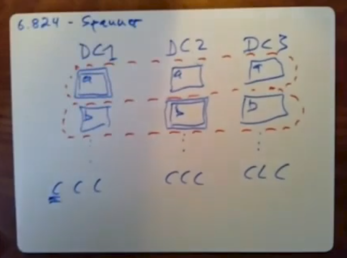
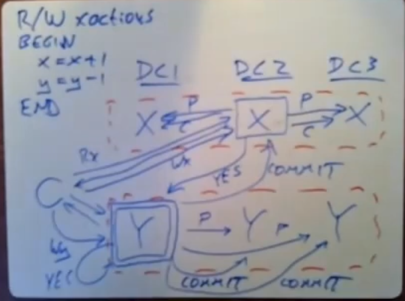

# Lec13 - Spanner

spanner run 2PC but actually run it over paxos replicated participants 

for google's advertising database apparently the workload was dominated by read-only transactions 

each paxos instance manages all the replicas of a given shard of the data

上图中 **C** 为web server，一个红框为一个Paxos Group，即一个shard一个Paxos Group

上图为 two-phase commit (2pc) with Paxos-replicated participants.

**RO Transaction**：if you know in advance that all of  the operatons in a transaction are guaranteed to be reads then spanner has a much faster much less message intensive scheme for executing read-only transactions.

**snapshot isolation**：for r/w，提交开始的时间

we're gonna design our system or a snapshot isolation system , gets is designed to execute as if to get the  same results as if all the transactions had executed in timestamp order 

the snapshot isolation technique solves our problem causes the read-only transaction to be serializable 

**TT**

when a transaction coordinator is collects the votes and see that it's able to cimmit and choose a timestamp, after it choose this timestamp it's required to delay to wait a certain amount of time before  i have to actually commit and write the values and release locks 

TS < TS.now.earliest()，when the commit wait is finished,tis timestamp of the transaction is absolutely guaranteed to be inthe past

这两条rules为只读事务提供了外部一致性

