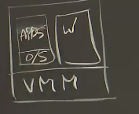
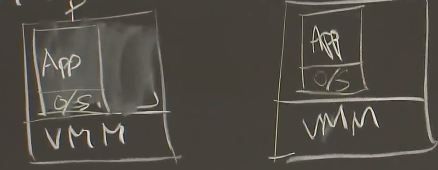
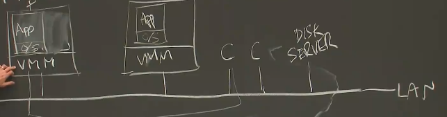

# Lec 4 - Primary-Backup Replication

通过容错来提高可用性 ，使用复制（ replication ）。

是否值得花几倍价格去冗余，取决于服务的价值

**状态转移** 背后的思路是：如果我们一个服务器有两个replica，作为replicas，你要做的就是让它们与该主服务器保持同步，如果primary故障了，那么backup（备机）就能接管它所需要的一切东西。它的工作原理是让primary发送一个它整个状态的副本给backup，backup会去保存最新的状态，如果primary发生了故障，那么backup（备机）就能从它所拥有的最近的状态开始执行

如果想变得高效，那么我们只需发送内存中上次发送后修改过的部分给backup（备机）就可以了

**replicated state machine** ：我们想要复制的是某些内部操作，除非有外部输入介入，不然它就是确定性的 。它不会往replica之间发送状态，相反，它们只会发送那些外部事件的操作，即将这些外部事件从primary（主）发送到backup（备机），即发送给backup（备机）那些它需要知道的来自于外界的输入。

（外部操作大小远小于状态大小）

**若对于随机事件，如获取当前时间或获取处理器序列号** ，主执行完后，将答案发送给备份，备份不执行这些指令，直接将获得的答案作为自己的查询结果 。

**VM-FT** 只讲了单处理器的情况，没讲如何扩展到多核处理器，两个 core 所交错执行的指令的顺序是不确定的 。所以在多核处理器上不支持这种方案 。（vmware 可以运用在多核处理器上的 replication 方法是 **state transfer** 而非 **replicated state machine**，状态转移在处理多核和并行这些方面来说更强大）

**replicated state machine** 方法下想创建一个新的 **replica** ，必须进行 状态转移 。新的 replica 需要有一个该状态的完整拷贝 。

***

**VM-FT**

进行了 **machine-level** 的复制，即复制了内存中所有的内容以及机器寄存器中的所有内容。优点：可以在VM-FT上运行任何软件；缺点：不是很高效

如果是应用程序级的复制，必须内置在应用程序内部 。如果我们拿到了一系列应用程序级别的操作，那么我们就需要让应用程序参与到其中，机器并不能理解哪些东西需要被复制的语义 。

**VM** 不是像往常那样通过硬件来启动操作系统，我们会在硬件之上去调用一个虚拟机监视器（VMM）或者Hypervisor，**Hypervisior** 的工作实际上就是在硬件上模拟多个虚拟计算机

主备虚拟机运行在不同物理机上 。虚拟机里有虚拟机管理程序（VMM），上面执行者 **GuestOs** ，再上面是 应用程序（ Application ）：

事实证明，这些主备虚拟机并不适用本地磁盘，而是会和某些磁盘服务器进行通信（从此论文中很难意识到这点）

- 主备服务器精准复制
- 某些Client会发送一个请求给primary（以网络数据包的形式），生成一个中断，这种中断被发送给VMM
- VMM接收到数据包后
  - 它会去模拟一个网络数据包的到达中断给primary（主）上的 guest operating system（客体操作系统），以此将这个数据包发送给primary上的这个应用程序的副本
  - VMM知道这个输入是要传给一个replicated虚拟机的，它将这个数据包的副本通过网络传给backup（备机）虚拟机监视器（VMM）
- backup（备机）虚拟机监视器（VMM）知道这个数据包是给这个Replicated state machine的，它也会在backup（备机）中伪造一个网络数据包的到达中断，并将该数据包发给应用程序副本
- 现在，primary（主）和backup（备机）都有了这个数据包的副本，它们会对很多的细节进行相同的处理，并保持同步
- primary（主）上的服务可能会对Client端进行回复，该服务会生成一个应答包，并通过虚拟机监视器（VMM）所模拟的NIC（网络接口卡）将它发送出去
- 虚拟机监视器（VMM）会看到primary（主）所输出的数据包，虚拟机监视器（VMM）会将这个应答包通过网络发回给Client端
- 因为backup（备机）也在执行完全相同的指令序列，它也会生成一个要返回给Client端的应答数据包，并通过它所模拟的NIC发送这个应答数据包
- 虚拟机监视器（VMM）表示，我知道这是来自backup（备机）的数据包，只有primary（主）才被允许生成这个数据包，虚拟机监视器（VMM）会将backup（备机）所发出的应答数据包丢弃（它们两个都拿到了输入，但只有primary（主）才会生成应答数据包）

paper中将我们所谈论的这种输入事件和其他事件流称为 **Logging Channel** 

**fault tolerance**：

事实上，backup（备机）期望能每秒得到许多log entry，因为在primary（主）中，会通过周期性的时钟中断（ Periodic timer interrupt）来生成log entry。事实证明，每次中断会生成一个log entry放到backup（备机）中

在primary 崩溃时，fault tolerance（容错）机制就要起作用了，作为backup（备机），它会看到它无法从logging channel中接收到任何log entry 。这就需要让backup上线（Goweird live），这就意味着，backup（备机）就会停止等待这些来自primary（主）发送到logging Channel上的输入事件；相反，虚拟机监视器（VMM）就会允许这个backup（备机）自由执行而无需等待来自primary（主）的输入事件 。虚拟机监视器（VMM）会让网络中接下来来自Client端的请求都发送给backup（备机）而不是primary（主），此处的虚拟机监视器（VMM）就不再会去丢弃backup（备机）中虚拟机所生成的输出数据包，原来primary（主）的工作就被backup（备机）所接管了 。

如果backup（备机）发生了故障，primary（主）就必须使用类似的处理方式来放弃这个backup（备机），停止向backup（备机）发送事件 。

**非确定性事件**：

Input：来自外界（例如Client端）的输入（packet + interrupt（通知数据包已到达的中断信号）），这些输入可能会在任何时候到达

（非确定性指令）weird instructions（如随机数生成指令、在不同时间调用获得时间的指令、生成唯一ID的指令）

multicore parallism：服务中的指令会在不同的Core上以某种方式交错执行，执行顺序是不可预测的

（前两个事件会通过logging channel来传送）

**Log entry** ：

- 事件发生时的指令号、因为如果你要发出一个中断信号或者输入之类的东西，最好 primary与backup是精确到一样的地方执行的，所以我们需要去知道指令号
- 类型：指明是网络输入或是其他指令
- 数据：数据包里的数据（若是奇怪指令，则此数据是该指令在primary上执行的结果，所以backup就可以伪造该指令，并提供相同的执行结果）

**防止back比prim执行更快**：backup（备机）上的虚拟机监视器（VMM）会维护了一个buffer（缓冲区），用于存储等待执行来自primary（主）的所发事件，除非在这个buffer中至少有一个事件，它才会让backup（备机）去执行；如果在这个buffer中有一个事件，那么它就能根据指令号来决定backup在什么位置强制停止执行，So，backup（备机）在执行时，会告知CPU下一个停止点的指令号是什么，因为backup（备机）只有在它有一个事件告诉它下一个停止执行的点在哪，它才会去执行。So，这就意味着，它会在primary（主）之后启动，因为只有primary（主）生成了第一个事件，并且该事件已经到达了backup（备机）处，backup（备机）才会开始执行，so backup（备机）始终要比primary（主）在执行上至少晚一个事件。

**output** 基本上就是指发送网络数据包 。

primary（主）和backup（备机）会计算出它们想发送的输出数据包，接着告诉模拟器来发送这个数据包，它只发送在primary上的这个数据包，并且，将backup（备机）处的输出数据包直接丢弃 。

**output rule**：backup 看到数据包并将其存入buffer后，返回ACK

primary 通过log将output记录 。

对于primary产生output后挂掉，但是backup中对应指令还在buffer中的问题：backup 上线前，必须向将log entry处理完 。backup知道所有的TCP连接以及序列号，生成output时，它将使用与原始数据包相同的TCP序列号生成它，Client端上的TCP stack看到这个数据包就会表示这是一个重复的数据包，会在TCP层面将这个重复的数据包丢弃，用户层面的软件就永远不会看到这个重复的数据包

**split-brain** 问题：主备同时上线（网络故障，主备之间不能通信）

**test-and-set server**（会放在存储服务器上） ，当一个VM想要上线时需要进行发送 **test-and-set** 请求，一个TAS sever中会存有 flag用于确立是否已有primary vm，第二个请求TAS server的vm不会上线成为primary 。 （类似于互斥锁）

