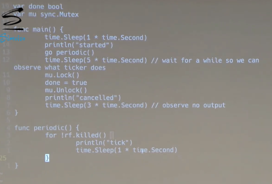

# Lec 5 - go, thread and concurrency

关心可读性而非性能，不需使用粒度良好的锁或其他技术，使用大锁来保护比较大的关键部分 。

（ 上图 `rf.kill()` 用法可能在lab中用到 ）

如果你想确保跨线程通信，请确保你使用了go中的同步原语，无论你是用的是channel，还是lock，或者是状态变量 。

如果你生成了一堆Goroutine，其中一个goroutine也就是这里的main函数，这里Go的工作方式是，如果这个main goroutine退出了，那么这整个程序就会结束，所有的Goroutine也会被结束。

**channel**：

channel 是同步的