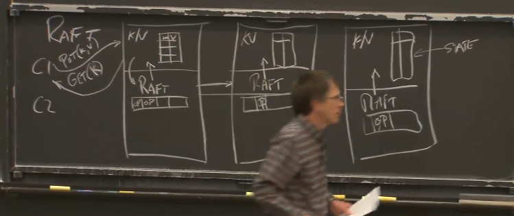
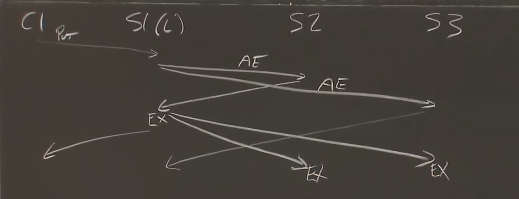

# Lec6 - Fault Tolerance - Raft 1

**split-brain**：因网络故障而造成的产生多台 **primary** 的问题 。

**partition**：网络被一分为二的情况下，两边都无法相互进行通信，称为 **network partition** 。

**majority vote ( Raft )**：为了构建不受脑裂现象困扰的自动复制系统而想到的重要想法是少数服从多数 。服务器数量得是奇数，而不是偶数 （好处是network partition时，有且只能有一个分区拥有半数以上的服务器）。

选出一个 **leader** 或 **commit** 一个新的 **log entry** ，必须得到半数以上服务器的支持 。

**majority** 指的始终是所有服务器中的大多数服务器，而不是在线服务器中的大多数服务器 。

如果有 `2f+1` 个服务器，那么就可以承受 **f** 次故障 。

**Raft** 通过 **majority vote** 来解决 **split-brain** 问题 。

**Raft** 以一个库的形式被包含在某些服务应用程序中 。如果你有一个replicated服务，在该服务中的每个replicas （副本）可以通过一个 raft 库再加点代码来接收RPC之类的请求 。

在应用程序中会有一个用raft 来帮助管理的replicated state。key/value服务器会在raft中进行函数调用，它们会反复进行通信，通过raft 来保持state。state中最关键的一部分就是，raft会保存一份关于操作的日志

所谓的Client端，实际上指的就是需要能够使用该服务的外部代码，客户端与通过有着replicated服务的多台服务器组成的一个整体进行通信。Client端实际上将请求发送给当前leader所在的应用层，即发送给raft中作为当前leader的那个副本 。

应用层会直接把Client端的请求下发给raft层，Raft会和每个副本进行通信，直到所有的副本中有半数以上的副本把这个新的操作添加到其日志中，那么Raft的Leader就知道所有已完成日志记录的副本，只有在这个前提下，Raft 层会发送回key-value应用层一个通知。这时应用层就可以执行这个（已记录日志的）操作了（即应用到状态机）

**基于时间线的消息传递**：

Raft把 **通知副本entry以commit的消息** 装载在Leader发出来的下一个AppendEntries RPC请求中 。这些副本（replica）就会执行该操作，并修改它们的状态 。

这个日志是一种机制，记录了leader按顺序所执行的操作

一旦你选出了一个leader，通过这个AppendEntries机制，leader会强制所有其他副本（replica）所拥有的日志与leader的日志必须完全一致

**code**：

key/value层接收到RPC命令，然后key/value层调用START函数（参数为command），START函数会将解析结果返回给key/value层响应，而在拿到解析结果后，key/value层并不会返回响应给Client（因为它并不清楚这个命令现在有没有被执行，会不会执行，因为它无法确定该请求是否已被提交），So，只有在Start函数返回后（即master接收到绝大数响应后，知道请求已经预发到各个备机），该Client请求所对应的消息会出现在key/value服务器中的ApplyChannel中。只有这样才会让key/value服务器去执行该请求，并发送回复消息给Client 。

**leader election**：

raft会经历一系列的leader，raft使用这些term号，来确定我们所讨论的是哪个leader。事实证明，follower不需要知道该leader的id是什么，它们只需要知道当前的term号是什么就行了 。

每一个term最多只有一个leader，这是一个关键属性 。

每个raft服务器中会有一个election timer（选举计时器），在一段时间内（这段时间可以看作leader选举触发时间，如果过期，触发选举），如果服务器没有收到任何来自当前leader消息的情况下，那么服务器就会假定当前的leader可能挂掉了，并且开始一次新的选举。

会发起一轮请求投票（给所有的replicas机器，哪怕它失联了），一个新的candidate总是给它自己投票 。

以为如果leader并没有挂掉，我们就不会开始一个新的选举。然而情况其实并非如此（如果leader并没有挂，但和其他replicas断连了，成为了少数派也是不行的）

但当leader并没有挂掉的话，不幸的是，我们可能依然得开始进行选举。如果网络比较慢，或者丢掉了某些heartbeat或者其他之类的东西，最终选举计时器会过期。即便这里有一个很好（正常运行）的leader，我们可能还得开始一个新的选举。老的leader依然觉得它是leader，比如遇上网络分裂的情况，老的leader依然在少数派分区活地好好的，多数派所在的分区可能就会进行一次选举，一次成功的选举，并选出一个新的leader，前一个leader完全不清楚其他分区所发生的事情。

AppendEntries也有重置每个服务器的选举计时器的作用，每当一台服务器收到一次AppendEntries，重置自己的选举计时器，这样就能阻止其他人成为一个新的candidate了 。

有一些场景会使得选举一开始就失败，如果太多服务器挂掉了或者不可用，或者网络很差。

**split vote**：可能会有两个想成为leader的candidate在几乎同一时间内发起选举，他们会去彼此那里去瓜分选票，没人得到大多数的赞成票，并且没有人成为leader

针对 **split vote** 问题，要使用 **随机选举超时时间** 。

每次重置选举计时器的时候，一定要选择一个不同的新的随机数来设置超时触发选举时间，千万不要在服务器第一次创建的时候选择一个随机数，并在未来的选举中重复使用该数字。否则可能有两个服务器选择相同的随机值 。

假如遇到 **partition** ，其中，有两台服务器在一个网络分区里（其中一台是老leader），它们是这些服务器中的少数派，服务器中的多数派则是在另一半网络中。在多数派所在的网络分区中，它们选出了一个新的leader。那原来老的leader会怎么样呢？

有两个潜在问题。其中一个不是问题的问题是，如果在另一个分区中有一个leader，并且那里面的服务器数量并不占服务器总数量的大多数，一个Client向这个leader发送一个请求时，少数派服务器所在分区中的leader会对外发送AppendEntries，但因为该leader所在的分区是少数派服务器所在的分区，它接收到的响应数加上它自己达不到大多数这个指标，所以leader就永远没法提交操作了，它也就永远不会去执行操作，它也就永远不会对Client进行响应。

**leader该如何处理不同副本上的日志（为恢复一致性状态），特别是当出现故障的情况下**：

