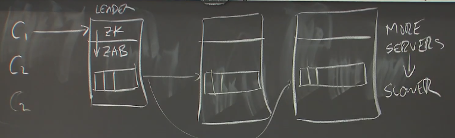

# Lec 8 - Zookeeper



主要关心Zookeeper的性能，而不是它在做什么 。

Zookeeper 基于 **Zab** ，Zab 是类似于 Raft 的东西 ，用于管理副本，维持一个含有一系列操作（client送来的）的log 。

写操作需要被leader发送给每个副本，所以副本越多，性能越低。但是现实中，工作负载中读操作更多，所以可以从任意一个副本直接读，这样也帮助了写的性能（通过把读的工作负载减轻）

Zookeeper不要求可线性化，它允许Client发送只读请求到任何一个副本，这个副本用自己的状态响应请求。这个副本可能是落后的、可能没有最新值，可能返回的是过期的值 。

副本恢复client的读请求时会回复对应的ZXID，当副本宕机切换时，Client用此ZXID去在新副本上找到已读取的位置 。（若新副本上该位置还未写入，则读请求一直等到该位置被写入后在响应）

zookeeper只保证对于一个Client，遵循FIFO order；如果是A先写入，B后读，B不被保证会读到最新的数据 （这是Zookeeper提高性能的方式）。

> - 所有client的写操作是可线性化的（读操作不遵循可线性化）
> - 对于单个client其操作遵循FIFO（单个client操作遵循可线性化）

如果一个Client想读别的client写的新数据，发送 `sync` 操作 。（ 实现读的可线性化 ）

称zookeeper is based on raft 。

***


add one to a number stored in a ZooKeeper znode


```
while true:
    x, v := getData("f")
    if setData(x + 1, version=v):
      break
```

如果setdata得到的是过期数据 或在setData之前数据已被改变，则version号会不匹配，返回错误。循环不会退出并进行下一次修改尝试


