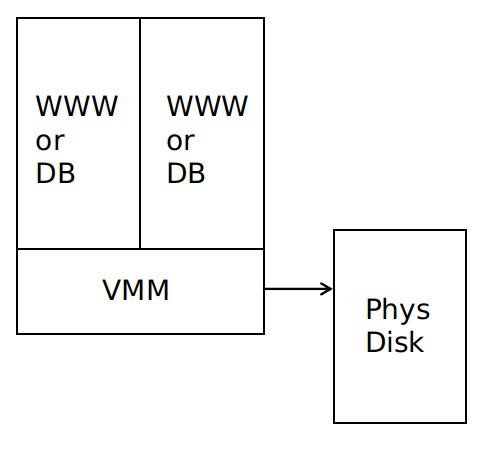
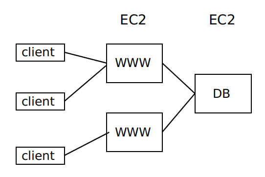
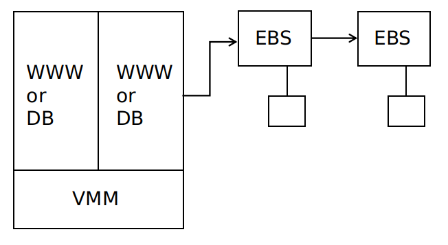
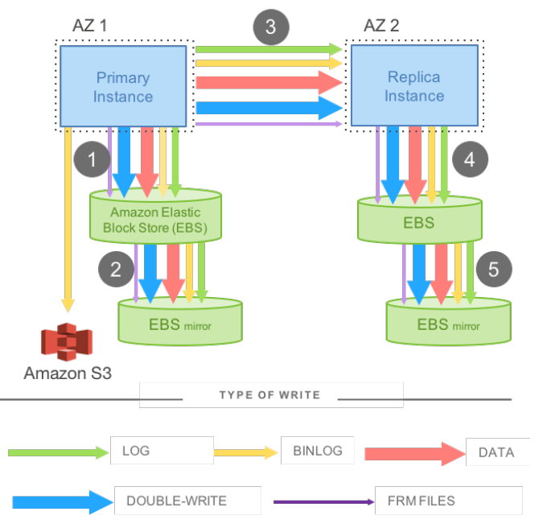
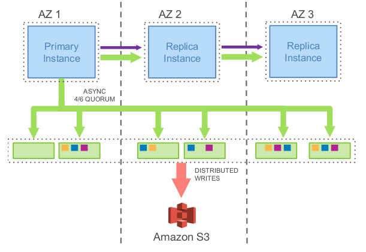
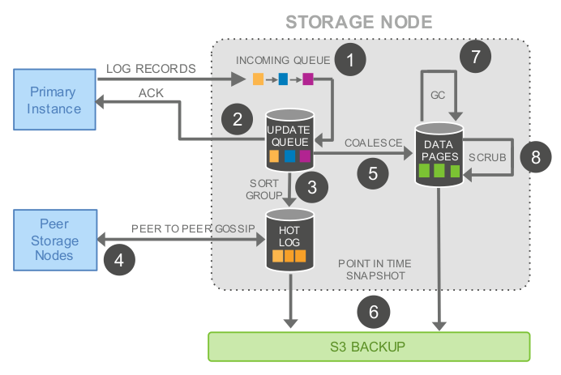
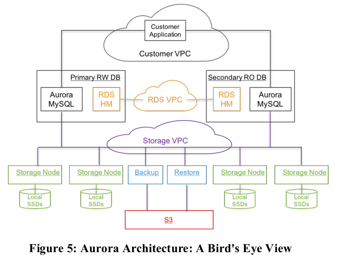
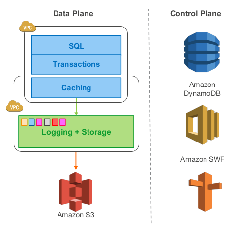

# Aurora总结

**说明**：本文为论文 **《Amazon Aurora: Design Considerations for High Throughput Cloud-Native Relational Databases》** 的个人理解，难免有理解不到位之处，欢迎交流与指正 。

**论文地址**：[Aurora Paper](https://github.com/XutongLi/Learning-Notes/blob/master/Distributed_System/Paper_Reading/Aurora/aurora.pdf)

> 本文首先基于 **MIT6.824** 课程内容介绍 **AWS** 云数据库的演进过程，接着基于论文内容介绍 **Aurora**。

***

## 0. 简介

**Aurora** 是一种由 *AWS* 于 *2017* 年提出的关系型数据库架构，它为 **OLTP** 业务提供关系型数据库服务。它将计算与存储分离、基于 `Quorum` 模型保证底层存储的一致性、将 *redo* 日志相关的功能下推到存储层、并通过读写分离降低数据库层的负载。

***

## 1. 数据库执行过程

首先来描述一下单机通用事务型数据库的写操作执行过程，数据存储在硬盘的 *B-Tree* 中，数据库中有缓存的数据页。

以事务 `x=x+10` `y=y-10` 为例：

- 首先锁定 `x` 和 `y`

- 在 **WAL (Write-Ahead Log)** 中添加更新条目

  - 此时 *log entry* 可以表示为：

    | LSID | TID  | Key    | old  | new  | 注释                 |
    | ---- | ---- | ------ | ---- | ---- | -------------------- |
    | 101  | 7    | x      | 500  | 510  | x=x+10               |
    | 102  | 7    | y      | 750  | 740  | y=y-10               |
    | 103  | 7    | commit |      |      | transaction finished |

- 在 *WAL* 写入到硬盘后释放 `x` 和`y` 的锁定，回复 *client* 

- *Log Applicator* 在缓存数据页的前镜像上作用 *log entry* 上的修改，会产生后镜像

- 之后将修改后的缓存数据页写入到硬盘中（延迟写入可以优化性能，因为数据页很大）

故障恢复时：

- 对于 *log* 中所有已提交的事务重放（ **redo** ）
- 对于 *log* 中所有未提交的事务回滚（ **undo** ）

***

## 2. AWS 数据库演进过程

### 2.1 Amazon EC2

每台服务器上开启多个虚拟机，每个虚拟机为一个 **EC2实例** ，可以作为 *web* 服务器或者数据库服务器，数据存储在直接连接的物理磁盘上。

可通过 **EC2** 构建服务，如下图所示：

**EC2** 适用于 *web* 服务器，因为服务器负载增加时可以通过租借更多的 *EC2* 来承担更大的负载，并且一旦发生服务器崩溃，由于 *web* 服务器是无状态的，不会有什么负面影响。但是 **EC2** 不适用于数据库服务器，因为它只能提供只读的副本，没有很好的伸缩性，且一旦发生服务器崩溃，数据库中的数据可能会永久丢失。

### 2.2 Amazon EBS

**EBS** 是弹性块存储，相当于是 *EC2* 的存储硬盘，实际实现为带有硬盘驱动的一组服务器，以链式复制的形式组织，使用基于 *Paxos* 的配置管理。

每个副本都存储在一个可用区当中，对于每次写操作，必须等到所有副本写入，才可以响应客户端。

**EBS** 的容错性高于本地硬盘存储，一旦一个 **EC2** 实例故障，重启另一个实例、并连接到同一个 **EBS** 即可。

**EBS** 的缺点：

- 存储共享，在一个时间点上，一个给定的 **EBS** 只能被一个 **EC2** 实例使用
- 很多数据需要通过网络传输，即使仅有很少一部分数据被修改，整个数据块都要被传输
- 两个副本容错性还是不够，但是更多的副本会影响性能
- 所有的副本都在一个可用区中，一旦可用区发生火灾、网络故障、电力故障等，所有的副本将不能被访问

### 2.3 Amazon Multi-AZ RDS

**Amazon Multi-AZ RDS** 采用 **mirrored MySQL**，将数据库作为服务，而不是让用户在 **EC2** 上建立自己的数据库。

每次写操作都写到本地 *EBS* 和镜像 *EBS* ，并传送给备份实例的 *EBS* 和其镜像 *EBS* ，传送内容包括 *log* 和 *data page* 以及一些别的数据，写操作要等到四个 *EBS* 副本都写入后才返回响应。

**Amazon Multi-AZ RDS** 实现了跨可用区的容灾，缺点是传送数据量太大，且步骤1、3、5是顺序且同步的，延时会因为同步而累积（写放大问题）。

***

## 3. Aurora

### 3.1 一些术语

**可用区 (Availability Zone, AZ)**：一个可用区是一个地域的子集，与其他可用区通过低时延的链路连接。可用区之间对很多故障是隔离的，将数据副本存放在不同可用区中，可以保证通常的故障模式只会影响到一个副本。

**数据段 (data segment)**：将数据库的总容量划分为固定大小的数据段，每个数据段大小为 *10G* 。数据段是系统中最小的故障和恢复单元。

> 为何采用数据段？
>
> 必须保证在修复一个故障所需的时间内，不相关故障成对出现的概率足够低。因为不相关故障成对出现的情况难以控制，因此通过降低平均修复时间来降低成对故障的影响，于是将数据分段。

**保护群 (Protect Group,  PG)**：每个数据段有6个副本，组成一个 *PG* ，分布在3个 *AZ* 中，每个 *AZ* 2个。

**存储卷 (storage volume)**：存储卷是一组串联的 *PG*，物理上使用大量的存储节点实现，这些节点通过 *EC2* 配置为带有附加 *ssd* 的虚拟主机。通过分配更多的 *PG* ，可以线性的扩展数据卷的容量。

### 3.2 quorum机制

**Aurora** 使用基于 **quorum** 的投票机制来为存储服务器容错。

如果 *V* 个副本每个都有一个投票权，那么一个读操作必须获得 *R* 票，一个写操作必须获得 *W* 票。为读到最新的数据，必须满足 $W+R>V$  （使读多数派和写多数派至少包含一个相同节点）；为让每次写操作都知到最近写入的数据，必须满足 $W>V/2$ 。

**Aurora** 被设计为能容忍：*a)* 挂掉一整个 *AZ* 以及一个额外的节点而不影响读取数据（AZ+1）；*b)* 挂掉一整个 *AZ* 而不影响写入数据。具体设计为：

- 将数据复制为6个副本，存放在3个 *AZ* 中，每个 *AZ* 2个
- $V=6$ 、$W=4$ 、$R=3$ 

**如何确定哪个读取副本拥有最新的数据？**

写操作每次给数据一个单调递增的版本号，存储服务器记录数据的版本号，读操作会取所有副本中版本号最大的。

**基于quorum机制的存储服务器的优点**：

- 对于服务器故障、执行慢或网络分区的问题处理更平滑，因为每次操作不需要得到所有副本服务器的回应（如如相对于链式复制，链式复制需要等待写操作在所有副本上完成）
- 在满足 $W+R>V$ 的前提下，可以调整 *W* 和 *R* 在针对不同的读写负载情况，若读负载比较大，可以减小 *R*，反之亦然

> **Raft** 也使用了 *quorum* 机制：*leader* 在多数副本写入 *log entry* 后才会将该 *log entry* 提交
>
> 但是 **Raft** 更加强大：可以处理更复杂的操作（由于它的顺序操作）；出现 *split-brain* 问题时可以自动重新选举出 *leader* 

### 3.3 REDO日志处理下推到存储层

**Aurora** 中，**Log Applicator** 被下推到了存储层，用来在后台或按需产生数据页，通过网络传输的写数据只有 **REDO** 日志，因此减少了网络负载、并提供了可观的性能和持久性。

上图展示了一个 **Aurora** 集群，包括一个主实例和多个副本实例，部署在不同的可用区中，该模型工作流程为：

- 主实例将 **REDO** 日志写入存储层。*I/O* 流根据目的地来将日志顺序打成 *batch* ，并将每个 *batch* 传给数据的6个副本并持久化到数据盘上
- 主实例将日志以及元数据的更新一起发送给副本实例
- 数据库引擎只要收到6个中的4个回复就形成了一个写多数派，此时可认为这些日志文件被持久化了
- 每个数据副本使用这些 **REDO** 日志将数据页的变更应用在他们的 *buffer cache* 中
- 对磁盘上数据库数据的写入（B-Trees等）可以在以后完成，通常是希望能够将多个事务对数据库同一部分的写入合并为一个磁盘写入。

基于此模型，实验表明，**Aurora** 可以负载比 *MySQL* 镜像多35倍的事务。

对于 **故障恢复** ，在传统的数据库中，系统必须从最近的一个检查点开始恢复，重放日志确保所有的 *REDO* 日志都被应用。在 **Aurora** 中，可持久化 *REDO* 日志不断地、异步地应用在存储层，分布在各个数据节点上。如果数据页还没生成，一个读请求可能会应用一些 *REDO* 日志来生成数据页。这样，故障恢复被分散在所有的正常的前台操作中，在数据库启动的时候不需要做任何事情。

下图为存储节点的处理流程：

存储节点的处理流程为：

1. 收到日志记录并将其加入内存的队列
2. 持久化记录并确认写入
3. 整理日志记录并确认日志中有哪些缺失，因为有些包可能丢了
4. 与其他数据节点交互填补空缺
5. 用日志记录生成新的数据页
6. 不断将数据页和 *REDO* 日志持久化到 *S3* 
7. 周期性地回收旧的版本
8. 最后周期性的对数据页进行 *CRC* 校验

以上操作都为异步的，只有步骤1和2是在前台操作的路径中，可能会影响延时。

### 3.4 故障恢复时一致性保证

**Aurora** 使用 **异步** 的思路来维护状态的一致性协议（从上层来看，维护一致性和可持久性的状态点，并随着收到请求的确认消息，不断地推进这些点），而不是使用 *2PC* 这种沟通复杂且对错误容忍度低的协议：

- 每一条日志记录都有一个由数据库产生的单调递增的日志编号 **LSN**
- 存储服务首先确定 **VCL (Volume Complete LSN)** ，它是能确保各副本之前的日志记录都可用的最大 *LSN*。在存储恢复过程中，大于 *VCL* 的日志必须被截断
- 数据库可以有多个 **CPL (Consistency Point LSN)** ，*CPL* 标记了 *log* 中可以被安全读取的点，*CPL* 必须小于等于 *VCL*
- 可以定义 **VDL (Volume Durable LSN)** 为副本中最大的 *CPL* ，所有大于 *VDL* 的日志记录都可以被截断丢弃

例如：即使有到 *LSN* 为1007的完整数据，数据库发现只有900、1000和1100是 *CPL* 点，那么必须在1000处截断。因为有到1007的完整数据，但是只有到1000是持久化的。

实现中，数据库和存储必须如下交互：

1. 每个数据库层的事务会被划分为多个 *mini* 事务，这些事务是有序的，并且被原子地执行
2. 每个 *mini* 事务由多个连续的日志记录组成
3. *mini* 事务的最后一个日志记录就是一个 *CPL* 

在故障恢复的时候，数据库告诉存储服务建立每个 *PG* 的可持久化点，并使用这些来确认 *VDL* ，然后发送命令截断所有大于 *VDL* 的日志记录。

### 3.5 常规操作

#### 3.5.1 写

**Aurora** 中，数据库不断与存储服务交互，维护状态来保持大多数派，持久化日志记录，并将事务标记为已提交。

写操作是将 *log* 写入到存储服务器中，不会修改已有的数据项。一次写操作包含一个过程中的事务或是事务结束标记。

数据库发送每一条 *log* 到6个存储副本中，收到4个写确认后，会将此 *log* 提交，即将 *VDL* 向前推进一个。

当数据库提交一个事务，处理这个提交请求的线程将事务放在一边，并将 *COMMIT LSN* 记录在一个单独的事务队列中等待被确认提交，然后就去做其他事情了。当 *VDL* 不断的增加，数据库找到哪些事务等待被确认，用一个单独的线程给等待的客户端返回事务完成的确认。

#### 3.5.2 读

**Aurora** 中，与传统数据库一样，数据页是从 *buffer cache* 中读取，只有在被请求的页不在 *cache* 中时，才会发起一次存储 *I/O* 请求。

如果 *buffer cache* 满了，系统会找到一个页并将其踢出缓存。传统数据库中，若踢出的页是脏页，为保证读取的数据永远是最新的，该脏页在被替换之前会被刷新到数据盘中。但是 **Aurora** 在踢出页时不会写磁盘，它通过保证踢出 *应用的最新日志记录的 LSN* 大于等于 *VDL*  的数据页，来保证 *buffer cache* 中的数据永远是最新的。这个协议确保：（a）所有对数据页的变更都已经持久化在日志中了，（b）如果缓存失效，可以通过获取最新页来构造当前*VDL* 所对应的页面。

数据库在通常情况下都不需要通过多数派读来获得一致性。当从盘里面读一个页的时候，数据库建一个读取点，代表请求发生时的 *VDL* 。数据库可以选择一个对这个读取点是完整的存储节点，这样读取的数据肯定是最新的版本。

**Aurora** 在故障恢复的时候需要进行多数派读（ *read quorum* ）。

### 3.6 读写分离

副本实例为只读的副本，*client* 可以发送只读请求给它们，这样可以减少主实例的负载。

在 **Aurora** 中，一个写副本和多至15个读副本可以挂载同一个共享的存储空间。因而，读副本不会增加任何的存储和写开销。

只读副本从存储服务器读取数据页并将它们缓存，主实例会发送 *log* 给副本实例，副本实例使用这些 *log* 去更新缓存中的数据页。

### 3.7 Aurora 云上体系

- 每个数据库集群包含一个写副本、0个或多个读副本
- 集群中所有实例分布于不同的可用区中，连接到相同区域的存储服务
- **Aurora** 使用 *Amazon RDS* 作为控制面板，*RDS* 监控集群健康状况，判断是否要做故障切换
- 每个数据库实例可以与三个 *Amazon* 虚拟网络 *VPC* 通信：用户应用与数据库引擎交互的 *Customer VPC* 、数据库引擎与 *RDS* 控制面板交互的 *RDS VPC* 、数据库与存储服务交互的 *Storage VPC*
- 存储服务部署在一个 *EC2* 虚拟机集群上，集群最少跨同一个区域的三个可用区
- 存储节点操作本地的 *SSD* 盘，与数据库实例、其他存储节点、备份/恢复服务交互，持续地将数据备份到 *S3* 或者从 *S3* 恢复数据
- 存储服务的控制面板用 *Amazon DynamoDB* 作为持久存储，存放数据库容量配置、元数据以及备份到 *S3*上的数据的详细信息
- 为了支持长时间的操作，比如由故障导致的数据库恢复或者复制操作，存储服务的控制面板使用 *Amazon Simple Workflow Service, SWF* 

### 3.8 优点和缺点

**优点**：

- 计算与存储分离，一份存储对接多个计算节点，多租户存储服务，成本低
- 读写分离，降低数据库负载
- 只通过网络传输日志，解决写放大问题
- *quorum* 机制降低最差性能点的惩罚
- 实例快速故障恢复
- 跨可用区容错
- 架构简单，通过多副本能快速扩展读能力，单个写副本则避免了分布式事务等复杂实现

**缺点**：

- 适合于读多写少的应用
- 复杂查询（*OLAP*）能力较弱
- 单个写副本，无分区多点写能力

***

