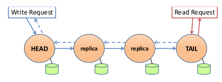
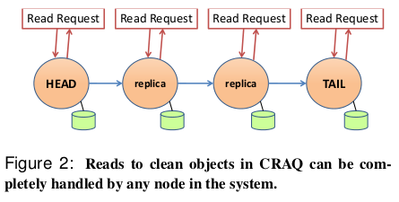
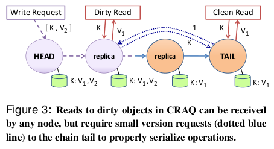

# CRAQ 论文总结

**说明**：本文为论文 **《Object Storage on CRAQ: High-throughput chain replication for read-mostly workloads》** 的个人理解，难免有理解不到位之处，欢迎交流与指正 。

**论文地址**：[CRAQ Paper](https://github.com/XutongLi/Learning-Notes/blob/master/Distributed_System/Paper_Reading/CRAQ/craq.pdf)

***

## 0. 简介

**Chain Replication with Apportioned Queries (CRAQ)** 是一种对链式复制的改进，它通过在所有对象副本上分配负载，在保持强一致性的同时极大地提高了读吞吐量。

本文主要对链式复制、**CRAQ** 原理以及 **CRAQ** 的一致性模型做出总结。

***

## 1. 对象存储

在 **基于对象** 的存储中，数据作为整个单元呈现给应用程序。

对象存储支持两种基本原语：

- `read` 或 `query` 操作返回存储在对象名称下的数据块
- `write` 或 `update` 操作更改单个对象的状态

对象存储更适合于平面名称空间，例如键值数据库，而不是层次目录结构。对象存储简化了支持整个对象修改的过程，通常，它们只需要考虑对特定对象的修改顺序，而不是整个存储系统。为每个对象提供一致性保证成本要低得多。

***

## 2. 一致性模型

本文涉及到的两种一致性模型为：

- **强一致性**：系统保证对一个对象的读写操作都以顺序执行，并且对于一个对象的读操作总是会观察到最新被写入的值。
- **最终一致性**：在系统中，对一个对象的写入仍是按顺序在所有节点上应用的，但对不同节点的最终一致性读取可能会在一段时间内（即，在写操作应用于所有节点之前）返回过时的数据。但是，一旦所有副本都接收到写入操作，则读操作将不会返回比最新提交的写操作更早的版本。事实上，如果一个 *client* 维护与特定节点的会话，那么它也会看到单调的读一致性。

***

## 3. 链式复制

**链式复制 (Chain Replication、CR)** 是一种跨多个节点复制数据的方法：

- 节点形成一个长度为 *C* 的链
- 链的头部节点处理来自客户端的所有写操作
- 当一个节点接收到写操作时，它将传播到链中的每一个节点
- 一旦写入到达尾部节点，它就被应用于链中的所有副本，并且被认为是提交的
- 当尾节点提交写操作时，会向客户端发送一个回复
- 尾部节点处理所有读操作，因此只有提交的值才能由读操作返回

链式复制实现了 **强一致性**：由于所有的读操作都是在尾部进行的，而所有写操作都在尾部提交，所以链尾可以简单地对所有操作应用一个总的顺序。

链式复制的简单拓扑使得写操作比提供强一致性的其他协议消耗更小。如在 *Raft* 中，*leader* 需要将每次写操作都发送给所有的 *follower* ，但是 *CRAQ* 中，*head* 只需要将每一次写操作发送一次；并且 *Raft* 中 *leader* 需要处理读写操作，而 *CRAQ* 中的 *head* 只需要处理写操作。 

链式复制的 **故障恢复**：

- 当头节点出故障时：后续节点取代它成为头节点，没有丢失的已提交写操作
- 当尾节点出故障时：前一个节点取代它成为尾节点，没有丢失的写操作
- 当中间节点故障时：从链中去掉，前一个节点需要重新发送最近的写操作

**局限性**：对一个对象的所有读取必须都要转到同一个节点，尾节点的负载很大。

***

## 4. CRAQ

### 4.1 CRAQ原理

**CRAQ** 是链式复制的一种改进，它允许链中的任何节点执行读操作：

- *CRAQ* 每个节点可以存储一个对象的多个版本，每个版本都包含一个单调递增的版本号和一个附加属性（ 标识 `clean` 还是 `dirty` ）

- 当节点接收到对象的新版本时（通过沿向下传播的写操作），该节点将此最新版本附加到该对象的列表中
  - 如果节点不是尾节点，则将版本标记为 `dirty` ，并向后续节点传递写操作
  - 如果节点是尾节点，则将版本标记为 `clean` ，此时写操作是 `已提交` 的。然后，尾节点在链中往回发送 `ACK` 来通知其他节点提交
- 当对象版本的 `ACK` 到达节点时，该节点会将对象版本标记为 `clean` 。然后，该节点可以删除该对象的所有先前版本
- 当节点收到对象的读请求时：
  - 如果请求的对象的最新已知版本是干净的，则节点将返回此值
  - 否则，节点将与尾节点联系，询问尾节点上该对象的最后提交版本号，然后，节点返回该对象的此版本

### 4.2 CRAQ性能提升

**CRAQ** 相对于 **CR** 的吞吐量改进发生在两种不同情况下：

- **读密集型工作负载**：读操作可以在所有节点上执行，因此吞吐量与链长度呈线性比例关系
- **写密集型工作负载**：大量写操作的工作负载中，更容易读取到 `dirty` 数据，因此对尾节点的查询请求比较多。但是对尾节点查询的工作负载远低于所有读请求都由尾节点来执行的工作负载，因此 *CRAQ* 吞吐量高于 *CR*。

### 4.3 CRAQ的一致性模型

对于读操作， *CRAQ* 支持三种一致性模型：

- **强一致性**：*4.1* 中描述的读操作可以使每次读取都读到最新写入的数据，因此提供了强一致性
- **最终一致性**：允许节点返回未提交的新数据，即允许 *client* 可从不同的节点读到不一致的对象版本。但是对于一个 *client* 来说，由于它与节点建立会话，所以它的读操作是保证单调一致性的。
- **带有最大不一致边界的最终一致性**：允许节点返回未提交的新数据，但是有不一致性的限制，这个限制可以基于版本，也可以基于时间。如允许返回一段时间内新写入但未提交的数据。

### 4.4 split-brain 问题

若两个相邻节点之间的网络连接断开，后面的节点会想去成为头节点，这样就会产生两个头节点。

**CRAQ** 本身并不会解决这样的问题，所以需要外部的分布式协调服务来解决这一问题，如使用 **Zookeeper** 。由 *Zookeeper* 来决定链的组成，决定哪个节点是头、尾，并监控哪个节点出了故障。当发生网络故障时，由 *Zookeeper* 来决定链的新组成，而不是基于各节点对于网络情况的自身感知。

***

