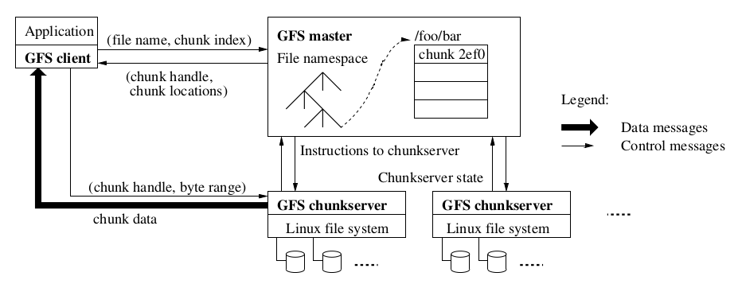
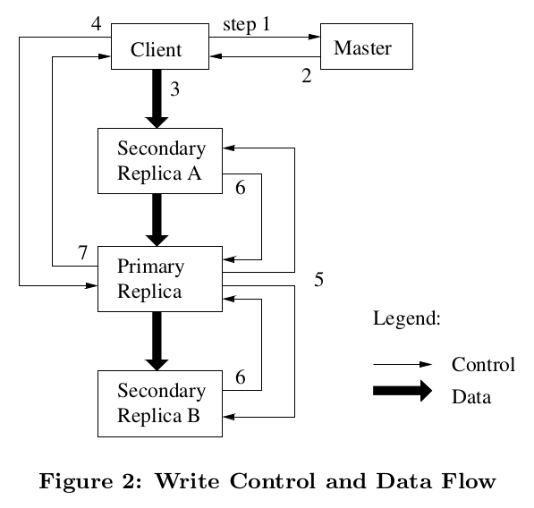
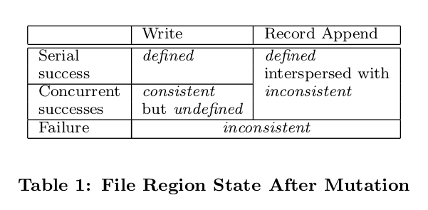

# GFS 论文总结

**说明**：本文为论文 **《The Google File System》** 的个人总结，难免有理解不到位之处，欢迎交流与指正 。

**论文地址**：[GFS Paper](https://github.com/XutongLi/Learning-Notes/blob/master/Distributed_System/Paper_Reading/GFS/The%20Google%20File%20System.pdf)

> 阅读此论文的过程中，感觉内容繁多且分散，一个概念的相关内容在不同部分相交地出现 。所以本文尽量将同一概念的相关内容串联并总结在一起 。
>
> 本文以批注的形式添加个人理解 。

***

## 1. 前言

**Google File System (GFS)** 是由 **Google** 设计并实现的、一个面向大规模数据密集型应用的分布式文件系统，它不仅满足所有分布式文件系统共有的 `高性能` 、`伸缩性` 、`可靠性` 、`可用性` ，还以 **Google** 自身 `应用程序` 和 `技术环境` 为基础进行了特有的设计 ，主要包括：

- 因为 **GFS** 使用设备数多，将组件失效视为常态事件 。因此 `持续监控` 、`错误检测` 、`灾难冗余` 和 `自动恢复` 的机制必须包括在 **GFS** 中 。
- 主要对大文件的管理进行了优化 。
- 主要应用于 `对文件尾部追加数据` 的修改，而非覆盖原有数据的方式，如 “生产者-消费者” 队列，或者其他多路文件合并操作 。一旦写完后，对文件的操作通常是顺序读 。
- 采用了较弱的 `一致性` 要求，引用 `原子性的记录追加` 操作，保证多个客户端能够同时进行追加操作，不需要额外的同步操作来保证数据的一致性 。
- 目标程序绝大多数要求高速率、大批量地处理数据，极少要求对单一读写操作有严格的响应时间要求 。即 `高性能的稳定网络带宽` 比 `低延迟` 更重要 。

***

## 2. 架构

### 2.1 接口

**GFS** 提供了一套类似传统文件系统的  `API接口函数` ，文件以 `分层目录` 的形式组织，用 `路径名` 来标识 。支持：创建新文件、删除文件、打开文件、关闭文件、读和写文件，以及快照和记录追加操作 。

### 2.2 架构设计



一个 **GFS** 集群包含：一个 `master` 、多台 `chunkserver` 、同时被多个 `client` 访问 ，这些都是普通的 **Linux** 机器 。

每个文件被分为多个 `chunk` ，每个 **chunk** 大小为 **64MB** 。

**chunk** 保存在 **chunkserver** 上，每个 **chunk** 含有 **3** 个 `副本` ，分别存于 **3** 个不同机架上的不同 **chunkserver** 。

文件只以本地文件形式保存在 **chunkserver** ，不在 **client** 或 **chunksever** 进行缓存 。

***

## 3. Chunk及其副本

### 3.1 chunk 大小与数量

**chunk** 大小为 **64MB** ，每个 **chunk** 副本都以普通 **Linux** 文件的形式保存在 **chunkserver** ，使用 **惰性分配** 策略避免了因内部碎片造成的空间浪费 。

> 惰性分配：指直到使用一个资源的时候再去给它分配空间 。

**chunkserver** 把 **chunk** 以 **Linux** 文件形式保存在本地硬盘，并根据 **chunk handle** 和字节范围来读写 **chunk** 。

出于可靠性的考虑，每个 **chunk** 都会复制到多个 **chunksever** 上，默认副本数为 **3** 。

**选择较大 chunk 尺寸的优点**：

- 减少了客户端和 **master** 节点通信的需求
- 用较大的 **chunk** 尺寸，客户端能够对一个块进行多次操作，这样就可以与 **chunkserver** 保持较长时间的 *TCP* 连接而减少网络负载
- 减少了 **master** 节点需要的元数据的数量

### 3.2 副本的位置

**GFS** 集群是高度分布的 `多层布局结构` 。一般将一个 **chunk** 的多个副本本别存储在多个 `机架` 上，可以：

- 最大化数据可靠性和可用性：不仅可以预防硬盘损坏、服务器宕机引发的问题，还可以预防网络、电源故障失效，比仅部署在不同服务器上拥有更高的可靠性
- 最大化网络带宽利用率：针对 **chunk** 的读操作，能够利用多个机架的整合带宽 

### 3.3 chunk 创建

**master** 创建一个 **chunk** 时，会选择在哪里放置初始的空的副本，主要考虑几个因素：

- 希望在低于平均硬盘使用率的 **chunkserver** 上存储新的副本
- 希望限制在每个 **chunkserver** 上 `最近` 的 **chunk** 创建操作的次数
- 希望把 **chunk** 分布在多个机架上

### 3.4 chunk 重新复制

当 **chunk** 的有效副本数量少于用户指定的复制因素的时候（ 默认为 **3** ），**master** 会重新复制它 。

可能的原因有：**chunkserver** 不可用了、**chunkserver** 上副本损坏、**chunkserver** 磁盘不可用或 **chunk** 副本的复制因素被提高了 。

优先级因素：优先复制 `副本数量和复制因素相差多的` 、`优先复制活跃的文件而非刚被删除的文件` 、`优先复制会阻塞 client 程序的chunk` 。

**master** 选择优先级最高的 **chunk** ，然后命令 **chunkserver** 直接从可用的副本克隆一个副本出来，选择新副本位置的策略和创建时的策略相同 。

### 3.5 chunk 重新负载均衡

**master** 服务器周期性地对副本进行 `重新负载均衡` ：它检查当前的副本分布情况，然后移动副本以便更好地利用硬盘空间、更有效地进行负载均衡 。

若加入了新的 **chunkserver** ，**master** 会通过重新负载均衡的方式逐渐填满这个新的 **chunkserver** ，而不是短时间内填满它（可能导致过载）。

### 3.6 租约 (lease)

**master** 为 **chunk** 的一个副本建立一个 **lease** ，将这个副本称为 `primary` （ 主 **chunk** ），剩余副本为 **secondary** 。

**primary** 对 **chunk** 的所有更改操作进行序列化，所有的副本都遵从这个序列进行修改操作 。因此，修改操作全局的顺序首先由 **master** 节点选择 **lease** 的顺序决定，然后由 **primary** 的分配的序列号决定 。

设置 **primary** 的 `目的` ：为了最小化 **master** 的管理负担 。

> **split-brain** 问题：
>
> 假设 **S1** 是一个 **chunk** 的 **primary**，并且 **master** 和 **S1** 之间的网络连接已断开，**master** 发现此 **S1** 无响应后将确立 **S2** 为 **primary** 。此时 **client** 可以和 **S1**、**S1** 两个 **primary** 连接 ，这就是 **split-brain** 问题 。

为解决 **split-brain** 问题，将 **lease** 的超时设置为 **60s** 。**master** 发现 **S1** 没有响应，则会等 **lease** 过期后，分配新的 **lease** ，即 **S2** 只有在 **S1** 到期后才有可能被设为 **primary** 。

只要 **chunk** 被修改了，**primary** 就可以申请更长的租期，得到 **master** 的确认并收到租约延长的时间 。这些租约延长请求和批准的信息通常附加在 **master** 和 **chunkserver** 之间的 *HeatBeat* 来传递 。

***

## 4. master

### 4.1 元数据

**master** 主要存放 **3** 类型的 `元数据` ：文件和 **chunk** 的命名空间、文件和 **chunk** 的对应关系、每个 **chunk** 副本的存放地址 。

元数据细节：

```
namespace (a lookup table mapping full pathnames to metadata)	(nv)
filename -> array of chunk handles		(nv)
chunk handle -> version num				(nv)
				list of chunkservers	(v)
				primary					(v)
				lease time				(v)
// nv 表示非易失的，即存储于内存与磁盘；v 表示存于内存
```

**master** 服务器可以在后台周期性扫描自己保存的全部状态信息 。

### 4.2 chunk 管理

`chunk` 创建的时候，**master** 会给每个 **chunk** 分配一个唯一的标识符 `chunk handler` 。

**master** 服务器在启动时，或者有新的 **chunkserver** 加入时，向各个 **chunkserver** 轮询它们所存储的 **chunk** 信息 （ **chunk** 位置等 ）。 

**master** 会为 **chunk** 的一个副本建立 **lease** 。

**master** 使用 `HeatBeat` 信息周期性地和每个 **chunkserver** 通信，发送指令到各个 **chunkserver** 并接收 **chunkserver** 的状态信息 。

**master** 会对自己保存的元数据进行周期性扫描，这种周期性的状态扫描也用于实现 **chunk** 垃圾收集、在 **chunkserver** 失效的时重新复制数据、通过 **chunk** 的迁移实现跨 **chunkserver** 的负载均衡以及磁盘使用状况统计等功能 。

### 4.3 操作日志 

操作日志包含了关键的 `元数据变更历史记录` ，操作日志不仅是元数据唯一的持久化存储记录，也作为判断同步操作顺序的逻辑时间基线 。

会把日志复制到多台远程机器，并且只有把相应的日志记录写入到本地以及远程机器的硬盘之后，才响应客户端的操作请求 。

### 4.4 快照

快照操作几乎可以瞬间完成对一个 `文件或目录树 (源)` 做一个拷贝，而且几乎不会对正在进行的其他操作造成任何干扰 。

使用 `copy-on-write` （ 写时复制 ）技术实现快照 ：

- 当 **master** 接收到一个快照请求，首先取消需要快照的文件的所有 **chunk lease** 
- **lease** 取消或过期后，**master** 将此操作记录到日志，并通过复制源的元数据将此日志记录反映到内存中（ 此时该 **chunk** 的引用计数加一，但并不真实地复制 **chunk** ）
- 直到 **client** 要写入数据到此 **chunk** 时，发请求到 **master** 询问 **primary** 
- **master** 注意到该 **chunk** 引用计数大于一，就要求所有拥有该 **chunk** 副本的 **chunkserver** 建立拷贝，对这三个新拷贝中的一个设置 **lease** ，返回给 **client**
- **client** 得到回复后就可以正常写这个 **chunk** ，而源 **chunk** 此时就保存成为快照

> 之所以要先取消需要快照的文件的 **chunk** ，是因为当 **client** 与 **chunkserver** 通信，找不到 **primary** 时，必须去询问 **master** 谁是 **primary**，这就相当于给了 **master** 一个触发条件，让它去发现建立快照的需求（ 即 **chunk** 的引用计数大于一 ），并创建 **chunk** 新拷贝 。

> 使用写时复制的原因：这样可以减少不必要的复制，因为建立快照时，并不是所有的 **chunk** 都被修改过（ 相较于上一次建立快照 ），所以直到一个 **chunk** 被修改时才真正复制它 。

### 4.5 命名空间锁

通过使用 `命名空间锁` 来保证 **master** 并发操作的正确顺序 。

每个 **master** 的操作在开始之前都要获得一系列的锁。通常情况下，如果一个操作涉及 `/d1/d2/…/dn/leaf` ，那么操作首先要获得目录 `/d1`， `/d1/d2` ，…， `/d1/d2/…/dn` 的读锁，以及 `/d1/d2/…/dn/leaf` 的读写锁 。根据操作的不同， `leaf` 可以是一个文件，也可以是一个目录。

***

## 5. Client

**GFS** **client** 代码以库的形式被链接在客户程序里，**client** 代码实现了 **GFS** 文件系统的 *API* 接口函数、应用程序与 **master** 和 **chunkserver** 通信、以及对数据进行读写操作。

**client** 和 **master** 节点的通信只获取元数据，它向 **master** 询问应该联系的 **chunkserver** ，客户端将这些元数据信息缓存一段时间，后续的操作将直接和 **chunkserver** 进行数据读写操作 。 

***

## 6. 系统交互

### 6.1 读

借助系统架构图描述 `读` 的过程：


- **client** 发送 **filename** 和根据字节偏移量计算得出的 **chunk index** （当前字节偏移量/64MB ） 给 **master** 
- **master** 返回 **chunk handle** 和 **chunk** 的副本位置（仅包含最近 **version** 的）信息给 **client** 
- **client** 以 **filename** 和 **chunk index** 为 *key* 缓存这些数据
- **client** 发送请求到 **chunkserver** （一般选择最近的），请求包括 **chunk handle** 和字节范围
- **chunkserver** 读取文件，返回数据
- **client** 接收到数据，通过 **checksum** 去除填充数据以及通过 **unique id** 去重（如果有需要的话）

> 对于填充数据和重复数据的问题，有的任务并不介意这些，比如搜索引擎返回了两个一样的链接并无大碍 。对于介意这两个问题的任务，则使用 **checksum** 去除填充数据，使用 **unique id** 去重 。

> **unique id** 去重：**client** 上应用程序检查数据的 **id** ，若此数据 **id** 与之前收到的数据的 **id** 一样，则丢弃它 。

> **GFS** 提供了处理填充数据和重复数据的库 。

**client** 缓存信息到期或文件被重新打开前，**client** 不必再与 **master** 通信 。

**client** 通常会在一次请求中查询多个 **chunk** 信息 。

> 上述流程主要用于大规模的流式读取，如果是小规模的随机读取，通常做法是把小规模的随机读取合并并排序，之后按顺序批量读取 。

### 6.2 写



1. **client** 向 **master** 询问 **chunk** 的哪个副本是 **primary** ，以及该 **chunk** 的位置 。若没有 **primary** ：
   - 若所有的 **chunkserver** 都没有最近的版本号，返回错误
   - **master** 在拥有最近版本的副本中选择 **primary**
   - 版本号递增，并写入硬盘中的 **log**
   - 告诉 **primary** 和 **secondary** 它们的身份和新版本号，并将新版本号写入 **chunkserver** 的硬盘
2. **master** 将 **primary** 的标识符和 **secondary** 的位置返回给 **cient** ，**client** 缓存这些数据后续使用 。只有 **primary** 不可用或 **lease** 已到期，**client** 才会再跟 **master** 进行联系 。
3. **client** 将数据推送到所有的副本上（ 数据以管道的方式，顺序沿着一个 **chunkserver** 链进行传送，优先选择最近的 **chunkserver** ），**chunkserver** 接收到数据并保存在 *LRU* 缓存中。
4. 所有副本确认接收到数据后，**client** 发送写请求到 **primary** 。这个请求标识了早前推送到所有副本的数据，**primary** 为接收到的所有操作分配连续的序列号（ 这些操作可能来自不同的 **client** ）。**primary** 以序列号的顺序将操作在本地执行 。
5. **primary** 将写请求传递到所有的 **secondary** ，**secondary** 依照相同的序列号执行操作 。
6. 所有 **secondary** 回复 **primary** 已完成操作 。
7. **primary** 回复 **client** 。若返回错误，**client** 重复发起操作请求 。

> 若应用程序一次写入的数据量很大，或数据跨越了多个 **chunk** ，**client** 会将它们拆分为多个写操作 。

> 通过将 **数据流和控制流分开** 的方式，充分利用每台机器的带宽，避免网络瓶颈和高延时的连接，最小化推送所有数据的延时 。

### 6.3 追加

**GFS** 提供了原子性的 `记录追加` ，使用记录追加，**client** 只需要指定要写入的数据，**GFS** 保证有至少一次原子的 ( **atomically at least once** ) 写入操作成功执行（ 即写入一个顺序的 *byte* 流 ），写入的数据追加到 **GFS** 指定的偏移位置上，之后 **GFS** 返回这个偏移量给**client** 。

> 传统方式的写入操作需要 **client** 指定数据写入的偏移量，对一个 *region* 并行写入时，*region* 尾部可能包含不同 **client** 写入的数据片段 。

追加操作流程与写流程（ 本文 **6.3** ）基本一致，区别在于：

- 步骤 **4** 、**5** 、**6** 
  - **client** 推送数据到文件最后一个 **chunk** 所有副本之后，发送请求给 **primary** 。**primary** 检查追加数据是否超过 **64MB** ，若超过，**primary** 将当前 **chunk** 填充到最大尺寸，通知 **secondary** 执行相同操作，最后回复 **client** 让其对下一个 **chunk** 重新进行追加请求 。
- 步骤 **7**
  - 若追加操作在任何一个副本上失败了，**client** 重新请求追加，此时已经追加成功的副本还要多进行一次追加，就产生了记录的重复 （ **GFS** 不保证 **chunk** 的所有副本在字节级别是完全一致的，它只保证数据 `原子性地至少一次 (atomically at least once)` 地追加 ）。

***

## 7. 一致性模型

**GFS** 支持一个宽松的一致性模型 。

> **GFS** 的弱一致性：
>
> 系统和一致性之间存在 *tradeoff* ，更好的一致性往往意味着更复杂的系统设计以及更多的机器间通信。**GFS** 采用的较弱的一致性来降低系统复杂度，提高性能 。所以，它适用于对与不一致读的问题不太敏感的任务，例如使用搜索引擎搜索某个关键词，即使显示的几万条结果里有少数几条缺失、或顺序不对，我们并不会意识到这些问题，说明 **GFS** 服务于搜索引擎这种任务是可行的；而像银行数据存储这种对一致性和准确性有较高要求的任务，则不适合使用 **GFS** 。

文件命名空间的修改（ 如：文件创建 ）是原子性的，它仅由 **master** 控制：命名空间锁提供了原子性和正确性、**master** 操作日志定义了这些操作在全局的顺序 。

### 7.1 读、写、追加的一致性

对于数据修改后的文件 `region` ，首先有两个定义：

- **一致的  (consistent)**：对于一个 **chunk** ，所有 **client** 看到的所有副本内容都是一样的
- **定义的 (defined)**：数据修改后是一致的，且 **client** 可以看到写入操作的全部内容（ 换句话说，可以看到每步操作修改后的内容 ）

对于不同类型修改的 **region** 状态如下图所示：



当一个数据写操作成功执行，且没有并发写入，那么影响的 **region** 就是 **defined** ：所有 **client** 都能看到写入的内容。（ 隐含了 **consistent** ）

当并行修改写完成之后，**region** 处于 **consistent but undefined** 状态：所有 **client** 看到同样的数据，但是无法读到任何一次写入操作写入的数据 （ 因为可能有并行写操作覆盖了同一区域 ）。

失败的写操作导致 **region** 处于 **inconsistent** 状态（ 同时也是 **undifined** 的 ）：不同 **client** 在不同时间会看到不同的数据　。

当对文件进行追加操作，若追加操作成功，那么 **region** 处于 **defined and consistent** 状态；若某次追加操作失败，由本文 **6.3** 可知，**client** 重新请求后会导致数据填充和重复数据的情况，此时 **region** 处于 **defined but inconsistent** 状态 。

> 某次追加失败过程：
>
> **C1** 向副本 **S1** 、**S2** 中追加 *a* ，若向 **S2** 中追加 *a* 时失败，修改后结果为：
>
> **S1** - | a |						**S2** - |   |
>
> 此时 **C2** 并发地向 **S1** 、**S2** 中追加 *b* ，在两副本相同偏移位置追加，执行成功，修改后结果为：
>
> **S1** - | a | b |				**S2** - |   | b |
>
> 之后 **C1** 由于有副本追加失败，重新发起追加 *a* 的请求，此次追加成功，修改后结果为：
>
> **S1** - | a | b | a |			**S2** - |   | b | a |
>
> 可以看到，重复请求使得 **S1** 中有了重复记录，使得 **S2** 中有了填充数据（ 那个空白 ），这就导致了这块 **region** 是 **defined**（ 每步修改都能看到 ），但是 **inconsistent**（ 不同副本数据不一样 ）

***

## 8. 垃圾回收

**GFS** 在文件删除后不会立刻进行回收可用的物理空间，**GFS** 空间回收采用惰性的策略，只在文件和 **chunk** 级的常规垃圾收集时进行 。

当一个文件被应用程序删除时，**master** 立即把删除操作记录到日志 。**master** 并不立马回收资源，而是把文件名改为一个包含 `删除时间戳` 的隐藏名字 。当 **master** 对命名空间做 `常规扫描` 的时候，会删除三天前的隐藏文件 ，此文件相关元数据也被删除 。

在 **master** 对 **chunk** 命名空间做常规扫描时，若发现 `孤儿 chunk` （ 即不被任何文件包含的 **chunk** ），会提示 **chunkserver** 删除这些 **chunk** 的副本 。

隐藏文件在真正被删除前，还可以用新的名字读取，也可以将其改为正常文件名以恢复 。

**这种垃圾回收方式的优势**：

- 对于组件失效是常态的大规模分布式系统上，这种垃圾回收方式简单可靠
- 垃圾回收把存储空间的回收操作合并到 **master** 节点规律性的后台活动中（ 如 **master** 与 **chunkserver** 的握手 ），操作被批量执行，开销被分散
- 延缓存储空间回收为意外的、不可逆转的删除操作提供了安全保障

***

## 9. 容错与诊断

### 9.1 过期失效的副本检测

**过期副本**：当 **chunkserver** 失效时，**chunk** 的副本可能因为错失了一些修改而失效 。

**master** 保存了每个 **chunk** 的版本号用来区分当前副本和过期副本 。

只要 **master** 分配 **chunk** 一个 **lease** ，该 **chunk** 的版本号就会增加，然后通知最新的副本，**master** 和这些副本都将最新的版本号写入硬盘保存 。若某个副本所在的 **chunkserver** 处于失效状态，他的版本号就不会增加 。之后这个 **chunkserver** 重启，向 **master** 报告它拥有的 **chunk** 和对应版本号的时候，**master** 会检测出过期 **chunk** 。

且当 **master** 回复 **client** 关于 **primary** 的信息、或者是 **chunkserver** 从哪个 **chunkserver** 进行克隆时，消息中会附带了版本号，**client** 或 **chunkserver** 在执行操作时都会验证版本号以确保总是访问当前版本的数据 。

**master** 在例行的垃圾回收过程中移除所有过期失效的副本 。

### 9.2 快速恢复

不管 **master** 和 **chunkserver** 是如何关闭的，都在数秒内恢复状态并重新启动 。不区分正常关闭和异常关闭 。

**master** 在灾难恢复时，从磁盘上读取最近的快照，以及重演此快照后的有限个日志文件就能够恢复系统 。

**chunkserver** 重启后会发送 **chunk** 状态以及版本号给 **master** 。

### 9.3 chunk复制

每个 **chunk** 都被复制到不同机架的不同服务器上，用户可为文件命名空间的不同部分设定不同的复制级别 。

当有 **chunkserver** 离线了，或者通过 **checksum** 校验发现了已损坏的数据，**master** 通过克隆已有的副本保证每个 **chunk** 都被完整复制 。

### 9.4 master 的复制

**master** 所有操作日志和快照文件都被复制到多台机器的硬盘中 。若 **master** 进程所在的机器或硬盘失效了，处于 **GFS** 系统外部的监控进程会在其他的存有完整操作日志的机器上启动一个新的 **master** 进程 。

> 论文中没有详述这个 “外部的监控进程”，据 **MIT** 的 **Robert Morris** 教授解释，切换到新的 **master** 需要人为进行 。

还有 **shadow master** 在 **master** 宕机时提供文件系统的只读访问 。它启动的时候也会从 **chunkserver** 轮询得到数据、定期和 **chunkserver** 握手来获取状态 。在 **master** 因创建和删除副本导致副本位置信息更新时，**shadow master** 才和 **master** 通信来更新自身状态 。 

### 9.5 数据完整性

每个 **chunkserver** 都独立维护 **checksum** 来检查保存的数据的完整性 。**checksum** 保存在内存和硬盘上，也记录在操作日志中 。

对于读操作来说：

- 在把数据返回给 **client** 或者其它的 **chunkserver** 之前， **chunkserver** 会校验读取操作涉及的范围内的块的 **checksum** 
- 若某个副本的 **checksum** 不正确，**chunkserver** 返回请求者一个错误消息，并通知 **master** 这个错误消息
- 作为回应，请求者从其他副本读取数据，**master** 服务器从其他副本克隆数据进行恢复
- 新副本就绪后，**master** 通知 **chunkserver** 删掉错误的副本

**chunkserver** 空闲的时候，也会扫描和校验不活动 **chunk** 的内容 。一旦发现数据损坏，**master** 创建新的正确的副本，且把损坏的副本删除掉 。

### 9.6 诊断工具

**GFS** 服务器会产生大量日志，记录大量关键的事件（ 如 **chunkserver** 的启动和关闭 ）以及所有 **RPC** 的请求和回复 。

可以通过重演所有消息交互来诊断问题。日志还可以用来跟踪负载测试和性能分析 。

***

## 10. GFS 的优点

- **master** 和 **chunkserver** 的设计，将文件管理和文件存储分离
- 将文件分割成 **chunk** 存储，可并发访问，吞吐量较大
- 修改数据时控制流和数据流分离，充分利用每台机器的带宽
- 使用 **lease** 降低 **master** 工作负载，防止 **split-brain** 问题
- 对文件追加和顺序读的功能有优化
- 好的容错性

***

## 11. GFS 的缺点

- 只有一个 **master** ，元数据过多的话可能内存不够用
- **client** 量很大的话，一个 **master** 负载过大
- **master** 不能出错自动重启，出故障后人工切换 **master** 比较耗时
- **master** 通过浏览所有的 **chunk** 进行垃圾回收效率太低
- 不擅长处理随机写问题、海量小文件存储
- 一致性过松，无法处理对一致性要求高的任务
- **GFS** 被设计用于运行在单个数据中心的系统

***


