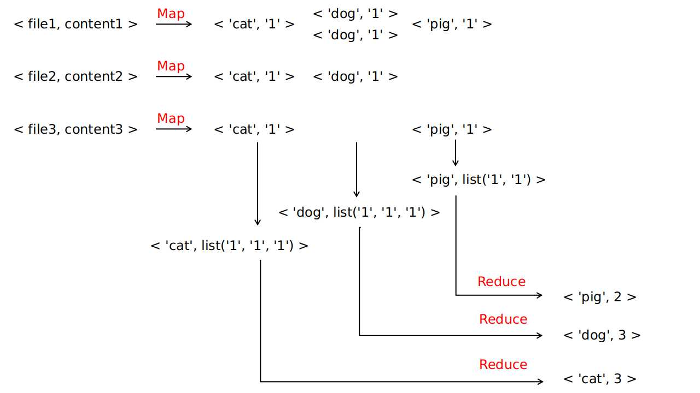
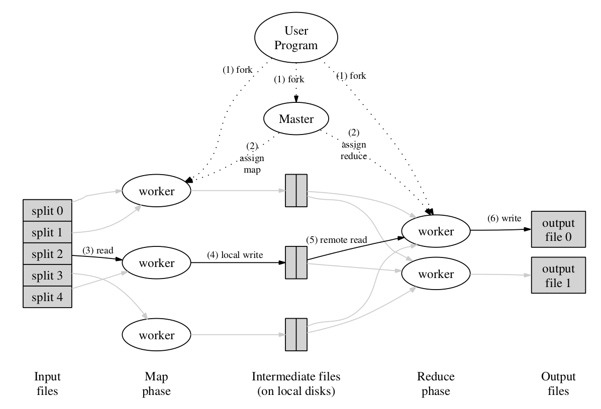

# MapReduce 论文解读

**说明**：本文为论文**《MapReduce: Simplified Data Processing on Large Clusters》**的个人理解，难免有理解不到位之处，欢迎交流与指正 。

**论文地址**：[MapReduce Paper](https://github.com/XutongLi/Learning-Notes/blob/master/Distributed_System/Paper_Reading/MapReduce/mapreduce.pdf)

***

## 1. MapReduce 编程模型

**MapReduce** 是 Google 提出的一种用于处理和生成大数据集的 **编程模型** ，具象地可以理解成一个 **框架** 。

该框架含有两个由用户来实现的接口：`map` 和 `reduce` ，`map` 函数接收一个键值对，生成一个中间键值对集合，*MapReduce* 框架会将所有共用一个键的值组合在一起并传递给 `reduce` 函数，`reduce` 函数接收此中间键以及该键的值的集合，将这些值合并在一起，生成一组更小的值的集合 。

该编程模型中，数据形式变换可由以下模式表示：

```
map:	(k1, v1)		->	list(k2, v2)
reduce:	(k2, list(v2))	-> 	list(v3)
```

**注**：论文中该模式第二行表示为 `reduce: (k2, list(v2)) -> list(v2)` ，个人认为由于通常情况下 `reduce` 会对 `list<v2>` 做一些处理（特殊情况下不做任何处理，即 *reduce* 为恒等函数），生成一些不同的值，所以用 `list<v3>` 进行表示可以区分处理前后的差异，更具一般化  。

***

## 2. 示例：文档中单词计数

论文中给出了 *MapReduce* 的经典使用示例，即 **统计文档中每个单词出现次数** （ *word count* 任务 ），通过此示例可以直观了解到 *MapReduce* 的使用方法 。

由用户实现的 `map` 和 `reduce` 函数的伪代码为：

```c++
map(String key, String value):
	// key: document name
	// value: document contents
	for each word w in value:
		EmitIntermediate(w,"1");

reduce(String key, Iterator values):
	// key: a word
	// values: a list of counts
	int result = 0;
	for each v in values:
		result += ParseInt(v);
	Emit(AsString(result));
```

通过上述伪代码可以看到：

- 对于 `map` 函数，输入一个键值对， *key* 为文件名，*value* 为文件内容，它对文件中每一个单词都生成 **中间键值对** `<w, '1'>` ，最后返回的内容为一个键值对的集合，表示为 `list(<'cat', '1'>, <'dog', '1'>, ..., <'cat', '1'>, <'pig', '1'>)` 
- 对于 `reduce` 函数，输入一个键值对，*key* 为一个单词 ，*value* 为该单词对应的计数的列表，即 `list('1', '1', '1', ..., '1')` ，列表中 `'1'` 的个数即为文档中该单词出现的次数，最后将单词出现的次数返回
- 从 `list(<'cat', '1'>, <'dog', '1'>, ..., <'cat', '1'>, <'pig', '1'>)` 转化为 `<'cat', list('1', '1', '1', ..., '1')>` 的步骤是由 *MapReduce* 框架来执行的

上述过程可以图示为：



论文附录 *A* 有由 *C++* 实现的针对文档词计数任务的 *map* 函数、*reduce* 函数 以及 调用两接口的完整程序代码，在此不做详述 。

***

## 3. Google 的 MapReduce 实现

*MapReduce* 模型可以有多种不同的实现方式，论文主要介绍了一种在 *Google* 内部广泛使用的计算环境下（通过以太网交换机连接，并由商用服务器所组成的大型集群）使用的 *MapReduce* 实现 。

### 3.1 执行流程



上图为此 *MapReduce* 框架实现的示意图，下文基于此图对 *MapReduce* 的执行过程进行描述，描述的序号与图中的序号相对应（这部分内容论文描述比较详细，所以以翻译为主，穿插个人理解以及补充后文中的优化细节）：

1. *MapReduce* 库会先把文件切分成 `M` 个片段（ 每个大小为 *16MB~64MB* ），存储在 **GFS 文件系统**  ，接着，它会在集群中启动多个 **程序副本** 。
2. 这些程序副本中，一个为 `master` ，剩余为 `worker` ，*master* 对 *worker* 进行任务分配，共有 `M` 个 *map*  任务以及 `R` 个 *reduce* 任务（ *M* 同时为文件片段数 ， *R* 由用户指定），*master* 会给每个空闲的 *worker* 分配一个 *map* 任务或者一个 *reduce* 任务 。
3. 被分配了 *map* 任务的 *worker* 会读取相关的输入数据片段，这些数据片段一般位于该 *worker* 所在的服务器上（ *master* 调度时会优先使 *map* 任务执行在存储有相关输入数据的服务器上，通过这种 **本地执行** 的方式降低服务器间网络通信，节约网络带宽 ）。它会解析出输入数据中的 **键值对** ，并将它们传入用户定义的 *Map* 函数中，*Map* 函数所生成的 **中间键值对** 会被缓存在内存中 。（ 要将 *map* 任务和用户定义的 *Map* 函数区分开来，*map* 任务包含了一些前置处理以及 *Map* 函数的执行 ，*reduce* 任务和 *Reduce* 函数同理 ）
4. 每隔一段时间，被缓存的中间键值对会被写入到本地硬盘，并通过分区函数（一般是哈希后取模）分到 *R* 个区域内 。这些被缓存的键值对在本地硬盘的位置会被传回 *master* ，*master* 负责将这些位置转发给执行 *reduce* 任务的 *worker* 。
5. 所有 *map* 任务执行结束后，*master* 才开始分发 *reduce* 任务 。当某个执行 *reduce* 任务的 *worker* 从 *master* 获取到了这些位置信息，该 *worker* 就会通过 **RPC** 的方式从保存了对应缓存中间数据的 *map workers* 的本地硬盘中读取数据 （ 输入一个 *reduce* 任务中的中间数据会产生自所有 *map* 任务 ）。当一个 *reduce worker* 读完所有中间数据后，会 **根据中间键进行排序，使得具有相同中间键的数据可以聚合在一起** 。（需要排序是因为中间 *key* 的数量一般远大于 *R* ，许多不同 *key* 会映射到同一个 *reduce* 任务中 ）如果中间数据的数据量太大而无法放到内存中，需要使用外部排序 。
6. *reduce worker* 会对排序后的中间数据进行遍历，对于每个唯一的中间键，将该中间键和对应的中间值的集合传入用户提供的 *Reduce* 函数中，*Reduce* 函数生成的输出会被追加到这个 *reduce* 任务分区的输出文件中 （ 即一个 *reduce* 任务对应一个输出文件，即 *R* 个输出文件，存储在 *GFS* 文件系统，需要的话可作为另一个 *MapReduce* 调用的输入 ）。
7. 当所有的 *map* 和 *reduce* 任务完成后，*master* 会唤醒用户程序 。此时，用户程序会结束对 *MapReduce* 的调用 。

### 3.2 容错

#### 3.2.1 Woker 故障

*master* 会周期性地 *ping* 每个 *worker* ，若在一定时间内无法收到某个 *worker* 的响应，那么 *master* 将该 *worker* 标记为 *fail* ：

- 此 *worker* 上 **完成** 的所有 *map* 任务都被重设为 *idle* 状态，交由别的 *worker* 去执行这些 *map* 任务
- 此 *worker* 上 **正在执行** 的 *map* 任务或 *reduce* 任务重设为 *idle* 状态，并等待重新调度

该 *worker* 上完成的 *map* 任务必须重新执行，因为 *map* 任务数据结果保存在 *worker* 的本地硬盘中，*worker* 无法访问了，则输出数据也无法访问；该 *worker* 上完成的 *reduce* 任务不需要重新执行，因为输出结果已存储在全局文件系统中 。

#### 3.2.2 Master 故障

目前的实现选择中断 *MapReduce* 计算，客户端可检查该 *master* 的状态，并根据需要重新执行 *MapReduce* 操作 。

### 3.3 数据存储位置

此模式是为了 **节约网络带宽** 。

将输入数据（ 由 *GFS* 系统管理 ）存储在集群中服务器的本地硬盘上，*GFS* 将每个文件分割为大小为 *64MB* 的 *Block* ，并且对每个 *Block* 保存多个副本（通常3个副本，分散在不同机器上）。*master* 调度 *map* 任务时会考虑输入数据文件的位置信息，尽量在包含该相关输入数据的拷贝的机器上执行 *map* 任务 。若任务失败，*master* 尝试在保存输入数据副本的邻近机器上执行 *map* 任务，以此来节约网络带宽 。

### 3.4 备用任务

此模式是为了缓解 **straggler (掉队者) 问题** ，即 ：一台机器花费了异常多的时间去完成 **最后几个**  *map* 或 *reduce* 任务，导致整个计算时间延长的问题 。可能是由于硬盘问题，可能是 *CPU* 、内存、硬盘和网络带宽的竞争而导致的 。

解决此问题的方法是：当一个 *MapReduce* 计算 **接近完成** 时，*master*  **为正在执行中的任务执行 备用任务** ，当此任务完成时，无论是主任务还是备用任务完成的，都将此任务标记为完成 。这种方法虽然多使用了一些计算资源，但是有效降低了 *MapReduce Job* 的执行时间 。

### 3.5 Combiner 函数

某些情况下，每个 *map* 任务生成的中间 *key* 会有明显重复，可使用 **Combiner 函数** 在 *map worker* 上将数据进行部分合并，再传往 *reduce worker* 。

*Combiner* 函数 和 *Reduce* 函数的实现代码一样，区别在于两个函数输出不同，*Combiner* 函数的输出被写入中间文件，*Reduce* 函数的输出被写入最终输出文件 。

这种方法可以提升某些类型的 *MapReduce* 任务的执行速度（ 如 *word count* 任务）。

### 3.6 临时中间文件

对于有服务器故障而可能导致的 **reduce 任务可能读到部分写入的中间文件** 的问题 。可以使用 **临时中间文件** ，即 *map* 任务将运算结果写入临时中间文件，一旦该文件完全生成完毕，以原子的方式对该文件重命名 。

***

## 4. MapReduce 的优点

- 适合PB级以上海量数据的离线处理

- 隐藏了并行化、容错、数据分发以及负载均衡等细节
- 允许没有分布式或并行系统经验的程序员轻松开发分布式任务程序
- 伸缩性好，使用更多的服务器可以获得更多的吞吐量

***

## 5. MapReduce 的限制

- 不擅长实时计算
- 无法进行流式计算，因为 *MapReduce* 的输入数据是静态的
- 无多阶段管道，对于先后依赖的任务，*MapReduce* 必须把数据写入硬盘，再由下一个 *MapReduce* 任务调用这些数据，造成了多余的磁盘 I/O

***

## 6. 相关问题总结

### 6.1 MapReduce 如何节约网络带宽 

1. 集群中所有服务器既执行 *GFS* ，也执行 *MapReduce* 的 *worker*

2. *master* 调度时会优先使 *map* 任务执行在存储有相关输入数据的服务器上

3. *reduce worker* 直接通过 *RPC* 从 *map worker* 获取中间数据，而不是通过 *GFS* ，因此中间数据只需要进行一次网络传输
4. *R* 远小于中间 *key* 的数量，因此中间键值对会被划分到一个拥有很多 *key* 的文件中，传输更大的文件（ 相对于一个文件拥有更少的 *key* ）效率更高

### 6.2 MapReduce 如何获得好的负载均衡 

1. 通过备用任务缓解 *straggler* 问题
2. 使 *task* 数远多于 *worker* 数，*master* 将空闲任务分给已经完成任务的 *worker* 

***

## 7. 现状

- *MapReduce* 已被 *Flume / FlumeJava* 所取代
- *GFS* 已被 *Colossus* 和 *BigTable* 所取代

***


