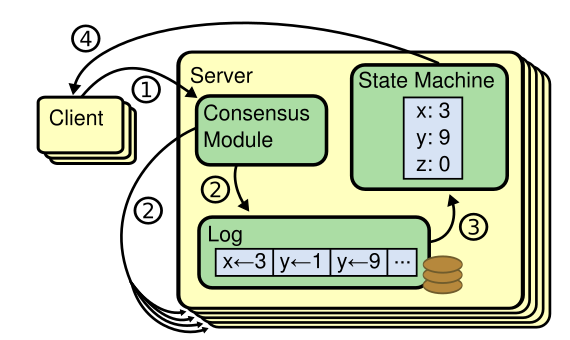
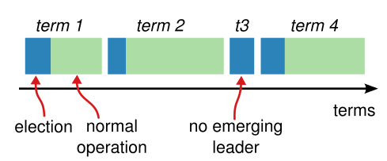
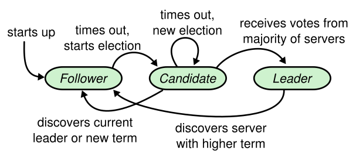
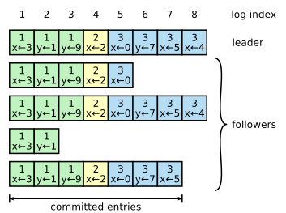
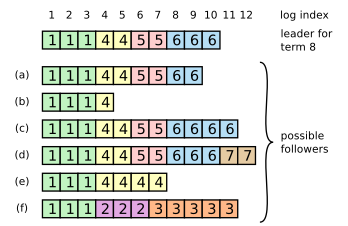
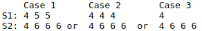
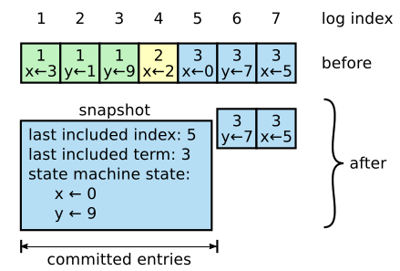
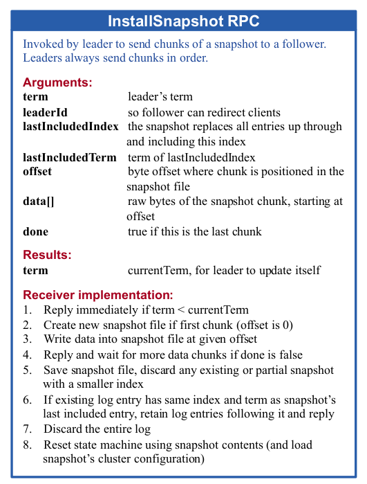

# Raft 论文详解

**说明**：本文为论文 **《 In Search of an Understandable Consensus Algorithm (Extended Version) 》** 的个人理解，难免有理解不到位之处，欢迎交流与指正 。

**论文地址**：[Raft Paper](https://github.com/XutongLi/Learning-Notes/blob/master/Distributed_System/Paper_Reading/Raft/raft-extended.pdf) 

***

## 1. 复制状态机

`复制状态机 (Replicated state machine)` 方法在分布式系统中被用于解决 **容错问题** ，这种方法中，一个集群中各服务器有相同状态的副本，并且在一些服务器宕机的情况下也可以正常运行 。



如上图所示，每台服务器都存储一个包含一系列命令的 **日志** ，并且按照日志的顺序执行。每台服务器都顺序执行相同日志上的命令，因此它们可以保证相同的状态 。

**一致性算法** 的工作就是保证复制日志的相同 。一台服务器上，一致性模块接收 **client** 的请求命令并将其写入到自己的日志中，它和其他服务器上一致性模块通信来保证集群中服务器的日志都相同 。命令被正确地复制后，每一个服务器的状态机按照日志顺序执行它们，最后将输出结果返回给 **client** 。

因此，服务器集群看起来就是一个高可用的状态机，只要集群中大多数机器可以正常运行，就可以保证可用性 。

> 关于复制状态机的更详细内容，可以阅读 **[VM-FT](https://blog.csdn.net/brianleelxt/article/details/106708202)** ，不过 **Raft** 应用到的复制状态机一般是应用级复制，不必达到像 **VM-FT** 那样的机器级复制 。

> 可将复制状态机应用于 **MapReduce** 的 **master** 、**GFS** 的 **master** 以及 **VM-FT** 的存储服务器 。

***

## 2. Raft 简介

**Raft** 是一种为了管理复制日志的一致性算法 。为了提高 **可理解性** ：

- 将问题分解为：领导人选举、日志复制、安全性和角色转变等部分
- 通过减少状态的数量来简化需要考虑的状态空间

**Raft** 算法在许多方面都和现有的一致性算法很相似，但也有独特的特性：

- **强领导性**：和其他一致性算法相比，Raft 使用一种更强的领导能力形式。比如，日志条目只从领导者发送给其他的服务器。
- **领导选举**：Raft 算法使用一个随机计时器来选举领导者，可有效解决选举时候的冲突问题 。
- **成员关系调整**：Raft 使用一种共同一致的方法来处理集群成员变换的问题，在这种方法下，处于调整过程中的两种不同的配置集群中大多数机器会有重叠，这就使得集群在成员变换的时候依然可以继续工作。

一个 **Raft** 集群必须包含奇数个服务器，若包含 **2f+1** 台服务器，则可以容忍 **f** 台服务器的故障 。（ 为了保留多数服务器在线，以正常完成日志提交和 **leader** 选举 ）

***

## 3. 领导人选举

**Raft** 通过选举一个 **leader** ，然后给予它全部的管理日志的权限，以此来实现一致性 。

一个服务器处于三种状态之一：`leader` 、`follower` 和 `candidate` ：

- **leader**：系统中只能有一个 *leader* ，它接收 *client* 的请求（ 若 *client* 和 *follower* 联系，*follower* 会把请求重定向给 *leader* ），并将日志复制到 *follower* ；*leader* 宕机或与其他服务器断开连接后会选举新的 *leader* 。
- **follower**：*follower* 不会发送任何请求，只会响应来自 *leader* 或 *candidate* 的请求 。
- **candidate**：一个 *follower* 在选举超时后就会变成 *candidate* ，此后它将进行选举，获得多于半数票数即成为 *leader* 。



一次选举开始对应这一个新的 `term (任期)` ，*term* 使用连续的整数标记 ，一个 *term* 最多有一个 *leader* 。

*Raft* 会使用一种 `心跳机制` 来触发领导人选举，当 *leader* 在位时，它周期性地发送心跳包（不含 *log entry* 的 `AppendEntries RPC` 请求） 给 *follower* ，若 *follower* 在一段时间内未接收到心跳包（ `选举超时` ），则认为系统中没有 *leader* ，此时该 *follower* 会发起选举 。

> 当系统启动时，所有服务器都是 *follower* ，第一个选举超时的发起选举 。

### 3.1 选举过程 



- **candidate**
  - 选举超时的 *follower* 增加当前 *term* 号，转换到 *candidate* 状态
  - *candidate* 并行地向其他服务器发送 `RequestVote RPC` 请求
  - *candidate* 保持状态一直到：
    - 若 *candidate* 获取了超过半数服务器的选票，则成为 *leader* ，并开始向所有 *follower* 发送心跳包
    - 若 *candidate* 在等候投票过程中接收到来自其他服务器的心跳包，表示已有 *leader* 被选举。若心跳包 *term* 不小于此 *candidate* 当前 *term*，则此 *candidate* 承认新 *leader* 合法并回到 *follower* 状态；否则此 *candidate* 拒绝此次心跳包并保持 *candidate* 状态
    - 若有同时有多个 *candidate* ，它们可能都无法获得超过半数的投票（ `split vote` 问题 ），则所有 *candidate* 都超时，并增加 *term* 号，开始新一轮的选举
- **投票方服务器**
  - 每个 *candidate* 只为自己投票
  - 每一个服务器最多对一个 *term* 号投出一张票，按照先来先服务的规则
  - `RequestVote RPC` 请求中包含了 *candidate* 的日志信息，投票方服务器会拒绝日志没有自己新的投票请求
    - 如果两份日志最后 *entry* 的 *term* 号不同，则 *term* 号大的日志更新
    - 如果两份日志最后 *entry* 的 *term* 号相同，则比较长的日志更新

### 3.2 split vote 问题：

- 上文有提到，若同时有多个 *candidate* ，则它们可能都无法获得超过半数的选票。此时它们会全部超时，并增加 *term* 号，开始新一轮的选举。由于它们会同时超时，于是 *split vote* 问题可能会一直重复 。
- 为解决此问题，使用 `随机选举超时时间` 。这样可以把服务器超时时间点分散开，一个 *candidate* 超时后，它可以赢得选举并在其他服务器超时之前发送心跳包 。即使出现了一个 *split vote* 情况，多个 *candidate* 会重置随机选举超时时间，可以避免下一次选举也出现 *split vote* 问题 。
- 每次重置选举计时器的时候，要选择一个不同的新的随机数，不能在服务器第一次创建的时候确定一个随机数，并在未来的选举中重复使用该数字。否则可能有两个服务器选择相同的随机值  。

### 3.3 日志条目完整性保证

（ 保证之前 *term* 中已提交的 *entry* 在选举时都出现在新的 *leader* 的日志中 ）：

- 因为 *leader* 提交一个 *entry* 需要此 *entry* 存在于大多数服务器
- 又因为 *candidate* 为赢得选举需要获得集群中大多数服务器的投票
- 可知每一个已提交的 *entry* 肯定存在于 为 *candidate* 投票的服务器 中的至少一个
- 因为投票方服务器会拒绝日志没有自己新的投票请求，即新 *leader* 包含的日志至少和所有投票方服务器的日志都一样新
- 则新的 *leader* 一定包含了过去所有 *term* 已提交的所有 *entry* 

### 3.4 时间和可用性

- *Raft* 要求 **安全性不能依赖时间**：整个系统不能因为某些事件运行的比预期快一点或慢一点就产生错误的结果 

- 为选举并维持一个稳定的领导人，系统需满足：

  ```
  广播时间(broadcastTime) << 选举超时时间(electionTimeout) << 平均故障时间(MTBF)
  ```

  - **广播时间** 指从一个服务器并行发送 *RPC* 给集群中其他服务器并接收响应的平均时间（0.5~20ms）
  - **选举超时时间** 即上文介绍的选举的超时时间限制（10~500ms）
  - **平均故障间隔时间** 指对于一台服务器而言，两次故障之间的平均时间（几个月甚至更长）
  - 广播时间远小于选举超时时间，是为了使 *leader* 能够发送稳定的心跳包维持管理
  - 选举超时时间远小于平均故障时间，是为了使整个系统稳定运行（ *leader* 崩溃后，系统不可用时间为选举超时时间，这个时间应在合理范围内尽量小 ）

***

## 4. 日志复制

### 4.1 日志



每个 *log entry* 存储一个 **状态机命令** 和从 *leader* 收到这条命令的 **term** ，每一条 *log entry* 都有一个整数的 **log index** 来表明它在日志中的位置 。 

`committed log entry` 指可以安全应用到状态机的命令。当由 *leader* 创建的 *log entry* 复制到大多数的服务器上时，*log entry* 就会被提交 。同时，*leader* 日志中之前的 *log entry* 也被提交 （包含其他 *leader* 创建的 *log entry* ）。

**日志的作用**：

- 使得 *follower* 以相同的顺序执行与 *leader* 相同的命令
- 使得 *leader* 确认 *follower* 与自己的日志是一致的
- 可以保留 *leader* 需要重新发送给 *follower* 的命令
- 服务器重启后可以通过日志中的命令重放

### 4.2 复制流程

- *leader* 接收到来自 *client* 的请求
- *leader* 将请求中的命令作为一个 *log entry* 写入本服务器的日志
- *leader* 并行地发起 `AppendEntries RPC` 请求给其他服务器，让它们复制这条 *log entry*
- 当这条 *log entry* 被复制到集群中的大多数服务器（ 即成功提交 ），*leader* 将这条 *log entry* 应用到状态机（ 即执行对应命令 ）
- *leader* 执行命令后响应 *client* 
- *leader* 会记录最后提交的 *log entry* 的 *index* ，并在后续 `AppendEntries RPC` 请求（ 包含心跳包 ）中包含该 *index* ，*follower* 将此 *index* 指向的 *log entry* 应用到状态机 
- 若 *follower* 崩溃或运行缓慢或有网络丢包，*leader* 会不断重复尝试 `AppendEntries RPC` ，直到所有 *follower* 都最终存储了所有 *log entry* 

- 若 *leader* 在某条 *log entry* 提交前崩溃，则 *leader* 不会对 *client* 响应，所以 *client* 会重新发送包含此命令的请求 

### 4.3 一致性保证

*Raft* 使用 `日志机制` 来维护不同服务器之间的一致性，它维护以下的特性：

1. 如果在不同的日志中的两个 *entry* 拥有相同的 *index* 和 *term*，那么他们存储了相同的命令
2. 如果在不同的日志中的两个 *entry* 拥有相同的 *index* 和 *term*，那么他们之前的所有 *log entry* 也全部相同

对于 **特性一**：*leader* 最多在一个 *term* 里，在指定的一个 *index* 位置创建 *log entry* ，同时 *log entry* 在日志中的位置不会改变 。

对于 **特性二**： `AppendEntries RPC` 包含了 `一致性检验` 。发送 `AppendEntries RPC` 时，*leader* 会将新的 *log entry* 以及之前的一条 *log entry* 的 *index* 和 *term* 包含进去，若 *follower* 在它的日志中找不到相同的 *index* 和 *term* ，则拒绝此 *RPC* 请求 。所以，每当 `AppendEntries RPC` 返回成功时，*leader* 就知道 *follower* 的日志与自己的相同了 。 

### 4.4 冲突解决



上图体现了一些 *leader* 和 *follower* 不一致的情况 。*a~b* 为 *follower* 有缺失的 *log entry* ，*c~d* 为 *follower* 有多出的未提交的 *log entry* ，*e~f* 为两种问题并存的 。

*Raft* 算法中，*leader* 处理不一致是通过：**强制 *follower* 直接复制自己的日志** 。

- *leader* 对每一个 *follower* 都维护了一个 `nextIndex` ，表示下一个需要发送给 *follower* 的 *log entry* 的 *index* 
- *leader* 刚上任后，会将所有 *follower* 的 *nextIndex* 初始化为自己的最后一条 *log entry* 的 *index* 加一（ 上图中的 *11* ）
- 如果一个 `AppendEntries RPC` 被 *follower* 拒绝后（ *leader* 和 *follower* 不一致 ），*leader* 减小 *nextIndex* 值重试（ *prevLogIndex* 和 *prevLogTerm* 也会对应改变 ）
- 最终 *nextIndex* 会在某个位置使得 *leader* 和 *follower* 达成一致，此时，`AppendEntries RPC` 成功，将 *follower* 中的冲突 *log entry* 删除并加上 *leader* 的 *log entiry*

> **冲突解决示例**：
>
> |        | 10   | 11   | 12   | 13   |
> | ------ | ---- | ---- | ---- | ---- |
> | **S1** | 3    |      |      |      |
> | **S2** | 3    | 3    | 4    |      |
> | **S3** | 3    | 3    | 5    |      |
>
> - *S3* 被选为 *leader* ，*term* 为 6，*S3* 要添加新的 *entry 13* 给 *S1* 和 *S2*
> - *S3* 发送 `AppendEntries RPC` ，包含 *entry 13* 、*nextIndex[S2]=13*、*prevLogIndex=12* 、*preLogTerm=5* 
> - *S2* 和 *S3* 在 *index=12* 上不匹配，*S2* 返回 *false*
> - *S3* 减小 nextIndex[S2] 到 *12*
> - *S3* 重新发送 `AppendEntries RPC` ，包含 *entry 12+13* 、*nextIndex[S2]=12*、*preLogIndex=11*、*preLogTerm=3* 
> - *S2* 和 *S3* 在 *index=11* 上匹配，*S2* 删除 *entry 12* ，增加 *leader* 的 *entry 12* 和 *entry 13* 
> - *S1* 流程同理

一种 **优化方法**：

当 `AppendEntries RPC` 被拒绝时返回冲突 *log entry* 的 *term*  和 属于该 *term* 的 *log entry* 的最早 *index*  。*leader* 重新发送请求时减小 *nextIndex* 越过那个 *term* 冲突的所有 *log entry* 。这样就变成了每个 *term* 需要一次 *RPC* 请求，而非每个 *log entry* 一次 。

> **减小 nextIndex 跨过 *term* 的不同情况**：
>
> *follower* 返回失败时包含：
>
> - **XTerm**：冲突的 *log entry* 所在的 *term*
> - **XIndex**：冲突 *term* 的第一个 *log entry* 的 *index*
> - **XLen**：*follower* 日志的长度
>
> *follower* 返回失败时的情况：
>
> 
>
> 其中 *S2* 是 *leader* ，它向 *S1* 发送新的 *entry* ，`AppendEntries RPC` 中 *prevLogTerm=6*
>
> 对于 **Case 1**：*nextIndex = XIndex*
>
> 对于 **Case 2**：*nextIndex* = *leader* 在 *XTerm*  的最后一个 *index*
>
> 对于 **Case 3**：*nextIndex* = *XLen* 
>
> （ 论文中对此处未作详述，只要满足要求的设计均可 ）

***

## 5. follower 和 candidate 崩溃

如果 *follower* 和 *candidate* 崩溃了，那么后续发送给它们的 *RPC* 就会失败 。

*Raft* 处理这种失败就是无限地重试；如果机器重启了，那么这些 *RPC* 就会成功 。

如果一个服务器完成一个 *RPC* 请求，在响应前崩溃，则它重启后会收到同样的请求 。这种重试不会产生什么问题，因为 *Raft* 的 *RPC* 都具有幂等性 。（ 如：一个 *follower* 如果收到附加日志请求但是它已经包含了这一日志，那么它就会直接忽略这个新的请求 ）

***

## 6. 日志压缩

日志不断增长带来了两个问题：空间占用太大、服务器重启时重放日志会花费太多时间 。

使用 `快照` 来解决这个问题，在快照系统中，整个系统状态都以快照的形式写入到持久化存储中，然后到那个时间点之前的日志全部丢弃 。

每个服务器独立地创建快照，快照中只包括被提交的日志 。当日志大小达到一个固定大小时就创建一次快照 。使用 **写时复制** 技术来提高效率 。



上图为快照内容示例，可见快照中包含了：

- 状态机状态（以数据库举例，则快照记录的是数据库中的表）
- 最后被包含的 *index* ：被快照取代的最后一个 *log entry* 的 *index*
- 最后被包含的 *term*：被快照取代的最后一个 *log entry* 的 *term*

保存 *last included index* 和 *last included term* 是为了支持快照后复制第一个 *log entry* 的 `AppendEntries RPC` 的一致性检查 。

为支持集群成员更新，快照也将最后一次配置作为最后一个条目存下来 。

通常由每个服务器独立地创建快照，但 *leader* 会偶尔发送快照给一些落后的 *follower* 。这通常发生在当 *leader* 已经丢弃了下一条需要发送给 *follower* 的 *log entry* 时 。

*leader* 使用 `InstallSnapShot RPC` 来发送快照给落后的 *follower* 。



***

## 7. 客户端交互

**客户端交互过程**：

- *client* 启动时，会随机挑选一个服务器进行通信

- 若该服务器是 *follower* ，则拒绝请求并提供它最近接收到的 *leader* 的信息给 *client*
- *client* 发送请求给 *leader* 
- 若 *leader* 已崩溃，*client* 请求会超时，之后再随机挑选服务器进行通信

**Raft 可能接收到一条命令多次**：*client* 对于每一条命令都赋予一个唯一序列号，状态机追踪每条命令的序列号以及相应的响应，若序列号已被执行，则立即返回响应结果，不再重复执行。

**只读的操作可以直接处理而无需记录日志** ，但是为防止脏读（ *leader* 响应客户端时可能已被作废 ），需要有两个保证措施：

- *leader* 在任期开始时提交一个空的 *log entry* 以确定日志中的已有数据是已提交的（ 根据领导人完全特性 ）
- *leader* 在处理只读的请求前检查自己是否已被作废
  - 可以在处理只读请求前发送心跳包检测自己是否已被作废
  - 也可以使用 *lease* 机制，在 *leader* 收到 `AppendEntries RPC` 的多数回复后的一段时间内，它可以响应 *client* 的只读请求

***

## 8. 集群成员变化

### 8.1 共同一致

集群的 **配置** 可以被改变，如替换宕机的机器、加入新机器或改变复制级别 。


配置转换期间，整个集群会被分为两个独立的群体，在同一个时间点，两个不同的 *leader* 可能在同一个 *term* 被选举成功，一个通过旧的配置，一个通过新的配置 。

*Raft* 引入了一种过渡的配置 —— **共同一致** ，它允许服务器在不同时间转换配置、可以让集群在转换配置过程中依然响应客户端请求 。

共同一致是新配置和老配置的结合：

-  *log entry* 被复制给集群中新、老配置的所有服务器
- 新、旧配置的服务器都可以成为 *leader* 
- 达成一致（ 针对选举和提交 ）需要分别在两种配置上获得大多数的支持

### 8.2 配置转换过程

**保证配置变化安全性的关键** 是：防止 $C_{old}$ 和 $C_{new}$ 同时做出决定（ 即同时选举出各自的 *leader* ）。

集群配置在复制日志中以特殊的 *log entry* 来存储 。下文中的 **某配置做单方面决定** 指的是在该配置内部选出 *leader* 。


- *leader* 接收到改变配置从 $C_{old}$ 到 $C_{new}$ 的请求，初始只允许 $C_{old}$ 做单方面决定
- *leader* 将 $C_{o,n}$ *log entry* 写入日志当中，并向其他服务器中复制这个 *log entry* （ 服务器总是使用最新的配置，无论对应 *entry* 是否已提交 ）
- $C_{o,n}$ *log entry* 提交以前，若 *leader* 崩溃重新选举，新 *leader* 可能是 $C_{old}$ 也可能是 $C_{o,n}$（取决于新 *leader* 是否含有此 $C_{o,n} $ *log entry* ） 。这一阶段， $C_{new}$ 不被允许做单方面的决定。
- $C_{o,n}$ *log entry* 提交之后（ $C_{old}$ 和 $C_{new}$ 中大多数都有该 *entry* ），若重新选举，只有 $C_{o,n}$ 的服务器可被选为 *leader* 。——这一阶段，因为 $C_{old}$ 和 $C_{new}$ 各自的大多数都处于 $C_{o,n}$，所以 $C_{old}$ 和 $C_{new}$ 都无法做单方面的决定 。
- 此时，*leader* 可以开始在日志中写入 $C_{new}$ *log entry* 并将其复制到 $C_{new}$ 的服务器。
- $C_{new}$ *log entry* 提交之前，若重新选举，新 *leader* 可能是 $C_{new}$ 也可能是 $C_{o,n}$ 。——这一阶段，$C_{new}$ 可以做出单方面决定 。
- $C_{new}$ *log entry* 提交之后，配置改变完成。——这一阶段，$C_{new}$ 可以做出单方面决定 。

可以看到，整个过程中，$C_{old}$ 和 $C_{new}$ 都不会在同时做出决定（即在同时选出各自的 *leader* ），因此配置转换过程是安全的 。

> **示例**：
>
> 若 $C_{old}$ 为 *S1* 、*S2* 、*S3* ，$C_{new}$ 为 *S4* 、*S5* 、*S6* 
>
> - 开始只允许 $C_{old}$ 中有 *leader* 
> - *S1* 、*S2* 、*S4* 、*S5* 被写入 $C_{o,n}$ *log entry* 后， $C_{o,n}$ *log entry* 变为已提交，此时 $C_{old}$ 和 $C_{new}$ 中的大多数都已是 $C_{o,n}$ ，它们无法各自选出 *leader*
> - 此后 *leader* 将 $C_{new}$ *log entry* 开始复制到 *S4* 、*S5* 、*S6*
> - $C_{new}$ *log entry* 提交后，*S1* 、*S2* 、*S3* 退出集群，若 *leader* 是三者之一，则退位，在 *S4* 、*S5* 、*S6* 中重新选举
> - 配置转换完成

> 事实上，实际 *Raft* 的配置转换实现一般都采用 `Single Cluser MemberShip Change` 机制，这种机制在 *Diego* 的 [博士论文]() 中有介绍 。关于论文中叙述的使用共同一致的成员变更方法，*Diego* 建议仅在学术中讨论它，实际实现使用 `Single Cluster MemberShip Change` 更合适。至于该机制的内容，之后抽空看了再补充吧 /(ㄒoㄒ)/~~

***

## 9. Raft 压缩总结


***


