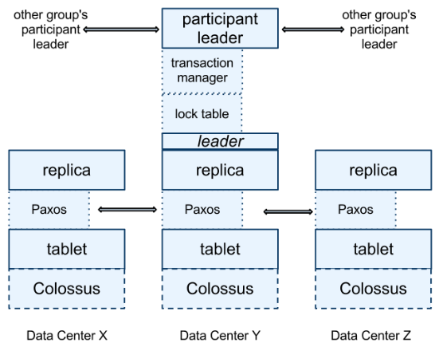
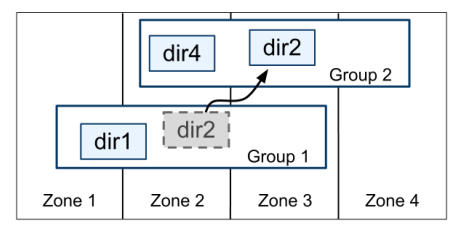
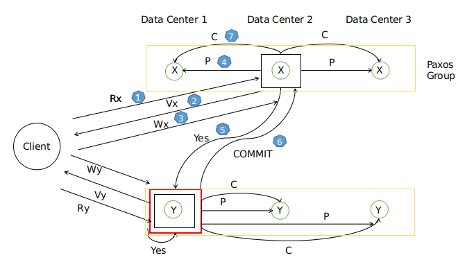
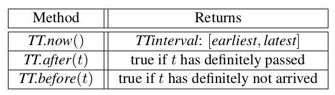

# Spanner 总结

**说明**：本文为论文 **《Spanner: Google’s Globally-Distributed Database》** 的个人理解，难免有理解不到位之处，欢迎交流与指正 。

**论文地址**：[Spanner Paper](https://github.com/XutongLi/Learning-Notes/blob/master/Distributed_System/Paper_Reading/Spanner/spanner.pdf)

***

## 0. 简介

**Spanner** 是由 *Google* 设计和研发的一款分布式数据库。它将数据分布在全球范围内，并支持外部一致性的分布式事务。对于读写事务，它使用基于 *Paxos* 复制容错的 *2PC* ；对于只读事务，它不使用锁机制，且允许从本地副本执行读操作，从而提高了只读事务处理效率。

***

## 1. 结构

### 1.1 Spanner 服务器组织


- 一个 **Spanner** 部署称为一个 **universe** 

- *Spanner* 被组织成许多个 **zone** 的集合
- **zone** 是管理部署的基本单元，当新的数据中心加入服务、或者老的数据中心被关闭时，*zone* 可以被加入到一个运行的系统中，或从中移除。*zone* 也是物理隔离的单元，在一个数据中心中可能有一个或多个 *zone*（当属于不同应用的数据必须被分区存储到同一数据中心的不同服务器集合中时，一个数据中心就会有多个 *zone*）。
- 一个 *zone* 包含一个 **zonemaster** 和多个 **spanserver** 
- **zonemaster** 把数据分配给 **spanserver** ，**spanserver** 把数据提供给客户端
- 客户端使用每个 *zone* 上面的 **location proxy** 来定位可以为自己提供数据的 **spanserver**
- **universemaster** 主要是一个控制台，它显示了关于 *zone* 的各种状态信息，可用于相互之间的调试
- **placement driver** 会周期性地与 **spanserver** 进行交互，来发现那些需要被转移的数据（或是为了满足新的副本约束条件、或是为了进行负载均衡）

### 1.2 SpanServer 构成



- 在底部，每个 **spanserver** 负载管理100-1000个称为 **tablet** 的数据结构的实例， *tablet* 实现映射：`(key:string, timestamp:int64)->string`
- **tablet** 的状态会被存储到 **Colossus** 分布式文件系统中
- 为了支持复制，每个 **spanserver** 会在每个 **tablet** 上面实现一个单个的 **Paxos** 状态机，每个状态机都会在相应的 **tablet** 中保存自己的元数据和日志
- 副本的集合被称为 **Paxos Group** ，即一个数据分片（**shard**）对应一个 **Paxos Group**
- 写操作要从 **Paxos leader** 开始执行，读操作可以从足够新的副本中直接执行
- 对于每个是 *leader* 的副本而言，每个 *spanserver* 会实现一个 **lock table** 来实现并发控制
- 对于每个是 *ledaer* 的副本而言，每个 *spanserver* 会实现一个 **transaction manager** 来支持分布式事务。*Paxos Group* 中的 *leader* 为 **participant leader**，其他副本为 **participant slave** ；如果一个事务包含了多个 *Paxos Group* ，其中一个 *Paxos Group* 会被选为 **coordinator** ，该组 *leader* 为 **coordinator leader** ，该组其他副本为 **coordinator slaves** （这些设置是为了支持 *two phase commit*）。

### 1.3 目录

*Spanner* 支持 **目录**，它是包含公共前缀的连续键的集合。对目录的支持，可以让应用通过选择合适的键来控制数据的局部性。

一个目录是数据放置的基本单元，属于一个目录的所有数据都具有相同的副本配置。当数据在不同的 *Paxos Group* 之间移动时，会一个目录一个目录地转移。



***

## 2. 分布式事务

### 2.1 读写事务

读写事务的提交，采用 **基于Paxos的两阶段提交 (2PC)** 。

以下述事务为例：

```
BEGIN:
	x = x + 1
	y = y - 1
END
```



上图中一个黄色矩形框为一个 *Data Shard* 的 *Paxos Group* ，每个绿圈为一个副本，存储在不同的 *Data Center* 。黑色矩形框中的副本为各 *Paxos Group* 中的 *leader* 。

上述读写事务的执行过程为（过程与图中序号对应）：

0. *client* 为每个事务设置一个事务 *ID* （*TID*）
1. *client* 发送读操作给到 *X* 和 *Y* 所在 *Paxos Group* 的 *leader*。读操作执行前要先获得对应记录的锁，锁由 *lock table* 提供
2. 两个 *leader* 返回 *X* 和 *Y* 的当前值给 *client*
3. 提交前，先选择一个 *Paxos Group* 作为*2PC* 的 *transaction coordinator (TC)* （图中红框即为 *TC leader*），其余 *Paxos Group* 为 *transaction participant (TP)*。接着，*client* 发送写操作给两个 *Paxos Group* 的 *leader*
4. 每个 *leader* 获取对应记录的锁，通过 *Paxos* 在 *Paxos Group* 中记录 `PREPARE` 
5. 如果记录好`PREPARE`，各 *leader* 回复 *TC* `YES` ；若出现故障，恢复 *TC* `NO`
6. *TC* 接收到所有 *TP leader* 的回复之后，决定是提交还是中断。将决定通过 *Paxos* 记录在本 *Paxos Group* 的 *log* 中，发送 `COMMIT` 通知给所有 *TP leader*
7. 每个 *TP leader* 通过 *Paxos* 将 *TC* 的决定记录在 *log* 中，之后释放占用的锁

### 2.2 只读事务

只读事务可能包含多个读操作，读取数据可能位于多个 *Paxos Group* ，但不包含写操作。

因为只读事务占比比较大，所以希望只读操作执行更快。

对于只读事务，*Spanner* 进行了两个方面的优化：**允许从本地副本读取** 和 **不使用锁、2PC、事务管理器** 。

#### 2.2.1 允许从本地副本读取

*Spanner* 允许 *client* 从本地副本读取数据，这样就避免了很多 *Paxos* 以及 *data center* 之间的通信，可以加快只读事务的处理速度。

但是本地副本可能不是最新的（由于 *Paxos* 的 *majority* 机制），为解决这个问题，使用 **safe time**：

- 每个副本都会跟踪记录一个值，称为 *safe time* （$t_{safe}$），它是一个副本最近更新后的最大时间戳
- 如果一个读操作的时间戳是 $t$ ，当满足 $t<=t_{safe}$ 时，这个副本就可以被这个读操作读取

#### 2.2.2 不使用锁、2PC和事务管理器

*Spanner* 支持不加锁的只读事务，这一特性同样避免了很多 *Paxos* 以及 *data center* 之间的通信，并且不会减慢读写事务的处理。

对于不加锁的只读事务，为保证正确性，必须满足：

- **可序列化**：虽然多个事务会并发执行，但是执行结果等同于它们按照一定顺序逐一执行的结果
- **外部一致性**：如果 *T1* 在 *T2* 开始前提交，则 *T2* 必须看到 *T1* 写操作的结果。

保证正确性的方法是采用 **快照隔离 (Snapshot Isolation)**：

- 首先同步所有服务器的时钟
- 为每一个事务设置一个时间戳
  - 读写事务：以提交开始时间作为时间戳
  - 只读事务：以事务开始时间作为时间戳
- 事务并发执行的效果与以时间戳顺序逐一执行的效果相同
- 每个副本对于每条记录都存储多个时间戳版本，所有读写事务的写操作都是相同的时间戳
- 只读事务能看到本事务时间戳之前的数据版本

***

## 3. TrueTime

由上述内容可以看到，时间戳在 *Spanner* 中起到了一个很重要的作用。但是如果不同服务器上的时钟不同步，则可能导致一些问题：

- 如果一个只读事务的时间戳过大，会导致它的时间戳大于副本的 *safe time* ，读操作就会阻塞
- 如果一个只读事务的时间戳过小，会漏读一些在该事务准确时间戳之前提交的数据版本（即读到的数据是过期的），这样违背了外部一致性

为进行时间同步，*Spanner* 在每个 *data center* 设置一些 *time master server* 。每个 *time master* 含有一个 *GPS receiver* 或一个 *atomic clock* 。其他 *server* 会从几个 *time master server* 中收集投票，获得时间参考值，从而减少误差。但是由于网络延迟原因，得到的时间也会有一定幅度偏移（时间不确定性问题）。

针对时间不确定性问题，*Spanner* 提供了一个 **TrueTime API** ，它将时间显示表达为 **TTinterval** ，它是一个时间区间，具有有界限的时间不确定性，保证了当前准确时间在这个区间里。*TTinterval* 的端点是 **TTstamp** 类型。*API* 提供了三个方法：



为保证 **外部一致性** ，*Spanner* 设定了两条规则：

- **Start rule**：设事务时间戳为 `TT.now().lastest`。对于读写事务，`TT` 为开始提交的时间戳；对于只读事务，`TT` 为事务开始时间。
- **Commit wait**：对于读写事务，延迟到 `TS < TS.now().earliest` 时再提交，保证事务时间戳`TS` 已经完全过去。

***

## 6. 特点

1. 数据分片存储在跨越全球的 *Paxos* 状态机上，通过并发访问来提高吞吐量
2. *Spanner* 提供了读和写操作的外部一致性，以及在一个时间标准下的全球一致性的读操作
3. 随着数据变化和服务器变化，*Spanner* 可以自动对数据进行重新分片，以进行负载均衡和失败处理
4. 应用可以对数据的副本进行控制，如指定哪些数据中心包含哪些数据
5. *Spanner* 可以为事务分配全球范围内有意义的提交时间戳，这些时间戳反映事务序列化的顺序，用以满足外部一致性的要求
6. 提出了 *TrueTime API* ，*Spanner* 时间戳的保证就是取决于这个 *API* 的界限
7. 只读事务不采用锁机制，且可以从最新副本上直接读取数据。由于只读事务占比大，因此显著提升了事务处理效率

***

## 5. 和 Aurora 的比较

|                      | Spanner        | Aurora       |
| -------------------- | -------------- | ------------ |
| 架构                 | Shared Nothing | Shared Disk  |
| 可用性               | Paxos-based    | Quorum-based |
| 写扩展               | T              | F            |
| 分库分表透明性       | T              | F            |
| 分布式事务           | T              | F            |
| MySQL/Postgres兼容性 | F              | T            |

**Aurora**：主要用于云上业务，兼容 *MySQL/PostgresSQL*。通过共享存储方案避免了二阶段提交、分布式事务等复杂的实现，因此开发周期较短。

**Spanner**：是一种重新设计的数据库，基于 *Paxos* 的强同步、对分布式事务的支持以及利用 *TrueTime* 机制实现的全局一致性读都是比较强大的功能。但是对 *SQL* 的兼容性不够好。

***

