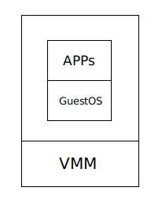
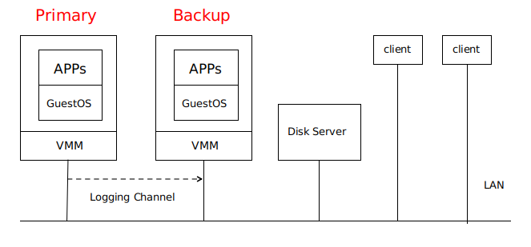
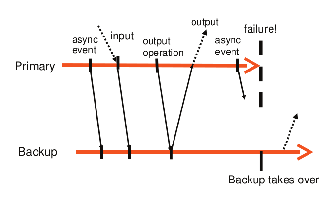
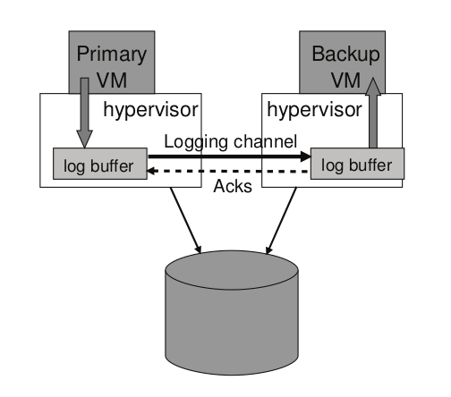

# VM-FT 论文总结

**说明**：本文为论文 **《The Design of a Practical System for Fault-Tolerant Virtual Machines》** 的个人总结，难免有理解不到位之处，欢迎交流与指正 。

**论文地址**：[VM-FT 论文](https://github.com/XutongLi/Learning-Notes/blob/master/Distributed_System/Paper_Reading/VM-FT/vm-ft.pdf)

> 本文的总结包括论文内容以及 [**MIT6.824 Lec4**](https://pdos.csail.mit.edu/6.824/notes/l-vm-ft.txt) 中的授课内容，其中包含了论文中没有提及的一些细节 。 

***

## 1. 前言

本论文主要介绍了一个用于提供 `容错虚拟机 (fault-tolerant virtual machine)` 的企业级商业系统，该系统包含了两台位于不同物理机的虚拟机，其中一台为 **primary** ，另一台为 **backup** ，**backup** 备份了 **primary** 的所有执行 。当 **primary** 出现故障时，**backup** 可以上线接管 **primary** 的工作，以此来提供容错 。

***

## 2.  主/备份方法

实现容错服务器的一种常见方法是 `主/备份方法` 。**backup** 状态与 **primary** 保持相同，**primary** 故障时，使用 **backup** 进行接管。并且以这种方式将故障对于 **client** 隐藏，不会丢失任何数据 。

主/备份方法中保持状态同步的方法有以下两种：

- `State transfer`：**primary** 持续地将所有状态（ 包括 *CPU*、内存和 *I/O* 设备 ）变化发送给 **backup** 。这种方法所需带宽非常大 。
- `Replicated state machine`：将服务器抽象为确定性状态机 。让 **primary** 和 **backup** 按照相同的顺序执接收相同的输入请求，对于不确定的操作使用额外的协调来保证主备状态一致 。这种方法实现复杂，但是所需带宽较小 。本文便是采用这种方法 。

> 确定性状态机：多台状态机从相同的初始状态开始、按照相同的顺序执行相同的操作，则它们的最终状态是一致的 。
>
> 状态机方法允许 **primary** 和 **backup** 进行更大的物理分离 。

***

## 3. 虚拟机的选择

**虚拟机 ( virtual machine )** 不是通过硬件来启动操作系统，而是在硬件之上会调用一个 **Hypervisor** ，**Hypervisor** 的工作实际上就是在硬件上模拟多个虚拟计算机 。**Hypervisor** 上执行着 **GuestOS** ，再上面是应用程序 。

 

> **Hypervisor** 即 **virtual machine monitor** ( **VMM** )
>
> **GuestOS** 即运行在虚拟机中的操作系统，与之对应的是 **HostOS** ，指物理机里的操作系统 。

在物理机上确保确定性执行是困难的，因为其会接收到很多不确定输入（ 如定时器中断 ），因此可以采用虚拟机，**Hypervisor** 对硬件进行模拟和控制，可以捕获到这些不确定输入的所有相关信息，使得 **backup** 可以重放这些不确定输入 。

> 因为我们讨论的故障主要是指服务器故障，因此不同的虚拟机要位于不同的物理机上，否则便失去了容错的意义 。

***

## 4. 基本设计

### 4.1 基本架构

**Primary VM** 和 **Backup VM** 运行在同一网络环境中的不同物理机上，两者可以访问同一个 **Disk Server** ，即论文当中的 **Shared Disk** 。

只有 **Primary VM** 向外界通知自己的存在，因此所有网络输入或其他输入（磁盘、鼠标、键盘）都进入 **Primary VM** 。

**Primary VM** 接收的所有输入都通一个称为 **Logging Channel** 的网络连接发送到 **Backup VM** ，以保证两者状态相同 。**Backup VM** 的指令执行结果与 **Primary VM** 的结果相同，但只有 **Primary VM** 返回给 **client** 结果，**Backup VM** 的结果会被 **Hypervisor** 丢弃 。

系统使用 **Primary VM** 和 **Backup VM** 之间的心跳包和 **Logging Channel** 上的流量监控来检测 **Primary VM** 或 **Backup VM** 是否是失效 。此外，必须确保 **Primary VM** 和 **Backup VM** 中只有一个接管执行 。

> 事实证明，这些主备虚拟机并不适用于本地磁盘，而是会和某些磁盘服务器进行通信。（ 论文中并未提到这点 ）

### 4.2 确定性重放

由上文可知，**VM-FT** 建模为确定性状态机的复制 。对于一系列输入，对 **primary** 的执行进行记录并确保 **backup** 以相同方式执行的基本技术称为 **确定性重放** 。

**primary** 的操作中包含了 `确定性操作` 和 `不确定性操作` 。确定性操作在 **primary** 和 **backup** 上的执行结果是相同的，不确定性操作包括：

- 来自 **client** 的输入，这些输入可能在任何时候到达
- 非确定性指令，如随机数生成指令、在不同时间获得时间的指令、生成设备唯一 *ID* 的指令等 
- 多核并发，服务中的指令会在不同的核上何以某种方式交错执行，执行顺序不可预测（ 本论文中的方法只针对单核处理器，不解决此问题 ）

> 前两种不确定性操作会在 **Logging Channel** 中传送

确定性重放记录 **primary** 的输入和 **primary** 执行相关的所有可能的不确定性，记录在 **log entry** 流中，发送给 **backup** 并使其重放 ：

- 对于不确定的操作，将记录足够的信息，确保其在 **backup** 上重新执行能够得到相同的状态和输出
- 对于不确定的事件，如定时器或 *IO* 完成中断，事件发生的确切指令会被记录下来，重放时，**backup** 会在指令流中相同的位置重放这些事件

**log entry** 中应该包含了：

- 事件发生时的指令号
- 类型，指明是网络输入还是其他指令
- 数据：数据包里的数据，若是不确定指令，则此数据是该指令在 **primary** 的执行结果，所以 **backup** 就可以对该指令提供与 **primary** 相同的执行结果

> 不确定性指令执行过程：
>
> （ 即使 **primary** 和 **backup** 在同一状态，执行不确定性指令后也会产生不同结果 ）
>
> **primary**：
>
> - **Hypervisor** 在 **primary** 执行指令时设置中断
> - **Hypervisor** 执行指令并记录结果
> - 发送结果和指令序号到 **backup**
>
> **backup**：
>
> - **Hypervisor** 读 **log entry** ，在该指令序号处设置中断
> - **Hypervisor** 应用从 **primary** 执行得到的结果，自己产生的结果被丢弃，从而保证主备一致

### 4.3 输出要求和规则

`输出要求`：若 **primary** 发生故障后且 **backup** 接管后，**backup** 必须以一种与原 **primary** 已发送到外部的输出完全一致的方式运行 。

只要满足了输出要求，故障转移就不会丢失外部可见的状态或数据，**client** 也不会注意到 **server** 服务中断或有不一致 。

可能有一种特殊情况会发生：如果 **primary** 在执行输出操作后立即故障，**backup** 在完成接管之前，可能还未执行到同样的输出操作，就被其他不确定事件所影响（ 如计时中断 ），这样 **backup** 就无法以与 **primary** 发生故障时的相同状态上线，为此提出了 **输出规则** 。

`输出规则`：**primary** 必须延后将输出发送到外部世界的动作，直到 **backup** 已经接收并确认 与产生该输出的操作相关 的 **log entry**  。

基于输出规则，**primary** 和 **backup** 的交互如下图所示：

**primary** 等待来自 **backup** 的 `ACK` 时，不会停止执行，只需要延迟输出的发送 （ 异步执行 ）。

**一些故障发生情况**：

- 如果 **primary** 在收到 **ACK** 之前故障，它不会返回结果给 **client** ，由于 **backup** 的输出会被丢弃，所以两者在 **client** 看来是一致的，即未收到 **server** 回复 。

- 如果 **primary** 在发送输出后故障，**backup** 在接管后也执行发送，**client** 会收到两次输出 。但是这种情况不会造成不良后果，因为对于 *TCP* 连接来说，它会处理重复的数据包；对于磁盘来说，会对同一块存储区覆盖写入 。

### 4.4 检测和响应故障

两种 **VM** 都有可能发生故障：

- 如果是 **backup** 故障，**primary** 将停止在 **logging channel** 上发送 **log entry** ，并继续执行
- 如果是 **primary** 故障，**backup** 会继续重放 **log entries** ，重放结束后 **上线** 成为 **primary** ，此时，它可以向外界生成输出 。

**VM-FT** 检测故障的方式有 *UDP* 心跳检测和监控 **logging channel** 中的流量以及 **backup** 发送给 **primary** 的 **ACK** 。若心跳或日志流量停止的时间超过了特定超时时间（ 大约几秒 ），就会声明故障 。

这样的故障检测方法，在有网络故障时，容易遇到 **split-brain** 问题：即 **primary** 和 **backup** 之间通信断开，但此时 **primary** 还在运行，若 **backup** 此时上线，会造成两者同时执行的问题，可能会导致数据损坏 。

为解决 **split-brain** 问题，使 **Disk Server** 支持 **atomic test-and-set** 测试，即在 **Disk Server** 上维护一个 **flag** ，第一个访问此 **flag** 的 **VM** 会成为 **primary** ，第二个访问此 **flag** 的 **VM** 不会上线 。（ 类似于锁 ）

### 4.5 恢复冗余

**primary** 发生故障，**backup** 上线时，在新的物理机上建立 **backup** ，恢复冗余，继续进入到容错状态 。

**VM vSephere** 实现了一个集群服务，用于维护管理和资源信息。当发生故障时，集群服务根据资源使用情况和其他约束来确定新的 **backup** 的最佳服务器，并将其复制成为 **backup** 。其结果是，**VM-FT** 通常可以在服务器发生故障后几分钟内重新建立冗余，而在执行容错转移时不会产生任何明显的中断 。

### 4.6 管理日志通道

**Hypervisor** 为 **primary** 和 **backup** 分别维护了一个 **log buffer** ，如下图所示：

- **primary** 执行时，会将 **log entry** 生成到 **log buffer** 当中
- **primary** 的 **log buffer** 会尽快将内容清除到 **logging channel**
- **log entry** 一到达 **logging channel** 就会被读到 **backup** 的 **log buffer**
- **backup** 发送 **ACK** 给 **primary**

若 **primary** 的 **log buffer** 已满，**primary** 会等待；若 **backup** 的 **log buffer** 已空，**backup** 会等待 。

另外，为了防止 **backup** 的重放落后太多，在发送和确认 **log entry** 的协议中，会发送附加信息来确定 **primary** 和 **backup** 之间的 `实时执行延迟` ，通常小于 *100ms* 。若 **backup** 出现明显的延迟，**VM-FT** 会通知调度器给它分配更少的 *CPU* 资源，从而降低 **primary** 的速度；若 **backup** 追起来了，逐渐增加 **primary** 的速度 。

### 4.7 磁盘的内存访问竞争

磁盘操作可能和 **VM** 中的应用程序或 *OS* 存在内存访问竞争 。

这种竞争在网络数据包或磁盘块到达 **primary** 时产生 。在没有 **VM-FT** 的情况下，相关硬件会通过 **DMA** 将该数据复制到内存中 。若 *APP/OS* 也在同时读取这块内存。那么对于 **primary** 和 **backup** ，由于时间上的微小差异，可能一个在 **DMA** 之前读取，一个在 **DMA** 之后读取，就导致了不一致 。

解决方法是使用 `bounce buffer` ，它的大小与磁盘操作访问的内存大小相同 。**primary** 的 **Hypervisor** 首先复制网络数据或磁盘块到 **bounce buffer** ，此时 **primary** 无法访问它 ，**Hyperbisor** 中断 **primary** 使其暂停执行，并记录中断的指令 。然后 **Hypervisor** 将 **bounce buffer** 中的内容复制到 **primary** 的内存 ，并让其继续执行 。通过 **logging channel** 将数据送到 **backup** 之后，**backup** 的 **Hypervisor** 在相同指令处中断 **backup** ，将数据复制到 **backup** 的内存后，最后恢复 **backup** 的执行 。

***

## 5. 机器级复制和应用级复制

### 5.1 机器级复制

`机器级复制` 即复制了内存中和寄存器中的所有内容 。优点为可以在 **VM-FT** 上运行任何软件；缺点为不够高效

### 5.2 应用级复制 

`应用级复制` 即 **primary** 仅发送 **high-level** 操作给 **backup** 。如数据库，同步的状态仅为数据库内容，不是所有的内存内容，操作仅为数据库命令（ **get** 、**put** 之类 ），没有网络包或中断 。**GFS** 使用的也是应用级复制 。

优点：更少的细粒度同步、更低的开销

缺点：应用程序必须理解系统的容灾

***

## 6. VM-FT 和 GFS 容错的比较

**VM-FT** 备份的是 `计算`，可以用它为任何已有的网络服务器提供容错性。**VM-FT** 提供了相当严谨的一致性而且对 **client** 和 **server** 都是透明的。例如，你可以利用 **VM-FT** 为已有的邮件服务器提供容错性。

相比之下，**GFS** 只为 `存储` 提供容错性。因为 **GFS** 只针对一种简单的服务提供容错性，它的备份策略会比 **VM-FT** 更为高效：例如，**GFS** 不需要使中断发生在所有的副本的同一指令上。**GFS** 通常只会被用作一个对外提供完整容错服务的系统的一部分：例如，**VM-FT** 本身也依赖了一个在主备虚拟机间共享的有容错性的存储服务，而你则可以用类似于 GFS 的东西来实现这个模块（ 虽然从细节上来讲 **GFS** 不太适用于 **FT** ）。

***

