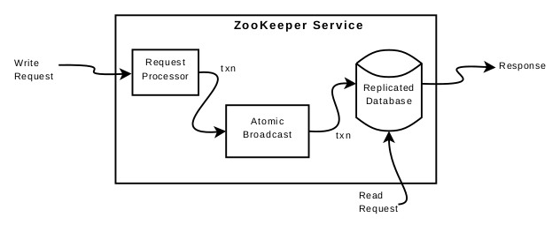
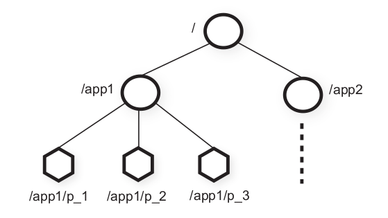

# Zookeeper 研读

**说明**：本文为论文 **《 ZooKeeper : Wait-free coordination for Internet-scale systems 》** 的个人理解，难免有理解不到位之处，欢迎交流与指正 。

**论文地址**：[Zookeeper Paper](https://github.com/XutongLi/Learning-Notes/blob/master/Distributed_System/Paper_Reading/Zookeeper/zookeeper.pdf) 

***

## 1. Zookeeper 介绍

**Zookeeper** 是用来协调分布式应用的服务框架，它是一个通过冗余容灾的服务器集群，提供 *API* 给 *client* ，用以实现一些 **原语**（ 如配置管理、成员管理、领导人选举、分布式锁等 ），在这些原语的基础上可以实现一些分布式应用程序（ 如 *GFS* 、*MapReduce* 、*VM-FT* 的 *test-and-set server*  以及雅虎的 *Fetching Service* 、*Katta* 、*YMB* 等 ）。

### 1.1 Zookeeper 服务实现



*Zookeeper* 通过在集群中每台服务器上复制 *Zookeeper* 数据来提供高可用性 。集群由一个 **leader** 和 多个 **follower** 组成 ，*leader* 负责进行投票的发起和决议、更新系统状态，*follower* 在选举 *leader* 的过程中参与投票。

每个服务器都可以连接客户端，客户端连接到一个服务器，建立 **Session** 。*Zookeeper* 使用 **timeout** 来检测 *session* 是否还在，如果 *client* 在一定时间内无法与服务器通信，则连接到其他服务器重新建立 *session*。

一台服务器上的组件构成如上图所示 。*client* 与 服务器通过 *TCP* 连接来发送请求。

如果是 **读请求** ：

- 则直接在该服务器本地读取数据，可能读到过时数据
- 若读请求之前有 `sync` ，则必然读到最新数据

如果是 **写请求**：

- 将写请求转发至 *leader* 
- *Request Processor* 对请求做准备。*leader* 使用 *Atomic Broadcast* 将写请求广播给 *follower* （ 写请求被排序为 *zxid* ），具体是使用 **ZAB** （ 一种原子广播协议 ）
- *leader* 得到多数回复之后，将写请求应用到 *Replicated Database* 中，最后将该写请求应用到所有 *follower* 上
- 为了可恢复性，强制在写入内存数据库之前将 *white-ahead log* 写入磁盘，并周期性地为内存数据库生成快照

服务器每次处理请求后，都会将 *zxid* 返回给 *client* ，若 *client* 连接一个新的服务器，新服务器会通过检查 *client* 的最后一个 *zxid* 保证服务器的最后一个 *zxid* 至少和其一样新，否则服务器在赶上 *client* 之前不会建立 *session* 。*client* 会连接一个具有最新视图的服务器。

### 1.2 Zookeeper 数据模型

*Repblicated Database* 是一个内存数据库，存储着一个层次性的文件系统，即一个数据树，每一个节点称为 **znode** 。



*znode* 并不用于通用数据存储，而是用来存储 *client* 引用的数据（ 用于协调的元数据 ）。一个 *client* 可以通过 *API* 来操纵 *znode* ，如上图中 *app1* 实现了一个简单的组成员身份协议：每个 *client* 进程 *pi* 在 */app1* 下创建了一个 *znode pi* ，只要该进程正在运行，该节点便会持续存在 。

*znode* 还将元数据与 *timestamp* 和 *version counter* 关联，这使 *client* 可以跟踪对 *znode* 的更改并根据 *znode* 的版本执行条件更新 。

*client* 可以创建三种 **znode**：

- `Regular`：*client* 显式地操纵和删除 *regular znodes*
- `Ephemeral`：这种节点可以被显式地删除，也可以在创建这个节点的 *session* 断开时自动删除。该节点不能拥有子节点
- `Sequential`：*client* 创建 *znode* 时设置 *sequential flag* ，该节点名字后会添加一个单调递增的序号

### 1.3 Fuzzy Snapshots

*Zookeeper* 使用周期定时快照，它不会阻塞地等待快照生成，而是一边生成快照，一边应用接收到的新的写请求 。这些新的写请求会部分地写入到快照 ，所以快照生成的时间点是不确定的 。

所以当服务器重新启动、从快照恢复后，会重复执行一些 *log* 中的写请求 。但由于 *Zookeeper* 状态变更是幂等的，所以只要按照状态变更的顺序应用状态改变，就不会产生错误的结果 。

### 1.4 Zookeeper 特性

- `wait-free data objects`：*zookeeper* 可执行一个 *client* 的请求，无需等待别的 *client* 采取什么行动
- `watch mechanism`：通过 *watch* 机制，*client* 不需轮询就可以接收到某 *znode* 更新的通知 。*watch* 表明发生了更改，但不提供更改的内容 
- `linearizable writes`：来自所有 *client* 的所有写操作都是可线性化的
- `FIFO client order`：*zookeeper* 对于一个 *client* 的请求，严格按照该 *client* 发送请求的顺序执行

> 事实上，*zookeeper* 的 *client* 经常通过 *watch* 机制来等待别的 *znode* 发生更新

对于全局写操作，所有的写操作都是可线性化的，即在写操作上保持了强一致性。这种可线性化实际上是异步可线性化，允许一个 *client* 有多个未完成的操作 。

但是对于全局读操作，*zookeeper* 并未提供可线性化，而是提供了较弱的一致性，允许 *client* 从它连接的服务器上直接读取到数据，这样的数据被允许是过期的。这是 *zookeeper* **性能高** 的关键所在，因为大多数分布式应用都是读操作占比更高，允许 *client* 从连接服务器的本地数据库读取数据，使得性能与集群中服务器数量成正比，大大提高了 *zookeeper* 系统的伸缩性 。

然而这种弱一致性也并非是无限制的，例如 `write(a,1)->write(a,2)->write(a,3)` ，假设集群中大多数服务器已将 *a* 更新为 *3*，某 *client* 连接的服务器上 *a* 仍为 *2* ，此时该 *client* 发送读请求，读到 *2* 是被允许的；但是读到 *2* 之后，下一个读请求读到 *1* 的情况是不被允许的，即一个 *client* 读的结果顺序不能违背数据的更新顺序 。所以 *zookeeper* 保证对于一个 *client* ，**FIFO** 地执行其请求，即对于一个 *client* 的请求实现了可线性化 。

如果想保证一次读取的数据必须是最新的数据，在读请求之前发送 `sync` 即可 。`sync` 使该服务器所有的更新全部写入副本。（ 类似于 *flush* ）

### 1.5 Zookeeper API

- `create(path, data, flags)` ：根据路径名和存储的数据创建一个 *znode* ，*flags* 指定 *znode* 类型 
- `delete(path, version)`：版本号匹配情况下删除 *path* 下的 *znode* 
- `exists(path,watch)`：如果 *path* 下 *znode* 存在，返回 true；否则返回 *false* 。*watch* 标志可以使 *client* 在 *znode* 上设置 *watch*
- `getData(path, watch)`：返回 *znode* 的数据
- `setData(path, data, version)`：版本匹配前提下，将 *data* 写入 *znode* 
- `getChildren(path, watch)`：返回 *path* 对应 *znode* 的子节点集合
- `sync(path)`：等待 *sync* 之前的所有更新应用到 *client* 连接的服务器上

*client* 进行更新操作时，会携带上次获取到的 *version* 值发起请求，若请求的 *version* 号与 *server*  的不匹配，说明该数据已被别的 *client* 更新，则更新将失败 。

所有的方法在 *API* 中都有一个同步版本和一个异步版本 。当应用程序执行单个 *zookeeper* 操作且没有并发执行的任务时，使用同步 *API* ；异步 *API* 可以并行执行多个未完成的 *zookeeper* 操作 。

***

## 2. 原语实现

### 2.1 配置管理

配置被存储在 *znode* `zc` 中，启动进程将 `watch` 标志设为 *true* 来读取 `zc` 以获得其配置。`zc` 有任何更新，都会通知进程，进程读取新配置。

### 2.2 汇合 (Rendezvous)

*client* 要启动一个 *master* 进程和多个 *worker* 进程时，因为启动进程由调度器完成，事先不知道 *master* 的地址和端口。

*client* 将 `rendevzous znode` 整个路径作为启动参数传给 *master* 和 *worker* 进程。*master* 启动时，把自己的地址和端口信息填充至 `zr` ，*watch* 机制通知 *worker* 这些信息，两者就可以建立连接了。将 `zr` 设为 `ephemeral` 节点，还可以通过 *watch* 机制判断 *client* 连接是否断开。

### 2.3 组成员管理

指定一个 `znode zg` 代表 *group* ，一个 *group* 成员启动时便在 `zg` 下创建一个 `ephemeral znode`。进程可以将进程信息，进入该进程使用的地址、端口等数据存入子 *znode* 中。

### 2.4 互斥锁

*client* 通过创建 `lock znode` 来获取锁，若该 *znode* 已存在，则等待别的 *client* 释放锁。*client* 释放锁时即为删除该 *znode* 。

```
lock():
	while true:
		if create("lf", ephemeral = true), exit
		if exists("lf", watch = true)
		wait for notification
unlock():
	delete("lf")
```

由于锁被释放后，会有多个 *client* 同时争夺该锁，这样就导致了 `Herd Effect` 。

### 2.5 没有 Herd Effect 的互斥锁

```
lock():
1 - n = create(l + "/lock-", EPHEMERAL|SEQUENTIAL)
2 -	c = getChildren(l, false)
3 -	if n is lowest znode in C, exit
4 -	p = znode in C ordered just before n
5 -	if exits(p, true) wait for watch event
6 -	goto 2

unlock():
1 -	delete(n)	
```

排队所有请求锁的 *client* ， *client* `a` 只 *watch* 它的前一个 *client* `b` 的 *znode*。当 `b` 的 *znode* 删除后，它可能是释放了锁，或者是申请锁的请求被放弃，此时再判断 `a` 是否是队列中的第一个，若是，则获取锁。

释放锁则是简单地删除对应的 `znode` 。

### 2.6 读写锁

```
write lock():
1 -	n = create(l + "write-", EPHEMERAL|SEQUENTIAL)
2 -	c = getChildren(l, false)
3 - if n is lowest znode in C, exit
4 -	p = znode in C ordered just before n
5 -	if exits(p, true) wait for event
6 -	goto 2

read lock():
1 -	n = create(l + "read-", EPHEMERAL|SEQUENTIAL)
2 -	getChildren(l, false)
3 -	if no write znodes lower than n in C, exit
4 -	p = write znode in C ordered just before n
5 -	if exits(p, true) wait for event
6 -	goto 3
```

### 2.7 Double Barrier

**double barrier** 使 *client* 能够同步计算的开始和结束。当进入 *barrier* 的进程数量大于一个阈值时，这些进程会同时开始计算，并在计算后离开 *barrier* 。

在 *zookeeper* 中用 `znode b` 表示 *barrier* ，每个进程 *p* 在进入 *barrier* 时在 `b` 下创建子节点。当子节点数超过阈值后，各进程通过 *watch* 机制开始计算。在计算结束后删除该节点 。

***

## 3. Zookeeper 的应用

### 3.1 The Fetching Service

**FS** 是雅虎爬虫的一部分，它有 *master* 进程用来控制页面爬取。*FS* 使用 *zookeeper* 的主要优点是可以使用主备容灾提高可用性，并且可以将 *client* 与服务器分离，允许 *client* 直接从 *zookeeper* 读取状态即可将请求定向到正常的服务器。因此 *FS* 主要使用到的原语有：**元数据配置** 和 **领导选举** 。

### 3.2 Katta

**Katta** 是使用 *zookeeper* 进行协调的分布式索引器。*Katta* 使用 *zookeeper* 跟踪 *master* 和 *slave* 的状态（ **组成员管理** ），处理 *master* 故障转移（ **领导选举** ），并跟踪分片的分配以及将其传播给 *slave* （ **配置管理** ）。

### 3.3 Yahoo! Message Broker

**YMB** 是一个分布式的 *publish-subscribe* 系统。该系统管理着数千个 *topics*，*client* 可以向其发布消息或从中接收消息。*topics* 分布在一组服务器之间。

*YMB* 使用 *zookeeper* 来管理 *topics* 的分布（ **元数据配置** ），处理系统中机器的故障（ **故障检测** 和 **组成员管理** ）以及控制系统操作。

***

